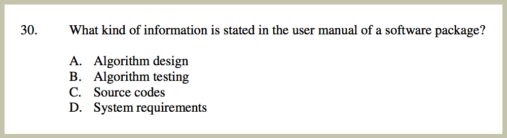

# 中學電腦科教育嘅困境

莫乃光議員最近撰文表示香港中小學 ICT 教育落後，修課人數不斷下跌，希望 ICT 可以成為必修課。

講起呢個問題，牽連好多相關議題，諗起都好沉重，好唏噓，好無力。

我會考(’02)同高考(’04)都有考電腦科，兩次都係「自修」，基本上就係考天才。你問我嗰啲嘢有冇用？我唔敢講冇。不過，作為中學生有冇需要知？ 我會話學 F=ma 會比較抵玩。

電腦呢個學科最特別嘅係，幾乎所有「入門」嘢都係好無聊嘅。你知道 8 bits = 1 byte, 1024 bytes = 1 kilobyte 有冇用？有，梗係有。你知道 C language 用 printf(), Pascal 用 writeln 又有冇用？有掛。

但個問題係，一般學生學完呢堆嘢，係唔會覺得學到嘢，更加唔會覺得自己識得應用。個感覺就好似，你教學生中文，淨係背默生字，但唔教佢欣賞文學作品，唔教佢自己造句作文。咁佢就會覺得，嗚呀，學中文真係好冇用。

電腦科另外一樣嘢，就係咩「電腦應用」。即係「常識」。嗰種問題嘅無聊程度，就好似「以下邊幾個地方可以買菜呀？ (1) 墳場 (2) 街市 (3) 超市 (4) 書店」。你以為我講笑？睇下張圖先講。

其實中學電腦科教育曾幾何時都會考學生點樣「作文」，但係據講近年編程嘅比重減少 (太「深」嘛，嘿嘿)，教你「茴字有四種寫法」、「買菜就去街市」、「半斤即係八兩」嘅內容就比較多。

咁呢啲問題應該點樣解決？我都唔知。出電腦科嘅試卷係極難，所以啲問題先會問得咁奇怪。點解呢？咁就要探究下「電腦」係乜家伙。

「電腦」呢個概念，一般上溯至 Charles Babbage 個 difference engine，但現代嘅電腦嘅始祖係 Von Neumann，而 Von Neumann architecture 其中一個重要元素就係佢係一個 Universal Turing Machine。上面嗰堆名你未聽過唔緊要，總之就係「Universal Machine」，即係你叫佢 **做乜都得 **。

正正因為「做乜都得」，所以先至難學。你學歷史，本書上面寫住「秦始皇滅六國」，咁你就唔可以講「齊桓公滅六國」；你學化學，實驗結果話你聽強酸強鹼中和係放熱反應，你唔可以話佢係吸熱反應；基本上大部份學科都有明確嘅現實世界嘅限制， 唔係「做乜都得」。

但電腦真係「做乜都得」。所有所謂電腦「常識」，全部都只不過係「慣例」，全部都有可能不斷咁變化。你以為唔可以用 word processor 去聽歌咩？其實係得架；你以為 browser 太慢唔可以用嚟行 virtual machine？你以為 Windows 系統行唔到 Unix 嘅軟件？你以為 User Manual 一定冇 source code？少年你真係太年輕。咁如果真係有條問題問「聽歌應該用咩軟件？」，咁我梗係答「music player」啦，唔通真係答「word processor」咩。不過，咁樣嘅問題咪好on9囉。

係咪真係「做乜都得」先？咁其實又唔係嘅。第一，硬件上嘅限制係有嘅，不過硬件技術喺呢幾十年變化好快，廿年前你唔會相信手機可以 video chat，但而家已經係智能電話嘅基本功能，所以如果你太著重硬件嘅皮毛嘢，咁呢啲知識喺學生畢業過幾年就可能過時。第二，電腦有理論上嘅限制，但呢種限制，幾近係「哲學」。講緊 Halting Problem 呢種，或者係 P=NP? 呢種。

除咗硬件同邏輯上嘅限制，其實一部電腦真係「做乜都得」。咁即係點呢？即係本身個電腦真係做乜都得，你要出試卷，理論上只可以問佢「點樣做 XXX？」，但唔可以問佢「有咩唔做得」或者「有咩係錯」。

又唔係話唔可以問「有咩唔做得」，但要先做假設。例如，先假設 A=1，再假設 A 只可以有一個數值，咁當然 A ≠ 2 啦。即係話，如果阿媽係女人，再假設女人唔係男人，咁阿媽就唔係男人喇。

呢個問題係非常搞笑嘅，因為最後出卷為咗簡潔，好多時會省略前設，直接要求考生答「阿媽唔係男人」。咁當然就係出卷唔嚴謹，因為阿媽可以係變性人，雙性人 (乜都得嘛)。相反，到你真係寫晒啲前設出嚟，咁條問題就變成閱讀理解，考你「邏輯」，唔係考你電腦。

咁可以點做呢？一係就只問「點樣做 XXX？」嘅問題。即係考編程 (programming)。即係好有邏輯咁作文。即係起碼九成人類都冇能力做得好嘅事情。即係「好深」。即係冇人肯揀呢科。即係唔可以太多出呢類問題。

另一個方法，就係根據一堆現有嘅國際標準去問問題。你話「database 可以做啲乜」呢種問題唔嚴僅？冇問題，咁可以改成「SQL-92 可以做啲乜」架嘛。你話「whitespace 同 comments 唔會影響程式嘅邏輯」唔嚴僅？唔緊要，你可以改成「會 whitespace 同 comments 唔影響C++14 程式嘅邏輯」架嘛。

但個問題係，除非你日後從事電腦行業，兼且你專攻呢範，否則你識 SQL-92 、C++14 真係冇用的。（如果真係要由中學開始學好一套 standard，我極力推薦 POSIX… 背得出 POSIX 嘅人，真係一定唔會餓死…）

好喇，我諗我已經講晒所有電腦科可以教同可以考嘅內容類別。簡單講就係，一係就係啲十年後會唔同晒嘅知識，一係就係啲非常形而上嘅嘢，一係就係啲極專門而冇用嘅嘢，一係就絕大部份考生冇可能學得識嘅嘢。

點解啲人會覺得電腦科冇用？其實都係咁解。大家坊間見識嘅電腦人，絕大部份都係識埋一堆「茴字四種寫法」呢類知識嘅人。(十年後，茴字變咗有三十種寫法。） 所以成日有人呻，咩 IT 嘢要係咁追技術。

至於我喺中學時期學嘅電腦嘢，斷唔係「十年後會唔同晒嘅知識」咁簡單，而係一大堆解難思維同常用嘅解難方法。呢啲嘢，唔係每星期上兩個小時課堂就可以學識，而係一定要好專心咁每日花幾個鐘，每個周末再花十幾個鐘，專注學習嘅嘢。我唔相信有中間路線。況且，呢啲思維有一半係天生嘅，唔係人人都學得識。( 當然啦，「唔係人人都學得識」唔代表唔考得。不過會否違反「訓練學生思維」呢個本意？ )

可能有人會話，喂唔係喎，所有學科都係要下苦功架啦！但問題係，我從來冇一日操幾個小時 physics，但而家我都識得計 F=ma，我而家都識得點計拋物線 (不過可能要少少熱身)，而呢啲知識，由牛頓到今日，幾百年嚟都冇乜點變過，一樣咁實用。相反，有幾多人讀完 ICT 十年之後寫得出一個完整嘅程式？可以用到嗰啲知識作最基本嘅應用？如果唔計工作上需要識編程嗰啲人，我估應該接近零。而，你淨係寫得出 hello world，有鬼用咩。

所以我成日都覺得，電腦野，一係唔學，一學，就要精，起碼要去到可以自己做啲小型創作嘅地步。中間根本冇任何走棧嘅餘地。箇中嘅分別，大概就類似，一個系統，一係 Turing Complete，一係唔係。中間亦都冇任何走棧餘地。

所以，電腦科應該點樣教先有用？我真係唔知。係咪個個人花十年八載光陰去學，就係一件好事呢？我都唔知。

（原文於 2015 年 11 月發佈，略有修輯。主要係冇咗幾句粗口⋯）
