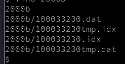
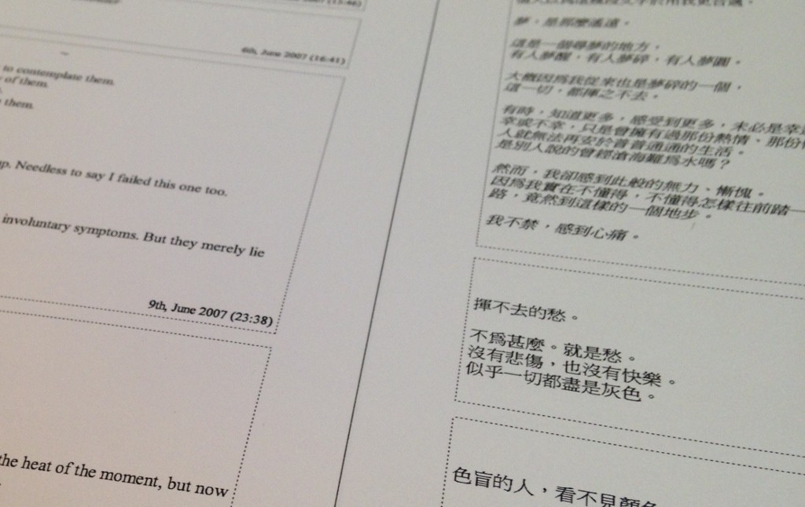

# 記住將重要嘅嘢印晒出嚟

話說自從踏入千禧年代，好多人都好鍾意用新科技處理資料。咩咩咩電子化，無紙辦公室，所有資料都用電腦儲存。電腦好嘢嚟，可以大幅提升效率，可以慳返啲紙，環保啲。

但講到長期保存資料，電腦就未必好得過死樹爛紙。

## Files are Highly Perishable

大家硬碟入面最舊嘅檔案係時嘅？[1] 可能係幾年前啦。可能你換過電腦冇抄返啲 files，或者硬碟壞咗，唔見晒啲舊 files。啲陳年舊 files，可能擺咗喺隻USB手指之後唔見咗；可能放咗喺公司email，轉工嗰陣唔見得抄返；可能真係唔知擺咗喺邊個 folder 然後唔覺意刪咗；又可能，真係唔知擺咗啲 files 喺邊。

所以，電腦入面嘅檔案真係好易唔見(i.e. highly perishable)。大家唔好以為 save 咗入電腦嘅資料最安全，其實電腦入面嗰啲嘢，隨時三五七年之後唔見咗。反而，如果啲資料印咗出嚟，通常都保存得好啲。廿年前嘅文件，通常都會搵得返。

## Don’t Trust The Internet

近年，大家好興用 Google Drive 呀、DropBox 呀、iCloud 呀呢啲網絡服務。通訊嘅時候，大家都好鍾意用 GMail 、Whatsapp 、LINE、呢啲服務。大家分享生活點滴，會用 Facebook、Instagram、Twitter 之類。

喺呢啲網上服務入面，大家會儲存大量文件、相片、文字。有啲係好無聊嘅，例如你 whatsapp 同事問佢去邊度食晏。但有啲就好有價值，例如你十年前用 MSN messenger 寫俾老婆嘅情信。

網絡上嘅服務，大部份都係由美帝公司操控。呢十幾年以嚟，呢啲網絡公司換畫換得好快。「老一輩」嘅網民可能會記得以前有樣嘢叫做 Geocities，當年好多人整 “homepage” 將啲資料 upload 上去。而家去咗邊？冇咗喇~~ [2] 幾年前香港人好鍾意用嘅 Xanga 去咗邊？冇咗喇~~~ [3] MSN messenger 去咗邊？冇咗喇~~~~ 唔知啲老嘢仲記唔記得，90 年代尾網上嗰啲「免費電郵」服務，最興標榜「終身免費」 (free for life)，當然今時今日仲喺度嘅服務寥寥可數，大部份都係執 Q 晒。

而家 Google 呀 Facebook 呀呢啲公司市值幾百幾千億美元，睇個勢唔似會執。不過將來嘅嘢你又點知？一來，佢哋就算唔執，都唔一定會繼續提供某啲服務；二來，科技公司死起上嚟只需要兩三年時間，曾經風光一時嘅 Nokia (硬件部) 剛剛蓋棺 [4]，真係令人不勝唏噓。你又點知過幾年科技市場會唔會有咩重大改變，令到今日嘅科技巨頭要執笠清盤？

## What good is a file, if you can’t open it?

好喇，你啲檔案留晒底，有兩三個 backup，好安全喇掛？其實未必。例如，你當年 ICQ 所有對話，都係儲喺電腦某個 file 嘅。嗰個 file，完全唔知係咩 format，而 ICQ 個 Windows 程式又冇得再 download，咁可以點樣讀返佢出嚟？[5] (見下圖…)

其實好多電腦檔案都有同類問題。Microsoft Office 對舊檔案嘅支援做得好好，所以大家未必會見到有咩問題。據講 Word 2010 都可以開到 Word 97 嘅檔案，算係咁。[6] 但如果大家係用啲比較冇咁主流嘅軟件，就未必會咁好彩。如果做軟件嘅公司執咗笠，或者決定唔再支援舊案檔格式，咁就會好麻煩。

## Where are my childhood photos?

咁呢，話說我父母唔知喺邊度掘返呢張相出嚟。都有廿幾年架喇。

今時今日啲相機咁平，大家成日都影影影，千禧年代嘅小朋友一定影咗好多相。之但係，呢啲相點樣保存呢？如果你使用「雲端」服務儲存啲相，個服務會唔會二十年後仲存在？如果有一日佢執左笠，或者，純粹係你唔記得咗個密碼，咁點算？即係咁，起碼我都叫做有一張相，知道原來我細個嗰陣一啲都唔可愛….。但如果大家淨係將啲相呀、信件呀，擺晒入電腦擺晒上網，就好易唔見。唔見晒啲相，點同個仔交代？連老逗細個都有相睇，點解我會冇架？！(之後一定係賴咗落啲無辜IT毒撚度….)

所以，我會建議將重要嘅嘢印晒出嚟。

## I print my blog on dead trees — proudly

某程度上我都幾「瘋狂」。我以前有個習慣，就係每年年尾會將自己個 blog 印出嚟。印咗七、八年，直至近年唔寫「blog」先冇再繼續做。成疊嘢都有兩三寸厚，唔惹少架。

近年冇再印，主要係因為用多咗 Facebook，寫少咗「blog」。而我 Facebook 寫嘅嘢，都係評論時弊居多，實在冇乜保存價值。略有有價值嘅文章，都拎晒去投稿啦。所以，冇乜動力去印。

不過咁，就算係投稿登咗出嚟嘅文章，都唔見得可以流傳百世。《主場新聞》嘅博客文章喺蔡東豪行山之際灰飛煙滅，都只係一年嘅事。所以諗下諗下，今年都係要將啲文印返出嚟。

## Finally…

最後，重要嘅事要講三次：記住將重要嘅嘢印晒出嚟。記住將重要嘅嘢印晒出嚟。

對你重要嘅文字、相片、資料，亦都會係社會重要嘅文化資產。所以，大家記住將重要嘅嘢印晒出嚟喇。

後記 1：

講開舊檔案，我好自然咁走去搵返我電腦入面嘅舊files。哇，一搵，嚇鬼死。原來我好聰明咁幫啲 files 加晒密碼，而我好多年冇用過嗰個密碼……已經唔記得咗。即係 ICQ 情信、十幾年前寫嘅日記、各類作品乜都唔見晒………嗚呀！！……好彩，過咗幾分鐘之後我終於諗返起個密碼。真係勁好彩！以我平時記性真係冇理由記得架！
— — — — –
* [1] 我電腦入面仲有啲 2000 年嘅檔案
* [2] http://evchk.wikia.com/wiki/GeoCities網存倒閉事件
* [3] 哈哈，其實佢哋仲喺度，不過同冇咗都冇乜分別架喇。
* [4] http://mashable.com/2015/07/08/microsoft-layoffs-nokia/
* [5] 話時話如果有巴打絲打知道點樣讀啲 ICQ2000b 嘅紀錄，不妨同我單聲。 (我懶得搵)
* [6] https://support.office.com/en-us/article/Use-Word-2010-to-open-documents-created-in-earlier-versions-of-Word-68e13b8d-a2d6-4caa-8007-4c65971069bf

（原文於 2015 年 7 月發佈，略有修輯）
