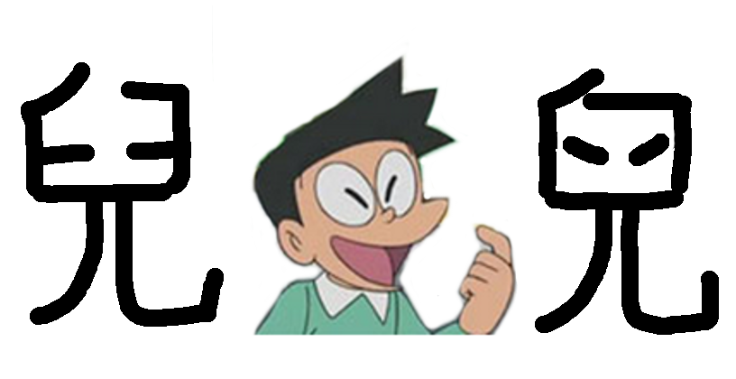

# 「𠒇」字係咩嚟？ — — 港姐冠軍帶出嘅哲學問題

利申：我真係唔識字

## 背景：港姐冠軍雷莊𠒇

啱啱選完港姐，我連冠軍叫乜名都唔知，直到見到擇言一個 message，講起個「𠒇」字，我先知道原來今屆美麗與智慧並重嗰位佳麗叫「雷莊𠒇」。大家當然唔知個「𠒇」字點讀，不過媒體一般都讀「兒 (ji4)」。擇言查到 unicode 嗰度話粵音係「maau6」，但又好懷疑其實係咪雷女士寫個「兒」字寫得樣衰。話晒雷女士嘅中文似乎麻麻，搞錯咗一啲都唔奇。

關於個「𠒇」字，事主係咁講嘅：「其實我當年攞身份證嗰陣一直冇發覺，原來喺嗰刻已經寫錯咗，到我參選，我仲問大會做乜寫錯我名，佢哋話係跟住我身份證咁寫，我先發覺寫錯咗，我遲啲會去改番！」

就咁聽落似乎好 make sense，有人寫錯咗字，所以身份證錯咗，要改返。不過我就唔係咁睇。如果你睇返張圖，個「兒」字同「𠒇」字，係咪真係差咁遠？我小一、小二嘅時候喺外國讀書，所以我冇咩點經歷過被中文老師深根蒂固咁洗腦話「埋口」同「唔埋口」有好大分別，亦都唔覺得個兩橫寫斜少少就寫錯。三歲定八十，冇咗呢啲執著同堅持，我真係好難算係「識字」。

## 異體字應該點處理？ 關於「字」嘅「本質」問題

不過我唔知大家係咪真係咁執著。舉個例，一直以來，我哋喺電腦寫「溫」字嗰陣，係用「溫」。不過相信大家小學嗰陣，老師係教你寫「温」嘅。據講台灣正體嘅「溫」字係「水囚皿」，不過香港以前就用「水日皿」比較多。不過由於以前 Big5 編碼冇「温」字，所以大家都用住個「溫」字先。而家大家習慣咗，連天文台網站報天氣都係寫「氣溫」。不過香港教育署嘅《香港小學學習字詞表》仍然係話正寫係「温」，而「溫」係異體字。

大家可能會疑惑：「咦，明明『溫』同『温』係同一隻字，點解電腦會當咗做兩隻字？」 呢個就關乎 unicode 對待中日韓(CJK)漢字嘅政策。我懶得翻查歷史，但總之佢哋決定咗將所有(/大部份)「異體字」都拆開咗做一個獨立嘅編碼。即係話，對電腦嚟講，「溫「同「温」係兩隻完全唔相關嘅字嚟。呢個決定有好有壞。好處係，我寫呢篇文嘅時候，可以分辨呢兩隻字。如果佢哋將所有異體字用同一個編碼代表，我就要畫圖去表示唔同嘅異體字。壞處係，大家心裡面都覺得係同一隻字，但實際上電腦唔知道呢樣嘢，引申出各種問題，例如如果你喺一篇文章想搵個「溫」字，但我文章裡面用「温」，你就搵唔到喇。

究竟邊種處理方法先至係「啱」？ 呢個係一個哲學問題，有人話係關乎「亞里士多德式本質主義」。有興趣嘅話，可以睇下 O’reilly 出版嘅《Fonts & Encodings》第 55 頁。 我一開始都以為作者講緊笑，不過後來先明白佢係認真嘅。究竟一個「字」嘅寫法重唔重要？定抑或一個「字」係形而上嘅概念嚟？究竟個「兒」字上面埋咗口，嗰兩橫寫得歪歪斜斜，算唔算係另一個字？呢個真係一個影響深遠嘅哲學問題！！！ （下面有長篇大論講呢個哲學問題對社會嘅影響）

不過，我討厭哲學。呢個世界好多哲學問題都係多餘嘅。寫字樣衰咪樣衰囉，唔需要郁啲就攞「亞里士多德式本質主義」出嚟批判嘅。試想像下，喺未有電腦嘅年代，如果你見到某張手寫嘅 form 上面，有人寫自己個名係「陳曼𠒇」咁啦。你會唔會即刻覺得自己唔識讀呢隻字，即刻走去查字典睇下個字點讀？ 應該唔會掛。你第一個反應，可能會心諗：「嘩，呢個人寫個『兒』字寫得咁樣衰嘅。」

重要嘅嘢要重覆多次：**試想像下，喺未有電腦嘅年代，如果你見到某張手寫嘅 form 上面，有人寫自己個名係「陳曼𠒇」咁啦。你會唔會即刻覺得自己唔識讀呢隻字，即刻走去查字典睇下個字點讀？ 應該唔會掛。你第一個反應，可能會心諗：「嘩，呢個人寫個『兒』字寫得咁樣衰嘅。」**

## 由「異體字」變成另一隻字？

不過，喺今日電腦嘅年代，大家打嘅字係「兒」就係「兒」，係「𠒇」就係「𠒇」。壁壘分明，冇中間嘅灰色地帶。yes or no。0 同 1。電腦就係鍾意 0 同 1，黑與白，唔鍾意灰色。喺電腦科學，我哋將 yes or no 嘅問題叫做「decision problem」。點解港姐冠軍嘅名，會同「decision problem」有關？ 因為，佢個名出現一個奇怪字，完全係因為電腦壁壘分明，迫住人將啲「灰色地帶」嘅嘢歸邊。大家見到一個寫得好樣衰嘅「兒」字，唔會查字典覺得係怪字，只會覺得寫得樣衰。但係，**一旦有人多手將個「樣衰兒字」判斷為「𠒇」嘅時候，我哋就會好疑惑，覺得自己唔識呢隻字。如是者，大家就好努力查字典，搵字源，康熙字典、廣韻、甲骨文、乜乜乜乜，查一大輪。**

## 黑白分明嘅世界，衍生好多問題

搞出咁大誤會，只係因為我哋嘅*電腦系統唔知「𠒇」同「兒」嘅關係*；但係，傳統手寫嘅字，其實係一張圖。要比較準確表達雷小姐喺入境署填 form 嘅筆跡，起碼都要幾十個 kilobytes，但 unicode 入面要表達一個字只需要幾個 bytes。”Decision problem” 本身就係會令好多訊息嘅流失，將好多訊息濃縮成 0 同 1，將寫得好樣衰嘅「兒」字變咗做「𠒇」。*好多時，如果避免刻意將啲嘢分門別類，就會少好多傷透古代聖賢腦筋嘅哲學問題。*所以，如果盡量將原有嘅資訊保留，避免做「0 同 1」判斷，世界就少好多哲學問題，世界就會更美好。（呢個結論，亦都係我哋搞《粵典》嘅時候深刻體會嘅嘢，擇言直頭喺某個 conference 講過呢個問題。有時分類無可避免，《粵典》都有分詞性，即係名詞動詞呢啲。但如果可以嘅話，我哋都盡量避免做太多其他不必要嘅分類。）

但係，就算點避，都避唔開用 unicode。某程度上，Unicode 係將我哋平時寫嘅「象形文字」變成電腦編碼。我哋以前寫字，啲訊息係一張圖嚟；而家就用 unicode 嘅編碼將佢「壓縮」成幾個 bytes。究竟「象形文字」係咪同電腦裡面嘅 “character set” 概念上有衝突，我真係唔知。但無論如何，喺電腦處理漢字嘅時候，有好多比用拉丁系語言更加複雜嘅問題。

一個人寫個「兒」字寫得樣衰，入咗電腦系統，出返嚟變咗另一隻字，真係好「現代」嘅問題，或者可以稱之為 “first world problem”。更加「現代」嘅問題，係喺資訊發達嘅社會，大家攞住一個奇怪字，喺網上可以查到好多更奇怪嘅資訊，例如曾經用過生辟字嘅古籍文本之類。以前大家喺啲古書見到寫得好樣衰嘅字，好可能只會當佢係一隻寫得好樣衰嘅字。但今時今日，中文書電子化，寫得好樣衰嘅字，有時會被歸邊做另一個 unicode 編碼，被電腦系統當咗做另一隻字。咁樣唔單止會令啲文字好難搜查，一啲喺電腦年代生長嘅人，更加好容易會套入咗 unicode 編碼嘅思維，先入為主覺得佢係另一隻字，黑白分明，而忘記咗以前曾經有「寫得好樣衰」嘅灰色地帶。

或者有人會質疑，呢啲「寫得好樣衰」嘅灰色地帶，係咪真係咁重要？寫字寫得樣衰，變咗另一隻字，抵死啦。我覺得係抵死架。不過，大家唔好忘記，漢字自古以來都一直演變。每個年代寫嘅字都有唔同，有時唔同嘅字會合拼成為同一隻字，有時同一隻字會演化成唔同嘅字，有時會因為有需要而創造新嘅字，或者抛棄唔再有用嘅字。當然，呢啲情況喺遠古（漢代之前）發生得比較頻繁，但之後一直都有發生。

## Unicode 系統，阻礙漢字發展

或者大家覺得漢字呢二千年以嚟咁穩定，唔再發展都冇咩問題啦？係掛，如果香港等於中國的話，可能係。不過，時代嘅變革仍然存在嘅。以前識字嘅人通常用文言文，但而家好多唔識字嘅人（例如我）會想將口語寫成文字，而好多口語嘅字都冇傳統漢字代表。香港主流選擇用同音字，或者用同音字加個「口」字部，但亦有人覺得咁樣唔理想。有啲人努力喺古籍搵出粵語嘅「本字」，但好多時係緣木求魚。大家只要讀過《漢字的結構》，都知道漢字係創造出嚟嘅，點解事必會有一個全世界都冇發現嘅「本字」呢？可能真係有隻字等待你去創造架嘛。*喺一個未有電腦編碼嘅年代，大家用紙筆可以隨便創造文字，只要有人睇得明，約定俗成，冇任何技術問題阻礙呢種事嘅發展。但係，喺呢個 unicode 一統天下嘅時代，大家只可以沿用一啲已經存在於 unicode 嘅字，唔可以隨便創新。*其實 unicode 係會推出新版本嘅，但係就算有得更新，都有雞同蛋嘅問題：大家唔用新字，啲字就唔會納入 unicode；啲字唔納入 unicode，大家就用唔到新字。

*喺而家「大中華一統主義」之下，中國嘅「方言」被視為獨立運動嘅切入點之一，研究「方言」嘅組織難以有足夠嘅官方認可地位去研究新造字、推動新造字、將新造字標準化。如是者，電腦系統有時竟然係語言演化嘅拌腳石。*或者煽情啲講句：「電腦編碼系統喺象形文字世界不斷助長文化帝國主義嘅霸權！」（有冇人諗唔到論文題目想寫下呢樣嘢？ XD）

## 文化帝國主義對粵語發展嘅影響

某程度上，香港算係好彩。喺 unicode 成為世界主流之前，香港政府一直都有維持香港獨有嘅字嘅字表，而家相信全數納入咗 unicode。不過就算係咁，都有好多平時大家廣東話用嘅字，根本冇咩人寫開，所以連一個標準嘅寫法都冇。例如「放peah (fong3 pe5)」個 “peah” 係點寫呢？平時大家「搵個同音字代替」呢招唔 work，又好驚「漢字霸權」話你用英文拼音係唔識字，所以*當大家冇一個可信權威去跟，就會直接放棄用呢個詞語，用其他詞語代替。就算平時大家肯寫廣東話，廣東話詞語仍然會因為呢類原因而流失。*呢啲問題，或者好多「識字」嘅人都未必為意到。喺好多「識字」嘅人眼中，字係死嘅，係唔應該變化嘅，係黑白分明嘅，係有絕對嘅「啱」或「錯」嘅。喺廣東話呢段「中興」嘅時期，大家開始喺網上實踐「我手寫我口」，我哋無可避免地會走去問啲「識字」嘅人，某某字應該點寫。有啲字，真係黑白分明嘅，例如耕田個「田」字，三歲細路都識寫。相反，有好多字，係冇咁確定嘅，例如「放peah」個 “peah” 咁。但係好多黑白分明嘅「識字之士」，心裡面只有「啱」或「錯」，容不下任何「灰色地帶」。就算本身隻字嘅「正寫」有不確定因素，佢都會毫不猶疑咁話隻字「係咁寫架喇」。坊間好多所謂「正字」、「本字」，我唔敢話佢哋係「錯」（都話我唔識字咯），不過我好相信，喺佢哋心底裡，其實佢哋對嗰啲「正字」、「本字」嘅「信心」(confidence interval?!)，比起個「田」字，一定細好多。

有時文化帝國主義嘅霸權，真係無孔不入。

講完一大輪，究竟我想講啲乜？冇呀，開咗個坑出嚟，要幫走數王找數架咋。

（原文於 2017 年 9 月發佈，略有修輯）
