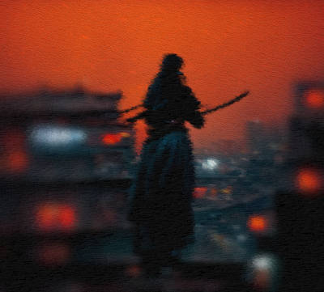
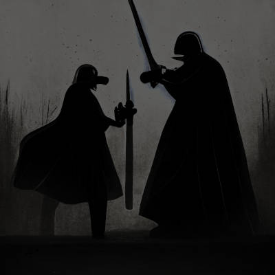

# 呆總嘅老豆

「轟隆！」

平靜嘅夜空，竟然響起乾雷。

「啊～！」老夫同漢昭烈帝一樣係蓋世英雄，立即虎口劇震，筷子連同夾緊嗰嚿叉燒一齊跌咗落地。「⋯⋯嚇死老夫喇。」

我望住屋外天色，月光一早被黑雲淹沒，濕氣極重。欽天監今次仲唔掛黑色暴雨警告的話，聽朝睇怕會有十萬人上書皇上，叫佢炒咗嗰班粉腸。

「轟隆！」 呢次雷聲，果然帶來傾盤大雨，屋外屋頂雨聲不絕。

我喺呢間屋已經孤獨度過十八個寒暑，屋頂落雨嘅滴嗒聲每一個細節，一早了然於胸。我正打算彎低身執返嚿叉燒嗰陣，忽然覺得唔對路。

屋頂 ⋯⋯ 多咗一個人。

我手握劍柄，六神歸一，留心傾聽。果然有人喺屋頂跳落後庭院！輕盈嘅腳步聲極之細微，來者顯然學過輕功。如果唔係忽然落大雨，敵人嘅突襲可能已經得手。

腳步聲越嚟越近，我腰間寶劍出鞘嘅一刻，廳門已經「嘭！」一聲被踢爆。來者係一個黑衣人，燭光之下只隱若見到佢炯炯雙眼同閃爍嘅劍刃。烏雲大雨雖然救咗我一命，但我真係咩都睇唔到，呢條命仔仍然危在旦夕。我學過嘅咩飛鵝山劍法、青城派刀法、甚至大內高手教我嘅辟邪劍法喺漆黑之中都起唔到作用，唯有向住敵人劍光嘅方向橫橫直直咁亂斬亂劈。

好在老夫力拔山河氣蓋世，雖然咁樣斬法我把寶劍肯定見財化水，但刀劍相交嘅時候，我感覺到對方力氣似乎比我大大不如。呢種刺客，似乎專學飛簷走壁之術，格鬥嘅訓練卻係不足。我喺黑暗中略佔上風，漸漸將佢迫出屋外。

「哼，大膽狂徒，你係邊個！點解要暗算老夫！」

「你做咁多傷天害理嘅事，今日我要替天行道！」聽黑衣人嘅聲音，竟然似係女人。難怪我同佢對打可以力拔山河。平時我邊有咁大力？佢口裡強硬，卻一個翻身跳出牆外，似乎想逃走。

我提劍急追，佢見我迫近，回身一劍，刺中我右肩。我「屌」一聲，寶劍亂揮，斬中佢手腕。佢大叫一聲翻倒在地，長劍亦 clang! 一聲跌咗落地下。

此時大雨已經停止，烏雲漸散。月光之下見到黑衣人喺泥地上不斷掙扎，卻已經無力起身再戰。黑衣人嘅臉相有點似曾相識，我再望返佢把劍，大吃一驚。咦！呢把咪係我以前嘅倚天劍？！

呢把劍係當年黨主席賜我嘅禮物，劍身刻有「HARRRR～！！！」嘅洋文，極為霸氣。自從熔癌之役之後，我就冇見過呢把劍，點解會重現人間呢？當年被襲之後，我家破人亡，幼女失蹤，老婆帶埋個低B仔返娘家，我孤身一人無處容身，唯有接受當今皇上招安，擁鳩《基本大法》，做下打雜，過下頹廢生活。屈指一算，已經廿年。

「你係咪熔癌嘅人？！」 我抑壓心抵嘅震驚，若無其事咁問。

「！！！」 黑衣人驚訝嘅眼神已經回答咗我。佢點都估唔到我認得呢把劍。原來係熔癌派人追殺我。斷估係佢唔抵得我投靠朝庭咁多年都死唔去，派人嚟送我一程。

我望住呢個嚟刺殺我嘅黑衣女人，定睛細看，確定咗我心底嘅疑惑之後，緩慢咁講：

「阿呆，哎暗若餓花打。」

「？？？」 佢一臉迷罔，我忽然醒起熔癌唔識英文。

「我先唔係你老豆呀，哼哼。」

【完】

— — — — — — — — — — — — — — — — — — — —

作者按：我一直都話，寫文同痾屎一樣，痾唔痾得出唔到你話事，總要慢慢消化然後再排泄。最近冇咩時間寫正經文章，忍屎忍咗好耐，見到 爾雅集 老總阿呆同幾個作者玩「呆總的XX」嘅短篇故仔，平日打死都唔寫fiction嘅我，靈感竟然一瀉如注。有屎痾唯有去廁所，人人做網絡9upper，唔通個個都想做9upper咩。近排冇咩時間，我都唔想咁樣架。

話時話，呢段小故事有好很多 inside joke，你哋睇唔明都真係唯有講聲so99ry，我平時係擁開基本法嘅，唔係寫網絡小說嘅，包容啲啦。

(原文於 2017 年 9 月發佈，略有修輯)
