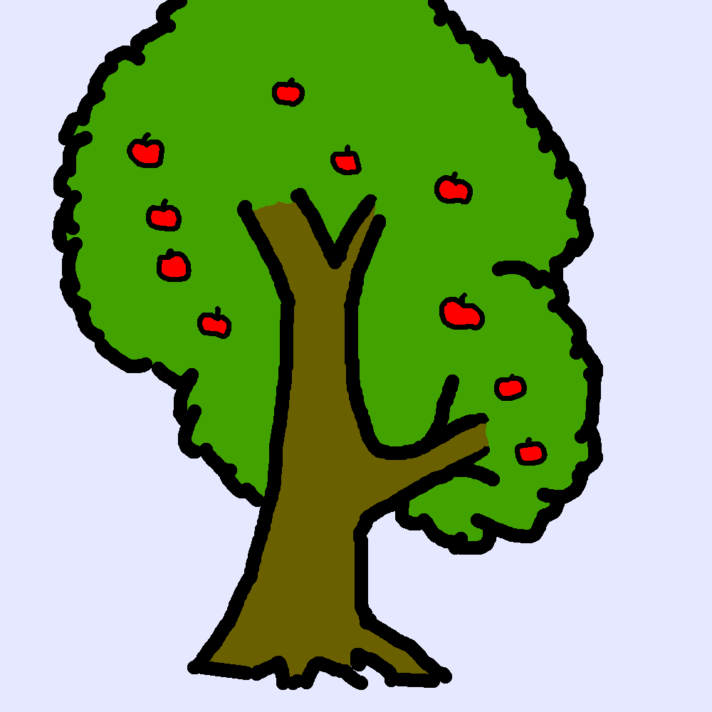

# 《 1 + 1 = 2 》哲學狂想曲



究竟 1 + 1 = 2 係咩意思？ 我以前一直覺得只係數字之間定義嘅關係。

近排唔知點解又諗返呢個無聊問題，有些少領悟，鳩噏一下。

我好好奇幼稚園老師點樣教「1+1=2」呢個概念。諗返都真係好複雜。對於大部份人嚟講，數學唔係一種研究形而上概念嘅學問，而係可以應用於現實生活嘅嘢。一個三歲細路唔會有興趣理會 Peano axioms 之下所定義嘅自然數，教佢 1 + 1 = 2 大概係要從實物開始，例如一個蘋果加一個蘋果就等於兩個蘋果，咁樣。

要識得將兩個蘋果加埋，睇嚟好似好容易，但其實要學識以下幾樣嘢：

1. 一個蘋果要當成「1」
2. 同類嘅嘢可以當係一樣嘅嘢
3. 兩堆一樣嘅嘢可以當成同一堆嘢

呢啲小學一年級都一定識嘅嘢，已經好少人去質疑。點解一個蘋果要當做「1」？點解明明啲蘋果嘅大細形狀都唔同，我哋都可以當佢哋一樣咁計數？就算啲嘢係一樣，點解要 group 起佢哋去計數？ 逐個去處理都得架。點解我要識得「三個蘋果」，而唔係「一個蘋果又一個蘋果又一個蘋果」？

或者呢啲問題真係搵嘢嚟拗。小學生都冇疑惑嘅嘢，點解要問咁多問題？

人類發明數字，作用係將 N 樣嘢，用 ~log(N) 嘅空間去描述。例如我有一百個橙，我想記錄我有一百個橙，可以咁樣寫：

```
「我有
橙橙橙橙橙橙橙橙橙橙
橙橙橙橙橙橙橙橙橙橙
橙橙橙橙橙橙橙橙橙橙
橙橙橙橙橙橙橙橙橙橙
橙橙橙橙橙橙橙橙橙橙
橙橙橙橙橙橙橙橙橙橙
橙橙橙橙橙橙橙橙橙橙
橙橙橙橙橙橙橙橙橙橙
橙橙橙橙橙橙橙橙橙橙
橙橙橙橙橙橙橙橙橙橙。」
```

但好明顯咁樣好浪費空間，所以一般係咁樣寫： 「我有 100 個橙。」

前者用 100x 咁多空間去紀錄，後者只係用咗 3 個 digit。大概係 N 同 log(N) 嘅分別。

但其實，我一百個橙每個都略有唔同。唔理得咁多啦，我冇時間去記錄每一個橙有咩特點。總之差唔多嘅橙就當係一樣，咁樣我就可以將需要處理嘅資訊減低好多。好多數學愛好者話數學係一門精準嘅學問，但數字之所以被發明，卻大概係因為呢啲咁「粗疏」嘅動機。諗起都覺得有趣。我認為，執著於對絕對精確嘅人，其實係唔會對現實世界嘅任何嘢做加數嘅。呢個世界根本冇兩樣嘢係一樣嘅，點解可以當佢哋係一樣而加埋佢？（所以呢類人好多時會去咗研究純數⋯）

事實上，近呢幾十年電腦資訊科技發達，我哋真係可以將全世界嘅橙逐個去處理。當然我哋唔可以無限細緻咁描述每一個橙啦，但如果約略描述每個橙嘅重量、顏色、品種、產地等等，都係一個 hard disk 可以裝到嘅資訊量。甚至要紀錄每個橙嘅 3d model，都唔係冇可能 （如果有機器 scan 個 3d model 的話）。所以其實，以而家嘅科技，我哋已經冇必要將一堆實實在在、各有不同嘅橙或蘋果，變成一個數字。

咁當然我係呃你嘅，加數點都要做。就算電腦真係可以輕易處理嗰幾十GB嘅數據，人類要理解大量資訊嘅時候，點都會想有啲統計數據。如果我話你聽，某部電腦儲存咗全世界所有橙嘅資料，你第一下就會問：「咁即係有幾多個橙唧？」唉，呢啲算唔算係「劣性難改」？冇計，大家都係幾歲大就學 1+1=2，所以搞成咁。何況，個電腦可以處理幾十GB嘅數據啫，人類就冇咁嘅本事喇，到最後都係要將 N 變成 log(N) 先可以理解。 (甚至我會話一般人有時會做 log(log(N)) 嘅簡化，所以「天文數字」好多時只睇 order of magnitude。）

有人話上帝創造宇宙用嘅語言係數學。我覺得呢樣嘢真係好神奇。如果上帝創造嘅宇宙真係有無窮嘅資訊處理力量，佢根本就唔需要發明數學公理。佢可以令每粒基本粒子都有獨一無二嘅特性，甚至有自己嘅物理定律。每個橙都唔同，但係點解每粒粒子都貌似一模一樣嘅呢？點解物理學嘅「力」(force?)，可以加得埋架呢？點解人類發明出嚟，本身用嚟粗疏咁做統計嘅數學，竟然同宇宙公理不謀而合？呢個問題大概係一個冇人可以解答嘅哲學問題。或者，我哋喺宇宙搵到越多符合數學嘅物理定律，就意味住上帝（或佢整出嚟嘅宇宙）處理海量資訊嘅能力都有某啲限制，所以先至要將某啲嘢變成數學公式，減少所需處理嘅資訊量。牛頓發明萬有引力之前，冇人估到原來天體嘅運動可以用幾條公式就計到出嚟。物理公式唔係必然嘅，只不過係我哋放眼宇宙，發現原來所有嘢都（似乎）可以用幾條公式去理解咋。

講咗一大堆廢話，其實都淨係講緊上述「 2. 同類嘅嘢可以當係一樣嘅嘢 」 引申出嚟嘅各種有趣(?!)問題。如果大家仲頂得順，我想講啲再無厘頭嘅問題，係關於「1. 一個蘋果要當成『1』」。

「一個蘋果要當成『1』」從字面睇已經好奇怪。我已經寫咗「一個」，咁當然係「1」啦，仲可以係啲咩？ 係嘅，當然係咁。但呢個問題係出於語言上嘅障礙。我講「一個蘋果」係隨便你去超市買到嘅、實實在在嘅蘋果。新鮮多汁嘅蘋果，你一啖咬咗落去，仲算唔算係一個蘋果？我諗大部份人都會姑且仲當佢係一個蘋果。咁咬多幾啖，仲算唔算？咬到一半，我諗任何小學生都會話：呢個唔係一個蘋果，係半個蘋果嚟！

問題嚟喇，呢個蘋果幾時由「一個」變成「半個」？可能有人話，個蘋果俾你咬一啖嗰陣就已經唔算係完整嘅蘋果。好，或者係咁啦，蘋果唔係一個好例子。不如講⋯⋯一碗飯？一碗白飯，香噴噴。我偷食一粒米，仲算唔算一碗飯？我要食幾多粒米，先至變成半碗飯？

呢啲問題冇答案嘅，純粹問下咁解。重點係，我哋雖然唔識答呢啲無厘頭問題，但我哋又可以將好多物件都判斷係「1」而唔係「0.99」，真係好神奇嘅事。

再神奇嘅事都仲有。喺現代社會，好多嘢都係工業制品，好方便咁一個個、一件件、一份份咁包裝。不過喺大自然裡面，其實好多嘢都係連埋一齊嘅。例如一棵蘋果樹，你可以話佢樹上有十個蘋果 (10)，但其實佢整體係一棵樹 (1)。不過呢棵樹又係森林嘅一部份，係大地嘅一部份，係地球宇宙嘅一部份。正如某啲人話齋：「Everything is connected」(我都唔知係邊啲人講，係咪 New Age?)。點解我哋要將蘋果樹上嘅蘋果當做一樣獨立嘅嘢呢？呢個係一個好深刻嘅哲學問題。我哋數蘋果樹上有幾多個蘋果，其實就係用一把概念刀，將蘋果從樹上切割落嚟。

某程度上呢種切割嘅觀點好符合科學精神。一個科學家想分析蘋果樹，會傾向先將樹切割成各種部份：樹幹、樹根、樹枝、葉、花、果實⋯ 等等，然後再逐一理解。呢種切割方式好似叫做「reductionism」，大概就係一種將問題切割再逐一分析嘅理念。某程度上，一個細路對住張圖，可以喺棵蘋果樹數 10 個蘋果出嚟，就係學識咗「將蘋果從樹切割出嚟」嘅技能。咁細個就學識點樣做科學觀察，人類真係前途無可限量呀。

但有時切割得太多，我哋會誤以為所有物件都真係獨立個體，忘記咗宇宙本身係渾然一體嘅。我哋將個蘋果切咗落嚟，就冇人關心蘋果樹，更加冇人關心蘋果樹身處嘅環境。某程度上，我哋教小朋友去計蘋果嘅加減乘除，其實係鼓勵緊「切割思維」，同時抑壓「渾一思維」。各位環保撚聽住喇，1+1=2嘅數學教育，阻礙小朋友發展環保意識。（究竟我係咪講笑呢？我都唔知道。）

當我哋將啲嘢當成「一個」獨立物體嘅時候，就好自然會忽略佢同宇宙萬物嘅微妙關係。我哋會抽空佢嘅背景，將佢變成抽象形而上嘅概念，然後將啲差唔多嘅嘢當成一樣，忽略每樣嘢獨有嘅特點，然後，我哋將佢哋加埋一齊。 1+1=2 嘅真諦，1+1=2 教識小朋友啲乜嘢理念，就係咁樣。從 1+1=2 之中，我哋睇到資本主義嘅盛行，睇到現代科學觀對幼兒教育嘅影響，睇到人喺宇宙裡面嘅卑微，甚至睇到上帝嘅極限！(好似係)
凌晨五點半。瞓先。

（原文於 2017 年 10 月發佈，略有修輯）

