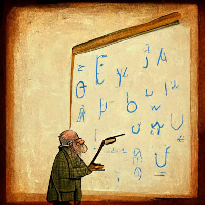

# 究竟 余光中 識唔識英文？

受仆教授煽動拜讀 余光中老師鴻文《怎樣改進英式中文？》[0]，自覺中文忽然改善咗唔少。余老文中對現代流行中文嘅批評大概係一針見血，令我得益良多。

不過，越睇余老舉嘅「英文」例子，越有個揮之不去嘅疑惑：「究竟呢條友識唔識英文架？」作為中文文學嘅大文豪，佢批評大眾嘅中文水平每況越下固然並無不妥。但若果余老原來對「英文」未有同等嘅造詣，隨便將「英文」妖魔化，將順手拈來嘅劣質英文當成英文之常態，似乎有失其大師級身份。喺教育普及化，媒體平民化嘅年代，每個語言都面對類似問題，事實上余老多次引用英美作家對現代英文嘅批評，亦充份證明此點。總唔能夠話因為英文出現某種弊病，所以中文出現類似問題就一定係受英文影響吧！雖然寫詩唔一定需要邏輯，但係主旨為議論嘅文章，就算唔濫用「由於⋯所以⋯」句式，作者心中亦應有基本邏輯思維，否則就只能抒己之情而已。

事實上「英文」係咪真係咁惡毒，會令人中文變差呢？首先，如果你學嘅只係劣質英文，就難免影響你語言能力。雖然我唔排除余老刻意取用劣質英文作為「稻草人」以便評擊，但此乃誅心之論，英文有句諺語：「don’t attribute to malice…」（唔記得全句係點，總之唔好假設人壞心腸）

余老文章一開頭，用咩嚟做例子呢？佢話「send a communication」應為「write」；後嚟又再重申「明明是letter，卻要說成communication」，以舉證英文臃贅成風。不過，我自問日日都寫唔少英文電郵，平時都睇唔少英文信件[1]，但實在未見過人用「send a communication」。為免只係我孤陋寡聞，我特登查過幾個英文語料庫[2]：喺 COHA，”send a communication” 有 1 個結果，”send a letter” 有 116 個結果；喺 COCA，”send a communication” 有 2 個結果，”send a letter” 有 467 個結果；喺 Hansard，”send a communication” 有 28 個結果，”send a letter” 有 418 個結果。

以上資料可以證明，”send a communication” 係十分少數嘅用法，”send a letter” 先至係正常通用用法。究竟咩人會覺得前者「顯得比較堂皇而高級」呢？睇怕係學英文未到家，見到「深字」就以為好勁嘅初階學生。我受嘅英文教育，同余老引用嘅英文作家嘅觀點一致：好嘅文字應化繁為簡。不過聽聞坊間嘅英文老師愛好教人深字同繁複句式，正如我上面提及，此乃學習劣質英文之後遺症，要怪就怪在座閣下嘅老師s，絕對唔應該怪到英文呢個語言頭上。(By the way, who the heck teaches students to write “send a communication” anyway?)

余老老屈英文嘅地方不止於此。文中批評「可讀性」此詞時，竟然大方承認此點：「我不明白這字眼怎麼來的，因為這觀念在英文裏也只用形容詞readable而不用抽象名詞readability。」既然英文並非罪惡之來源，何必苦苦追纏？後來討論「及」字時，直頭語出驚人：「『起步更早及邁步更快』簡直是英文」(!!!)。可能我唔識翻譯，不過「起步更早及邁步更快」讀起嚟一啲都唔係英文。直譯試試：”Started earlier and moving faster” 總係怪怪的。原句係「台北顯然比北京起步更早及邁步更快」，依我愚見翻成英文需要用兩個 tense，一個 past tense 一個 (present) perfect tense，因為兩件事其一已在過去完結，其二卻似乎仍然進行：”Taipei obviously started earlier and has moved faster than Beijing.” 若果要「簡直是英文」，嗰句大概會係「起步更早及至今邁步得更快」吧！至於余老繼續舉例話 “slow but sure” 唔可以寫成「慢及可靠」，我就真係睇唔明佢想表達咩意思喇。難道佢連字典都冇，認為 “but” 會被直譯成「及」？讀者固然理解「及」字唔可以濫用，但前文後理似乎毫無邏輯可言，究竟余老呢位詩人喺議論文章入面，省略咗幾多「由於⋯所以⋯」呢？

余老批評完「關於」之後，接住批評「由於」。余謂：「英文在形式上重邏輯，喜歡交代事物物的因果關係。中文則不盡然。」唔知余詩人平時讀開咩中文典籍，大概係興趣不同，可能大家涉獵唔同，對語言有唔同印像。我睇嘅中文書之中，百家書、史書，以議論為多，因果關係交代得清清楚楚；可能詩辭抒情嘅文章，多有留白供讀者想像之處，但若果你擬寫奏章，議論國家大事，豈可以詩辭態度對待？唔知余老有冇讀過漢初《鹽鐵論》，文中「是以」、「則」、「故」字貫徹全書！去到呢處我更增添一個疑惑：「究竟 余光中老師 識唔識⋯中文？」

我中文唔好，無資格批評人；事實上《鹽鐵論》我都冇讀過，哈哈。不過裡面邏輯關係就交待得好清楚，上網搵返佢出嚟 search 下關鍵字即可。網絡年代老師鳩噏，呃唔到學生嘅！

余老最語出驚人嘅一句，係「換了是英文，恐怕會說『因為清風徐來，所以水波不興』」。英文詩辭確實非我涉獵範圍，不過我印像中英文詩辭亦非「喜歡交代事物物的因果關係」。俾人玩到爛嘅 “Roses are red, violets are blue” 之後接落去嘅，應該都唔係 “therefore” 或 “thus”。我好懷疑若果英文詩人識睇中文，單憑「換了是英文，恐怕會說『因為清風徐來，所以水波不興』」呢句說話，就會引發世界第三次大戰。各位詩辭界嘅朋友不妨試試翻譯翻譯，一齊攬炒。

依我行外人猜想，余老大概係用唔同語言作唔同嘅功能。余老中文詩辭造詣高深，同時相信佢曾為外國大學教授亦有閱讀唔少英文學術文章。詩辭確實係「不喜歡交代事物物的因果關係」，我相信中英皆然，不過學術文章通常就要交待清楚。詩辭意境勝在朦瀧，議論文章卻不然，只不過中文嘅文學人未必會用到英文寫文學而已。

［寫到呢度，我都好想停手。諗起網友成日叫我化繁為簡，奈余老師文章臃長何！仲有半篇文未批評完，點可以在此收筆，愧對先烈！(?!) 所以我唯有繼續。］

余老接住批評「西化副詞片語太長」，舉「他知其不可為而為之地還是去赴了約」為例。呢句中文係冇可能直譯成英文嘅，問題正正係因為*中文*副詞片語太長。英文喺形容詞詞加 “ly” 都有個極限，例如 “Stubbornly, he attended the appointment” 或 “He steadfastly attended the appointment”，但 stubborn 同 steadfast 都係單字，冇可能同「知其不可為而為之」咁複雜嘅嘢相比啩？

事實上我喺《粵典》做粵=>英翻譯時，經常被迫將句子結構複雜嘅一句粵文翻譯成兩三句結構簡單嘅英文。例如上面嗰句，會變成 “Knowing that it was impossible, he still attended the meeting” (亦與余老嘅修改原句嘅建議相合)。誠然，英文亦有唔少複雜句式譯返中文時要拆返開做幾句，但我估計只係唔同語法所容許嘅結構唔同，並非某一語言特別傾向複雜句式。至於余老點解認為「知其不可為而為之地」係「西化副詞」，well, I have no f_cking clue. 我真係唔知英文點直譯。 (所以余老嘅英文好過我？而我中文好過佢[見上]？呢個結論會令我好沮喪喎！)

余老接住批評「的」字嘅濫用。佢話英文形容詞語尾有「 -tive, -able, -ical, -ous」中文變晒「的」。本身呢句冇錯嘅，不過由於佢冇交待前文後理嘅因果關係，我又一次難以解佢之後嘅例子同前面講嘅嘢有咩關係：

“ An old, mad, blind, despised, and dying king── “

嗰啲「 -tive, -able, -ical, -ous」去晒邊？！？！ 更搞笑嘅係，余老話「直譯」會變成：

「一位衰老的、瘋狂的、瞎眼的、被人蔑視的、垂死的君王──」

⋯ 但明明亦都可以譯成「一位衰老、瘋狂、瞎眼、被人蔑視、垂死的君王」。你試下去叫一個小學生將 “old” 譯成中文，佢一定會答你「老」，而唔係「衰老的」！究竟「衰老的」從何而來？濫用「的」字係因為受英文影響，定係因為啲人中文水平未到家學啲二三流文青將「的」字當青豆咁食？答案顯而易見。

文章唔交待因果關係，正正就係方便將邏輯唔通嘅論點胡混過去。老實講，喺睇開議論文章嘅「行家」眼中，呢啲技倆不值一哂。

余老接住批評「前飾」，重施故技。佢引用英文例子：”I saw a man who looked like your brother”。”Looked like a brother” 用嚟修飾 “man”，喺句中排其後，所以係「後飾」。然後余竟然話「若用中文來說，一般人會不假思索說成：『我見到一個長得像你兄弟的男人。』」(!!!)

如果英文嘅後飾句會被中文人譯成前飾句，呢個現像只能夠證明中英各自不同，喺呢方面並無互相影響。點可以話係「英式中文」？事實上，正如本文上述其他例子，我係唔識得將「長得像你兄弟的男人」直譯成英文嘅。難道要寫成 “your-brother-lookalike man”？最後只能夠乖乖變返做原句用 “who” 連接。多個例子都證明，英文本來句式就冇余講得咁複雜，呢啲「腫贅」、「繁複」嘅現像，反而更似係中文白話文自闢蹊徑。至於係好事定壞事，我就冇資格評論嘞。

寫到呢度，似乎終於可以完結。余老文章雖然邏輯不清兼夾涉嫌老屈，但我真心覺得自己讀完之後中文進步咗。冇批評嘅地方，大概係我欣賞同接受佢觀點，所以唔提。 (反正已經寫到咁長，唔通仲加多幾句「老師又中」咩！）

暫時唔寫結語喇，反正頭幾段引言講晒。（自己 scroll 返上去睇多次） 至於 余光中老師 識唔識英文，我諗都係留返俾大家自己判斷。

⋯ 又係凌晨四點幾，各位老師晚安！(錯字聽日先執。)

— —

- [0] https://news.mingpao.com/ins/%E6%96%87%E6%91%98/article/20171215/s00022/1513328994116/%E6%80%8E%E6%A8%A3%E6%94%B9%E9%80%B2%E8%8B%B1%E5%BC%8F%E4%B8%AD%E6%96%87-%E2%94%80%E2%94%80%E8%AB%96%E4%B8%AD%E6%96%87%E7%9A%84%E5%B8%B8%E6%85%8B%E8%88%87%E8%AE%8A%E6%85%8B%EF%BC%88%E6%96%87-%E4%BD%99%E5%85%89%E4%B8%AD%EF%BC%89?
- [1] 我由細到大習慣，中英對照嘅公文一律睇英文。學習環境所然，所以我真係唔識中文嘅，呢篇文亦都絕對唔係喺中文寫作方面表達任何意見。
- [2] https://www.english-corpora.org/

