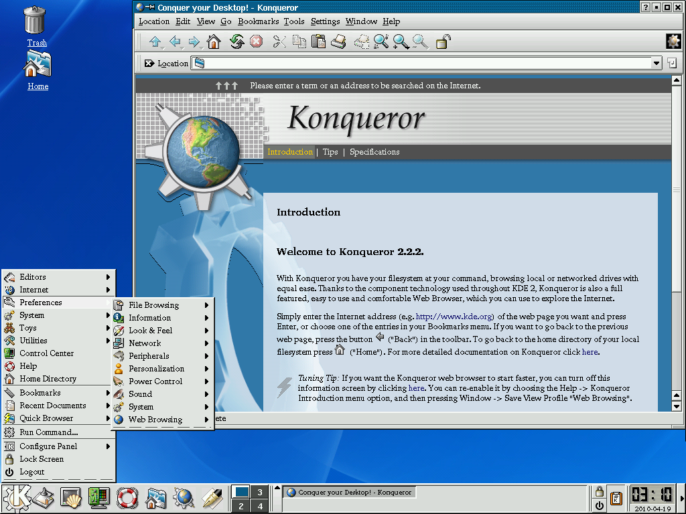

# Konqueror

It was more than 20 years ago when I first saw it.

Those were the days when Internet Explorer was at its peak glory. IE5, being (unsarcastically) the best web browser in the world at the time, killed off Netscape in a high stakes battle to become the world's de-facto interface to the Internet.

At that time, I recently switched to using Linux as my main OS, somewhat as an ideological statement against the inevitable Microsoft dominance over the tech industry. I also loved the developer-friendly environment having discovered the power of having the \*nix OS at my fingertips. The only problem with Linux at that time, was that it did not have a functional web browser.

Yes, in 2000, Linux did not have a functional web browser.

Some older Linux distributions gave you Netscape 4, but Netscape 4 was well known to be buggy and by 2000 already very out of date. (Netscape 6 was utter garbage) *Everyone* was using IE5, and many web sites just flat out did not work on Netscape. Mozilla was at version "0.6". Previously it was called "Milestone 18", which did not inspire much confidence. Whatever they called this thing, the UI was slow and laggy. Memory intensive too. They invented something called XUL that allows developers to write UI for applications using XML and Javascript -- if you thought Electron is slow now with hyper-optimized JS engines, imagine that happening in 2000.

There was also w3m of course, but I never got the hang of it, even with its graphics extensions on xterm.

Anyway, shortly after KDE2 was released, I downloaded it and ran it for the first time. Imagine my shock when I saw a fully functional, mostly standards compliant, *fast* browser that incidentally showed up as one of the apps. I literally didn't believe it, I loaded a couple web sites I had in development, tried to run Javascript on it, and it just worked. I still remember how mind blown I was when "" popped up a new window. Javascript engines are a dime a dozen these days, but in 2000 given how many man-hours were poured into developing IE and Netscape/Mozilla, I think I can be pardoned for naïvely presuming that it requires a multimillion dollar project to make one.

https://en.wikipedia.org/wiki/K_Desktop_Environment_2#/media/File:KDE_2.2.2.png

I mostly did web development at the time, which precluded me from using Konqueror as my main browser since I couldn't use it to check HTML rendering fidelity (as in, rendering properly on IE and Mozilla), but it did imprint a lasting impression on me -- this was a small sub-project in KDE, yet it was more than competitive with the big browsers, arguably much better than Mozilla was at the time. It was such a pity that only KDE users would have the chance to use it.

After using KDE for a while, I eventually settled on GNOME2 as my main desktop environment (I hated KDE's IE/ActiveDesktop-like asthetic, and the important apps in GNOME, Evolution and Nautilus, were better), and by that time Mozilla/Firefox was improving to become a somewhat reliable web browser, so my time with Konqueror was actually quite brief. (btw, KDE and QT were both great software that didn't get as much credit as they should have.)

Fast forward 20 years. Some of Steve Job's underlings must have been similarly impressed by the project and adopted the code in Apple's new Safari web browser as part of WebKit. Google forked WebKit and created Chrome. IE died of neglect and Microsoft's new browser is also based on Chrome. Mozilla's Firefox is now on life support. Microsoft never achieved its then-seemingly inevitable world domination. Who would have thought that 90+% of web traffic these days originate from a Konqueror descendant.

Anyone who was there at the time would have thought IE's domination was unassailable and seemed capable of lasting forever. It took Konquer's descendants more than 10 years for them to do it, but looking back, it feels pretty amazing how a tiny little browser nobody had heard of eventually beat IE at its own game.

