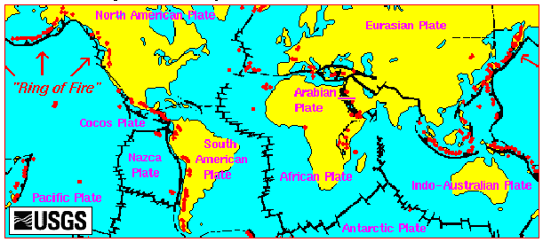

# 崑崙 = 埃及金字塔

「崑崙」係中國古代傳奇地方，神仙聖賢居所。至於崑崙實際喺邊，冇人知。有人話係西藏崑崙山脈，但古籍似乎唔係描述緊一個延連千里嘅山脈，一係一座大「山」。

埃及金字塔同中國古籍流傳嘅「崑崙」有好多吻合之處。當然唔係100%，始終千里之外流傳幾千年嘅紀錄好易走樣，不過我認為諸多跡像未必純屬巧合，就算難以確定真實性，亦應該有參考價值。

第一個證據係「崑崙」嘅音。金字塔幾時同點樣建築係古埃及嘅一個疑案。主流講法係埃及法老 Khufu ~2600-2500BC 建造。當然好多人都唔信4000年前埃及人有能力起一座咁大嘅建築，所以有人話係(被大洪水毀滅嘅)史前超高科技文明甚至係外星人建築。無論如何，二千年前嘅埃及人似乎都係認為大金字塔係 Khufu 建造。Khufu 全名 Khnum Khufu (英文音譯)。「崑崙」好可能係 Khnum 音譯。

留意今人稱「崑崙」做「崑崙山」，但大部份古籍都係叫「崑崙」做「崑崙之墟」或「崑崙之丘」，所以「崑崙」應該唔係一座好似「泰山」噉嘅嘢嚟。「墟」可以解「山」，但似乎都有 "Ruins" 嘅意思，即係年代久遠嘅人為建築。有「之」字，即係前面可以係人名（而唔係山名）。所以照呢個解釋，「崑崙之墟」係 "Ruins of Khnum (Khufu)" 咁解。

先秦古籍講「崑崙」主要來自《山海經》同《穆天子傳》：

* 《山海經．西山經》：西南四百里，曰崑崙之丘，是 **實惟帝之下都** ，神陸吾司之。**其神狀虎身** 而九尾，**人面** 而虎爪；是神也，司天之九部及帝之囿時。
* 《山海經．海內西經》：海內崑崙之墟，在西北，帝之下都。崑崙之墟，方八百里，高萬仞。上有木禾，長五尋，大五圍。**面有九井**，以玉為檻。面有九門，門有開明獸守之，百神之所在。在八隅之巖，赤水之際，非仁羿莫能上岡之巖。
* 《山海經．海內西經》：崑崙南 **淵深三百仞**。**開明獸身大類虎** 而九首，皆**人面**，東嚮立崑崙上。
* 《山海經．大荒西經》：西海之南，流沙之濱，赤水之後，黑水之前，有大山，名曰崑崙之丘。有神，**人面虎身**，有文有尾，皆白，處之。**其下有弱水之淵**環之，其外有炎火之山，投物輒然。有人戴勝，虎齒，有豹尾，穴處，名曰西王母。此山萬物盡有。

* 《竹書紀年．穆王》：王西征昆侖丘，見西王母。
* 《穆天子傳》：河宗又號之：「帝曰：『穆滿，示女舂山之寶，詔女昆侖□舍四平泉七十，乃至於崑崙之丘，以觀舂山之寶。賜語晦。』」天子受命，南向再拜。
* 《穆天子傳》：天子升于昆侖之丘，以觀黃帝之宮，而豐隆之葬，以詔後世。
* 《穆天子傳》：天子□昆侖，以守黃帝之宮，南司赤水，而北守舂山之寶。

## 「開明獸」就係獅身人面像(Sphinx)。

「崑崙就係金字塔」最確實嘅證據，主要係獅身人面像。呢個巨大雕像太過 iconic，山海經三次提及「崑崙」有「人面虎身」嘅神獸守護：

1. 西山經：「其神狀虎身而九尾，人面而虎爪」
2. 大荒西經：「有神，人面虎身，有文有尾，皆白」
3. 海內西經：「門有 **開明獸** 守之，百神之所在。[...]開明獸身大類虎而九首，皆人面，東嚮立崑崙上。」

山海經喺唔同嘅位唔同篇章用唔同字眼描述同一樣嘢，照計可以推斷係多過一個來源，同埋「抄錯機率」低啲，比《山經經》其他內容可信性高啲。獅身人面像的確係面向東方，「人面虎身」基本上係吻合。「九首」、「九尾」唔 match，不過有人話獅身人面像個頭係後世再修改過，所以頭細身大。有人話以前係獅頭嘅，不過如果某個年代曾經畫過九個人頭落去都唔係話冇可能嘅(?)

至於點解叫「開明獸」，難道佢好開明？唔關事，又係音譯。據網上資料，古埃及叫獅身人面像做 “Hor em-Akhet” (英意思 Horus on the horizon) "The ancient Egyptian was able to show the statue representing the god Horus between the pyramid of Khufu and Khafra, or between the two horizons"。"Hor em" 就係「開明」。

## 金字塔不為人知嘅地下建築

山海經描述崑崙「面有九井」、「南淵深三百仞」、「其下有弱水之淵環之」驟眼睇好似唔 match，但其實係準確描述緊金字塔嘅建構。金字塔下面的確有「井」同「淵」，應該係超級冷知識嚟：

- [First Time Exploring The Astonishing Osiris Shaft On The Giza Plateau](https://www.youtube.com/watch?v=quUtlWTB_dc)
- [Clear Evidence That The Great Sphinx Of Egypt Is Hollow](https://www.youtube.com/watch?v=QdVwg_dYG6U)
- [Exploring Tunnels UNDER Egypt's Giza Plateau Part 1](https://www.youtube.com/watch?v=Ba6G9vyhVFU)
- [Exploring Tunnels UNDER Egypt's Giza Plateau Part 2](https://www.youtube.com/watch?v=vihLxTVGJ3Y)
- [Exploring Tunnels UNDER Egypt's Giza Plateau Part 3](https://www.youtube.com/watch?v=MKjGbCJfb9w)

「實惟帝之下都」呢句幾有趣。古人係咪對金字塔嘅構建同目的有同樣疑惑呢？或者金字塔雖以法老 "Khnum Khufu" 為名，但有識之士認為其實另有用途，就會用「實惟」。「帝之下都」可以有幾種解釋：

1. 法老陵墓 - 呢個係最悶嘅解釋，個人亦覺得最低可能性。當大家都覺得金字塔係陵墓，加句「實惟」似乎冇必要；反而下面嗰啲解釋更加符合「實惟」
2. 「天帝」地上嘅都城 - 即係外星人喺地球嘅基地。古籍中「帝」係有某種「傳奇性」嘅聖賢人物嚟，在「天子」之上，所以指高於當時人類水平嘅外星人係合乎表面意思嘅；外星人嘅「下都」就自然係地球基地喇。計我話，呢個咁驚人嘅發現，先至符合「實惟」嘅轉折意思
3. 金字塔下面仲有嘢 - 金字塔下面的確有一堆隧道。唔知係咪有地下城呢？

## 古代中國人冇可能去到埃及咁遠？

好多人俾「人類發展必然係不斷進步」嘅假設限制咗想像，以為漢朝張騫去唔到埃及，先秦時期嘅中國人都一定未去過埃及。但係，就算假設漢朝「科技」比周朝進步，都唔代表周人去唔到埃及架喎！張騫出使西域困難重重，唔係技術水平唔夠，而係匈奴阻礙，想獨攬絲路生意利潤，唔俾漢使西進。如果先秦時期交通冇咁發達，中西冇貿易來往，國家派出嘅使者反而較「容易」穿越大西北去到古巴比侖、波斯、埃及等地方，因為中途遇到嘅部落冇誘因阻礙。況且，與其穿鑿附會話中國天子對青海高原、戈壁沙漠一帶嘅原始部路有興趣，不如諗下以周天子之尊貴，當時世界上有咩文明可以相提並論？咁肯定係「四大明文古國」之類。

所以「周穆王西征到埃及見西王母」雖然聽落天方夜譚，但如果周穆王時代有個能夠同周天子平起平坐嘅帝王，就只能夠係巴比倫同埃及。（印度都得，不過唔啱路線。)

地理位置嚟講，山海經東經、西經、北經都有提及「崑崙」，亂到七彩 (不過有實際描述嘅主要都係XX西經)，所以要從古籍鎖定某一個位置係冇可能。不過其中「大荒西經」嘅描述係準得驚人，唔知可唔可以話係巧合：「西海之南，流沙之濱，赤水之後，黑水之前，有大山，名曰崑崙之丘。」睇返張地圖就明：

另外山海經話崑崙之外有「炎火之山」，我望返地球上嘅活火山位置，埃及東面、沙特阿拉伯西邊，係有一堆活火山嘅。中國以要搵到活火山，西藏的確有幾個，不過長年熱辣辣嘅，可能真係要去到沙特阿拉伯，所以雖然埃及係遠，但如果山海經呢啲描述有事實根據，就只能夠係中東或更西嘅位置。

司馬遷喺《史記》特登評論話，張騫出使西域走過咁多路都冇聽過崑崙山，所以「崑崙」肯定係虛構嘅傳說。呢一點係幾有趣嘅，因為張騫冇去過埃及，所以一係就如司馬遷所講「崑崙」從來唔存在，一係「崑崙」位置比張騫到達嘅地方更遠！(班超團隊聲稱去過「條支」(應該係埃及嚟)，不過只係話地中海好大，去羅馬好遠，唔Q去喇。冇提過金字塔。) 記住，漢朝去唔到嘅地方，唔代表以前冇人去過。

有啲古籍記載崑崙係「黃帝之宮」，而黃帝有冇可能真係埃及人呢？一來中國考古仲未搵到「夏朝」，五千年前好似話只有兩河流域同埃及有古蹟，而某啲學者就話，中華文化源於兩河流域 (eg. https://en.wikipedia.org/wiki/Sino-Babylonianism ) ，所以話金字塔係上古賢者「黃帝」嘅住所，都未嘗唔係一個合理嘅猜想。

## 河宗 柏夭 => 埃及法老？

《穆天子傳》有個重要人物叫「河宗柏/伯夭」。「河宗」唔知係咩嚟，可能係人名，可能係氏族名，可能係地方名，甚至可能係國家名。可能係音譯，可能唔係。我傾向覺得係地方名，因為《穆天子傳》同時有提過「河首」。康熙字典曰：「百川以海爲宗」，所以「河宗」字面解係河流入海嘅地方。如果以「西王母、崑崙喺埃及」嘅前提考慮，埃及喺 Nile River 流入海嘅位置，其實係可以對得上嘅。至於「伯夭」或「柏夭」，雖然個「伯」字令人諗起貴族職階，但呢兩個字嘅音同「法老」咁啱撞音 (Wikipedia話古埃及法老唔係 "Fa" 音而係 "P")。

周穆王見伯夭好大陣仗：「天子命吉日戊午。天子大服：冕禕，帗帶，搢曶，夾佩，奉璧，南面立于寒下。曾祝佐之。」呢個證明伯夭身份非一般，如果係埃及法老或者大祭司就門當戶對。當然，亦都可能係同之後要做嘅嘢有關，因為呢個「河宗伯夭」上通天帝。先秦嘅「帝」通常係同「天神」差唔多，比「王」、「天子」更高一級。所以呢段係描述伯夭向周穆王傳達「天帝」旨示：

// 河宗□命于皇天子，河伯號之：「帝曰：『穆滿，女當永致用時事！』」南向再拜。河宗又號之：「帝曰：『穆滿，示女舂山之寶，詔女昆侖□舍四平泉七十，乃至於崑崙之丘，以觀舂山之寶。賜語晦。』」天子受命，南向再拜。 //

無論「伯夭」係咪 "Pharoah"，佢都肯定係非一般人物，可以幫周天子問米。佢唔係坊間所謂「善御者」、「周天子護從」，更加唔係康熙字典「夭」字解「馬名」(呢個真係wtf)

當然，西域嘅河有好多條，除咗 Nile River，Tigris 同 Euphrates 都係出名嘅河流。以字面意思嚟講，Tigris/Euphrates 合流出海嗰度叫「河宗」可能更 make sense。《穆天子傳》話穆王見完河宗之後仲要西行一段路先見到西王母，所以如果西王母喺埃及，咁「河宗」喺埃及東面 i.e. 今日伊拉克伊朗古波斯巴比倫嗰頭都唔出奇。

不過話返轉頭，呢個「河宗伯夭」帶周穆王去「崑崙之丘，以觀舂山之寶」，如果佢唔係埃及法老或大祭司，又邊有權帶周穆王去參觀金字塔？（當然另一種講法就係，穆天子傳半真半假，呢啲內容不得太認真。）

## 西王母 = Sekhmet

傳說崑崙附近有個西王母：

* 《山海經．西山經》：玉山，是西王母所居也。**西王母其狀如人，豹尾虎齒而善嘯，蓬髮戴勝，是司天之厲及五殘**。
* 《山海經．海內北經》：西王母梯几而戴勝杖，其南有三青鳥，為西王母取食。在崑崙虛北。
* 《山海經．大荒西經》：西海之南，流沙之濱，赤水之後，黑水之前，有大山，名曰崑崙之丘。[...]**有人戴勝，虎齒，有豹尾，穴處，名曰西王母**。此山萬物盡有。
* 《穆天子傳》：天子賓于西王毋。乃執白圭玄璧以見西王毋。好獻錦組百純，●組三百純。西王毋再拜受之。●乙丑，天子觴西王毋于瑤池之上。
* 《列子．周繆王》：賓于西王母觴于瑤池之上。
* 《史記．趙世家》：繆王使造父御，西巡狩，見西王母，樂之忘歸。
* 《漢書》：安息長老傳聞條支有弱水、西王母。亦未嘗見也。
* 《後漢書》：或云其國西有弱水、流沙，近西王母所居處，幾於日所入也。 -- (係後漢書作者指出啲唔可信嘅嘢，但起碼可以睇得出當時學者相信西王母係咩嚟)

上面記載，大概可以總括出「西王母」喺極西嘅地方，近崑崙之墟。漢朝時有人認為可能喺「條支」(埃及)。實際描述係「西王母其狀如人，豹尾虎齒而善嘯，蓬髮戴勝，是司天之厲及五殘。」、「有人戴勝，虎齒，有豹尾，穴處」。（當然秦漢以後啲人加鹽加醋將「西王母」變成「王母娘娘」同「玉皇大帝」配對，但先秦古籍係從來冇話「西王母」係女人嚟。）

埃及有個好出名嘅神叫 Sekhmet，啱音(「王」字古音好似有 "h~"？)，又係人身獅面(唔係獅身人面)。「司天之厲及五殘」都係 100% 吻合。Wikipedia 咁樣描述：

*Sekhmet was the daughter of the sun god, Ra, and was among the more important of the goddesses who acted as the vengeful manifestation of Ra's power, the Eye of Ra. Sekhmet was said to breathe fire, and the hot winds of the desert were likened to her breath. She was also believed to cause plagues, which were called her servants or messengers, although she was also called upon to ward off disease.*

另外必須提嘅係，埃及有個法老叫 Siamun，都同「西(王)母」係啱音，亦係周穆王差唔多時期嘅人物。會唔會周穆王走去到埃及，見到 Siamun，就以為係見到傳說中嘅「西王母」呢？

## 《穆天子傳》對埃及嘅其他描述

### 縣圃 = Hanging Garden (of Babylon fame?)

* 穆天子傳：季夏丁卯，天子北升于舂山之上，以望四野，曰：「舂山，是唯天下之高山也。」孳木□華畏雪，天子於是取孳木華之實，。曰：「舂山之澤，清水出泉，溫和無風，飛鳥百獸之所飲食，先王所謂縣圃。」

雖然古籍對「崑崙」某啲描述對得上埃及金字塔，但亦都有好多位唔 match。尤其係講「崑崙」上面有草鳥花木嗰啲，同光脫脫嘅金字塔牛頭唔對馬嘴。我就喺度諗，會唔會係撈亂咗其他嘢呢？「崑崙」會唔會其實係「巴比侖」或「白比侖」嚟？始終古巴比侖有個傳說中嘅「空中花園」，又係一個有各種動植物嘅巨型人工山丘。嗰啲講「崑崙」有「縣圃」嘅記戴，會唔會講緊呢樣嘢呢？「縣」通「懸」，對得上歐洲記載嘅「Hanging Gardens」。如果有樣嘢叫「昆侖」，另一樣嘢叫「白比侖」，我諗啲古籍抄抄下合二為一係一啲都唔奇，甚至唔撈亂先至出奇。以前巴比倫會唔會真係叫「白比侖」？呢個巧合機會細啲，但唔係冇可能。

如果咁理解，「此山萬物盡有」、「上有木禾，長五尋」、「帝之囿」係指空中花園，就勉強講得通。

### 瑤池 = 浴場 ?

浴場最出名係羅馬，但似乎再早期嘅埃及同希臘都有。埃及會唔會曾經有一樣類似咁嘅建築呢？ https://en.wikipedia.org/wiki/Great_Bath,_Mohenjo-daro 想像下周天子去到埃及，埃及王(或大祭司)喺浴場相迎，周人未見過咁嘅場面，梗係會大書特書。

## 總結

近年親身經歷過唔少有可能成為他日歷史嘅事，眼見啱啱發生嘅事已經被媒體、法庭、政府、大眾輿論等勢力修飾到不似原形，我深知任何歷史都冇可能係客觀描述真相嘅原貌。所以歷史嘅嘢係冇得「證明」嘅，尤其係靠文獻記錄分析，就算由「信一成」到「信九成」都唔係咩「證明」，最多只係自圓其說而已。

證據陳列在前，古籍對「崑崙」某啲描述同埃及金字塔十分吻合。冇人可以「證明」兩者係同一樣嘢，但我個人認為「崑崙」嘅原形好可能就係埃及金字塔。俗語有云：至於你信不信？我反正信了。
