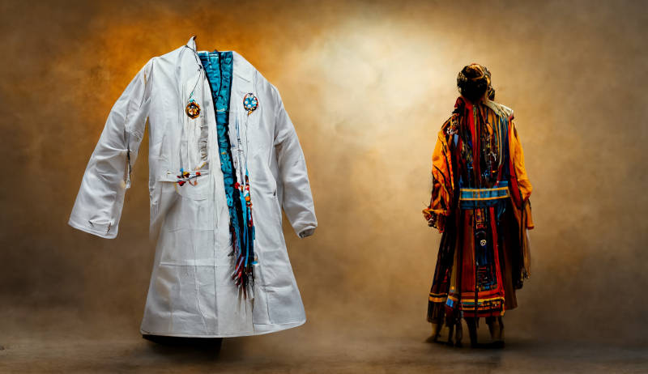

# 西方醫學 vs 所謂「巫醫」

尋晚唔覺意見到 cuhk secrets 有人鬧英語教學單位推出啲介紹「巫醫」嘅課程俾醫科生。

本身學生入大學白紙一張，讀書就係洗腦嘅過程，等於啲人讀籮會以為「法治有險可守」，讀醫嘅就會傾向以為西醫係唯一正統醫術，其他嘅民間偏方都係邪魔外道；本身呢個係文化帝國主義嘅問題，冇咩得搞。

我固然唔識醫學，不過都知道西醫普偏對其他醫術傳統嘅蔑視冇咩憑據。一來坊間啲偏方千奇百怪，就算大部份冇用，都唔代表全部係假。你固然可以 *假設* 呢啲未經證實嘅嘢「冇根據」所以係「冇用」，但若果要企喺「科學精神」講「證據」呢啲道德高地，其實你係要做大型臨床實驗去驗證呢啲偏方係咪真係冇用，否則只能夠話「唔知道有冇用」，而唔係「冇用」。

而呢種「唔知道」其實只係西方醫學唔承認而已。有啲傳統醫術流傳咗幾百年，嗰啲 practitioners 經過多年臨床驗證，佢哋話得喎，你唔識／唔信咋嘛（等於美國人都唔信口罩可以抗COVID）。呢啲嘢口同鼻拗，有啲似「邊個發現美洲大陸」嘅問題：歐洲人話係哥倫布，但你有冇問過美洲原住民先？

上面嗰啲都只係文化帝國主義嘅嘢，只要你唔當其他文化係值得尊重就冇呢個問題。（唔建議咁做不過歐洲以前的確係有咁嘅傳統）但更緊要嘅嘢係，本身西醫係好清楚啲「巫醫」係有效嘅。係呀，西醫係好清楚「巫醫」係比乜柒都唔做更有效嘅。不過佢哋稱之為「placebo effect」。現代醫學研究頭號敵人就係 placebo effect，一隻新藥或新療法如果證明唔到自己比 placebo effect 更有效就基本上即係冇用。

點解好多傳統文化(包括歐洲)巫術同醫術合流，就係因為 placebo effect 嘅療效同病人信念掛勾，病人越相信藥物有效，placebo effect 就越強。有趣嘅係，西醫明明清楚知道呢件事，但又冇乜訓練人利用 placebo effect 去加強療效，只係出盡全力嘗試將其排除在實驗室之外。

本身醫學研究要排除 placebo effect 係因為希望搵到更有效嘅藥物同療法，方向係正確嘅。但作為面對病人嘅 practitioner 嚟講，心態上否定 placebo effect 嘅實際功效只係一種「無神論信仰」，對病人冇好處。舉個極端例子，你係一個醫生，去到一個偏遠村落，嗰度有個病人發高燒。你口袋入面得一粒糖，你會點做呢？

如果病人知道你係醫生，咁你俾粒糖佢呃佢係退燒藥，可能會令佢舒服啲。不過，如果病人係信「巫醫」嘅，咁你都係幫手搵返條村嘅「巫醫」嚟睇佢好啲喇，因為，就算呢個巫醫手上冇藥，都只係得一粒糖，佢嘅療效都會比你嘅強。何況，現代西醫唔興搽到成身香草藥味手舞足蹈咁念咒語，但有啲巫醫會交足戲，好似話都會增強到 placebo effect。(如果有研究話醫生念咒語會醫多1%嘅病人，你會唔會做？)

至於呢樣嘢有冇科學解釋我就真係唔知喇，不過臨床西醫靠 placebo effect 醫人嘅成份都唔低 (尤其係啲傷風咳止痕止痛死唔去嗰啲)，用輕蔑嘅態度話其他人唔科學真係有唔止少少虛偽同仆街。

好多人鍾意講「批判思維」，某程度上學生真係擁有批判思維嗰陣，就會開始唔合規格。最吊詭嘅係，大家其實係真係唔想醫學院嘅本科生走去研究另類療法架，所以有唯有「教外別傳」，等聰明嘅人日後慢慢發現冇被傳授嘅真相。

