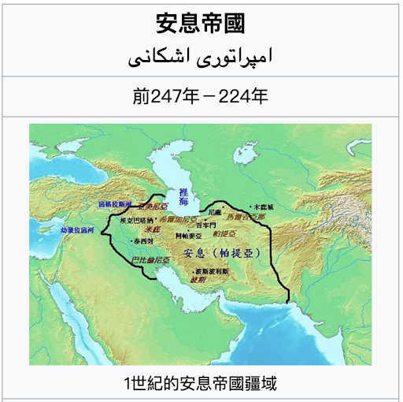
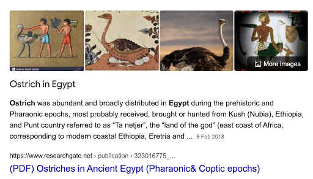
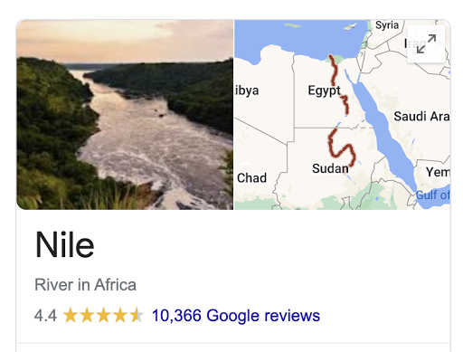
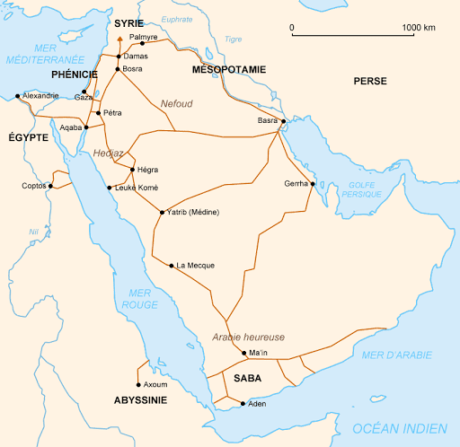
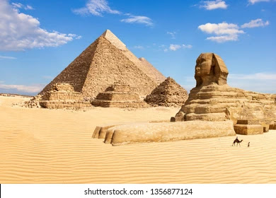
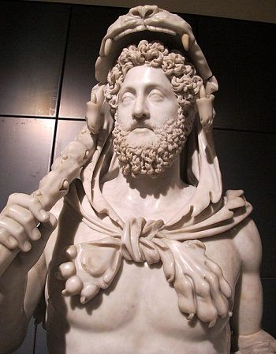

# 西王母 = 埃及法老王？！

最近睇到啲有趣嘢。

好似話「西王母」可能係埃及法老王。

第一次聽呢個講法係呢度： https://www.youtube.com/watch?v=pgdQ9n4jAVA

然後呢段片就形容得更清楚： https://www.youtube.com/watch?v=ja3T1c0gQRI

現代「王母娘娘」嘅形像，係被道教神話描寫成類似仙女般嘅人物。但一開始先秦典籍嘅「西王母」係半人半獸嘅神話人物嚟。我哋唔係講緊「仙女王母娘娘」，而係先秦時代流傳嘅「西王母」。

上面啲片講《山海經》同《穆天子傳》，啲人話係「神話」，講下就算。但最屈機嘅係，正史寫得清清楚楚。

《史記．大宛列傳》：

> 安息在大月氏西可數千里。其俗土著，耕田，田稻麥，蒲陶酒。城邑如大宛。其屬小大數百城，地方數千里，最為大國。臨媯水，有市，民商賈用車及船，行旁國或數千里。以銀為錢，錢如其王面，王死輒更錢，效王面焉。畫革旁行以為書記。其西則條枝，北有奄蔡、黎軒。
>
> 條枝在安息西數千里，臨西海。暑溼。耕田，田稻。有大鳥，卵如甕。人眾甚多，往往有小君長，而安息役屬之，以為外國。國善眩。安息長老傳聞條枝有弱水、西王母，而未嘗見。

大月氏好似話係今日阿富汗嗰頭，「**安息**」就係 Assyria 或 Arsacid Empire，即係今日伊朗嗰頭。

伊朗西邊有啲咩呢？「西海」。伊朗西邊得一個海架啫，就係我哋今日叫「地中海」嘅地方。伊朗以西，臨地中海嘅有咩國家？**埃及！**

*條支* 呢個名有啲麻煩，9-google 見到有人話係 Antioch 又話係 Colchis，一派胡言[1]。好明顯「*條支*」係**埃及**啦！睇下描述：

> 「有大鳥，卵如甕。」

「**往往有小君長**」即係啲國王係細路仔。

> // Ptolemy V Epiphanes, son of Philopator and Arsinoë, was a child when he came to the throne //
>
> // He was succeeded by his infant son Ptolemy VI Philometor. // [2]

呢兩個埃及王係漢朝同期，有可能係講佢哋。

「**而安息役屬之，以為外國。**」 呢個係講緊「條支」係安息嘅藩屬國，好可能係指漢朝同期嘅 Antiochus IV Epiphanes 打埃及：

> // Antiochus had prepared more thoroughly and launched a preemptive strike against Egypt, defeating a Ptolemaic force and seizing Pelusium. He then advanced into Egypt proper, conquering all but Alexandria and capturing King Ptolemy // [3]

「安息長老傳聞條枝有**弱水**」

「弱水」係河流，通常見於神話傳說。嗰頭有咩出名嘅河流？

《後漢書》（又係「正史」）都有講「條支」：「*條支國城在山上，周回四十餘里。臨西海，海水曲環其南及東北，三面路絕，唯西北隅通陸道。土地暑溼，出師子、犀牛、封牛、孔雀、大雀。大雀其卵如甕。*」

嗰啲動物名大家都識啦，都係非洲動物嚟 (大雀即係鴕鳥，見上；封牛可能係 buffalo?)。至於地理呢，「**海水曲環其南及東北，三面路絕，唯西北隅通陸道**」，係講緊呢嚿嘢：

雖然 Arabian peninsula 唔係 Egypt proper，但差唔多啦。

關於「條支」講多句，羅馬時期 Egypt 係叫 Aegyptus，雖然個音唔係好 match，但「支」係 "gypt" 都叫做解釋得到，只係個「條」字唔知點嚟。事但啦，可能抄錯字呢。(不過諗唔到可以點錯法⋯)

Anyway，上面應該都足夠論證「條支」就係今日嘅埃及，「西海」係地中海。而根據《史記》轉述，條支國可能有西王母。

正史啲嘢就好準嘅，因為張騫出使西域十幾年，《史記》就新鮮熱辣將佢嘅見聞記錄低。以下要講下關於「西王母」啲「神話」，就未必 match 得好準。不過既然「西王母」有埃及嘅關聯，咁呢啲描述就幾有趣嘞：

《山海經·大荒西經》：「**西海之南，流沙之濱，赤水之後，黑水之前，有大山，名曰崑崙之丘。有神人面虎身，有文有尾，皆白，處之**。其下有弱水之淵環之，其外有炎火之山，投物輒燃。有人戴勝，虎齒，有豹尾，穴處，名曰西王母。」

西海之南，流沙之濱，赤水之後，黑水之前

有大山，名曰崑崙之丘。有神人面虎身，有文有尾，皆白，處之。

按：關於「皆白」，好似話金字塔本身係有一層大理石(Marble)覆蓋嘅，所以係白色。「處之」係「不動」、「唔郁」嘅意思。石象嘅神梗係唔郁 :)

《山海經》：「西王母其狀如人，豹尾虎齒而善嘯，蓬髮戴勝，是司天之厲及五殘。」「戴勝，虎齒，有豹尾，穴處，名曰西王母。」諗諗下比較似 Hercules 之類嘅人物？(「戴勝」都唔知係咪「大力」變出嚟嘅...)

順帶一提，佛教大力金剛嘅原型都係 Hercules :0) [4]

不過去到《穆天子傳》西王母嘅形像就已經唔同咗，變成西域一個女神仙：

> 「吉日甲子，天子賓于西王母。乃執白圭玄璧以見西王母。」
>
> 「天子觴西王母于瑤池之上。西王母為天子謠，曰：『白雲在天，山䧙自出。道里悠遠，山川間之。將子無死，尚能復來？』天子答之，曰：『予歸東土，和治諸夏。萬民平均，吾顧見汝。比及三年，將復而野。』 ...西王母之山還歸丌世民作憂以吟曰：『比徂西土，爰居其野。虎豹為群，於鵲與處。嘉命不遷，我惟帝女，彼何世民，又將去子，吹笙鼓簧，中心翔翔。世民之子，唯天之望。』」
>
> 有趣嘅係，《穆天子傳》話穆王見完西王母之後，叫部下喺曠原打獵勞償將士，同埋收咗一百車羽毛皮革。原文有一堆「鳥」同「羽」字，似乎係打雀收羽毛為主，唔知隻雀係咪又係駝鳥呢？

周穆王 Big Game Hunter?

老老實實，《穆天子傳》入面個西王母其實冇任何同埃及有關嘅證據，不過又冇咩矛盾咁啫。有可能係西域一個女王，甚至係一個貴族女性，甚至未必係女人嚟 (唔排除「西王母」部份係音譯做漢字，然後啲人見到個「母」字就以為係女性⋯)

不過呢，又睇返「正史」，《史記．趙世家》話趙國老祖宗係幫周穆王平亂而得到封地：「繆王使造父御，西巡狩，見西王母，樂之忘歸。而徐偃王反，繆王日馳千里馬，攻徐偃王，大破之。乃賜造父以趙城，由此為趙氏。」所以如果西王母真係喺「條支」(埃及)，夾硬亂咁搵，唔知呢個又關唔關事呢？

介紹返先，(我都係啱啱搵搵下先知道) 呢條女叫「Sekhmet」個音都幾似「西王母」⋯

> Sekhmet... is a warrior goddess as well as goddess of healing. She is depicted as a lioness. She was seen as the protector of the pharaohs and led them in warfare. Upon death, Sekhmet continued to protect them, bearing them to the afterlife. Sekhmet is a solar deity, sometimes called the daughter of Ra. She also was given titles such as the "(One) Before Whom Evil Trembles", "Mistress of Dread", "Lady of Slaughter" and "She Who Mauls". (Wikipedia)

望返上面啲「其狀如人，豹尾虎齒而善嘯，蓬髮戴勝，是司天之厲及五殘。」都真係幾似。 (不過會唔會夾硬嚟咗啲？ :0)  我就覺得呢個假說幾有趣，反正《山海經》同《穆天子傳》太多神怪嘢唔可以太認真，大概去到咁嘅地步就要收手了。

結論係，「西王母」同古埃及似乎有啲關聯，不過係咪法老王就不得而知。但埃及又係出名有女法老王，或者女貴族好大權力，所以⋯ 嫌疑都幾大 :D [法官大人：疑點歸被告，退堂]

- [1] https://crrs.org/w/wp-content/uploads/2016/07/88-p87-DrLeung.pdf
- [2] https://en.wikipedia.org/wiki/Ptolemaic_Kingdom
- [3] https://en.wikipedia.org/wiki/Antiochus_IV_Epiphanes#Wars_against_Egypt_and_relations_with_Rome
- [4] https://en.wikipedia.org/wiki/Greco-Buddhism
