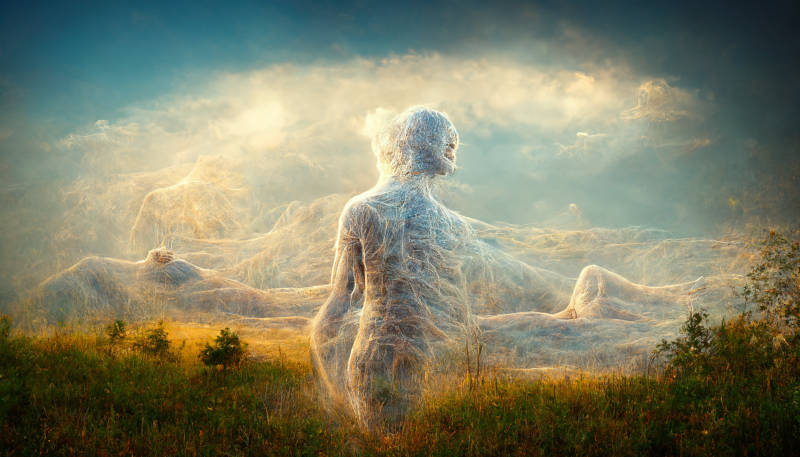

# Free Will

Many people mistakenly believe that free will is  incompatible with determinism, and that with advanced understanding of human systems (brain, etc.), the illusion of free will will be shattered. That is only true with dualistic assumptions, assuming that the "self" is a non-physical being exerting influence on the human mind. While I personally have seen evidence of non-physical entities that people call "spirits", the normal day-to-day experience of "free will" is generally not a result of such "spiritual" influence. (In fact, such influences are often called "possession" and traditionally requires exorcism... or perhaps contemporarily, lead to a medical professional diagnosing some form of psychosis and declaring the person devoid of free will...)

Anyway, the more practical approach to look at "free will" in a non-metaphysical sense is to consider what actually is the subject, i.e. the "self". Who am I? If we thought "I" was a non-physical mind, a ghost or a spirit, then advances in neuroscience might indeed leave little room for those theories. If "I" was proven to not exist at all, then there's no subject to experience the freedom, which is the true reason why determinism threatens dualistic free will -- it attacks not the freedom, but the "self".

But if we never made those fantastical assumptions in the first place, and instead posited that "I" was just my body (and its associated systems), then a thorough reductionist understanding of my body would not reduce its "freedom".

The concept of freedom is simple. There is a subject (I), and by implication, everything else external to it. If the subject is not conflict with the external world, then it is free. Freedom is necessarily relative, there is no absolute freedom. For example, a person in prison is presumed not to be free because he cannot go anywhere he wants. This is of course a socially agreed upon presumption, since if the person actually does not want to go anywhere, he is perfectly free to stay in his prison cell. It is also a social convention that people wanting to do ridiculous things (eg. travel to Mars) and not being able to do so is not considered unfree or imprisoned by Earth's gravity -- but rather just crazy. But in fact, it's the subjective experience that counts. If one truly wanted to go to Mars more than anything else, then his subjective experience must be similar to somebody locked up in a prison cell.

Shackles do not need to be physical. A person socially pressured into doing something against his will lacks freedom. For example, a worker shows up at work following the company dress code is not free to wear whatever he wants. However, a complication here arises -- if we identify the "self" as the whole human body (and also reject dualism), the choice is actually freely made. The conflict is not between the human's body and the external world, but rather, conflicting values in the systems in the mind -- on the one hand one part of the mind "wants" to wear a casual dress, but another part of the mind "wants" to keep a job (because of perceived necessity of living, etc.). The key here is that it is only socially acceptable to identify with the former, it would otherwise be considered borderline psychotic to identify with the workaholic self instead.

As we can see from these examples, freedom is not so much a philosophical matter of whether deterministic rules fully describe the universe, but rather a matter of identification of the "self" and whether this "self" is in harmony with its environment. Perhaps this is a linguistic issue -- whereas in English "free" invokes the concepts of disassociation (from external things that bind one down), in Japanese and Chinese 自由 literally means "originate from self", which seem to provide a more useful perspective in this context (I don't know any other languages).

The last difficulty in ascertaining "free will" is to identify the "self". It is one of the most difficult problems. We know as a matter of fact that the physical universe is a continuous entity where everything continuously interacts with everything around it. There is no physical reason we'd want to separate some parts and say it is "me", and call everything else "the external world". By social convention, every human body is considered a separate entity, which forms the basis of a "self" (physical). But bodies interact with each other forming systems. Systems such as families, companies, nations, etc. are also valid candidates of "me". It is often conflicts between these possible "selfs" that lead to a perception of lack of freedom. The state that punish criminals by locking them up. The company that enforces workplace dress code. The head of family that sets house rules. All of them infringe the "freedom" of the (concept of) individual person. If I identify with my individual personality, then I feel unfree. But the fact is that I am not only an individual person. I am also (hypothetically) a family member, an employee of a company, a citizen of a nation. When one accepts this fact, the "conflict" is internalized and there is no suffering of loss of freedom. If on the other hand one is not at peace with the rules and value systems that did not originate from the same human body, they will feel like "external conflicts" and it manifests as subjective feeling of restriction of freedom. On the other extreme, some people identify more strongly with the social group as opposed to the individual body. Sometimes this is considered pathological (eg. workaholics working themselves to death), but in some situations it is considered noble (eg. soldiers dying for the nation).

In the radically individualistic world of (western?) capitalism, determinism implies an unacceptable tearing down of the barrier between the individual self and the "external world". Rather than accept the obvious scientific fact that things outside the human body can influence the mind and its decisions, that all "individuals" are an integral part of this world, and the corollary that it is futile to "cleanly" separate the "self" and the "external world", people instead retreat into the unproven world of dualism, hoping it would provide a place for a non-physical "self" to reside. Even if dualism is true reality, it does not, however, solve the problem. No matter what substance or form the "self" assumes, whether physical or not, as long as it meaningfully interacts with the world, and is capable of being influenced by the world, and has a recognizable "personality", then the problems presented above still applies, even if it may not be capable of being fully explained by physical laws. Ironically the "thing" most threatened by determinism is not our "selfs", but rather the social concept of individual self, embellished and depended upon by modern capitalism. In this sense, determinism is not an assault on free will, but rather capitalistic morals. The idea that a person's social status is purely a function of one's own decisions and actions, and thus one is ultimately responsible for one's own fate falls apart when we realize that the world is fundamentally an integrated whole. (This is not an exaggeration. Notions of moral responsibility in criminal law of capitalist states traditionally borrow heavily on such flawed concepts of free will.)

I guess that's all I wanted to say, except that:

- those who believe free will lies in quantum physics (are stupid, and) can read "The Ghost in the Quantum Turing Machine" by Scott Aaronson
- I prefer genderless pronouns, but they don't really exist in English, at least not without having the text looking socially awkward (as of writing). If anyone cares, they can replace all "he" with "佢" and "his" with "佢嘅".
- Possibly written with spiritual assistance (靈感) by I have no way to tell one way or the other

