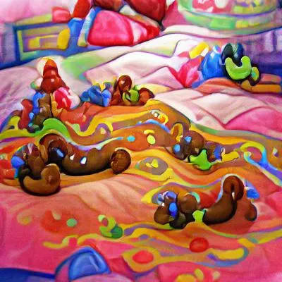

# 跟風講下屙屎單案

近年左翼運動趨向民粹，理論追唔上潮流。學院變咗cancel culture實驗場所，反而理論嘅傳播落在啲 KOL 手上。只要係明星或者 twitter/IG 上面有幾百萬follower就以為亂咁鳩噏可以令社會進步，然後迴音谷越吹越響。

當思潮缺乏理性，運動嘅架構就會一盤散沙，最後各據山頭互相攻擊。Heard 同 Depp 單官司曝露嘅唔止係所謂 #女性主義 嘅弊病，更加係曝露網絡民粹運動嘅根本性問題。

本來所謂 #metoo 運動嘅主題係揭露性侵慣犯，鼓勵受害者勇敢發聲。本身呢樣嘢喺當其時社會環境下某程度上係做到糾正時弊嘅效果。不過喺民粹爆發之下，最後玩爛咗變成女性公審男人嘅武器。

Heard 同 Depp 單官司基本上係講緊兩個性格有缺陷嘅人喺屋企互相嗌交，然後互相指責搞到大家各自冇咗份工。本身係一種私人領域嘅爭拗，同 #metoo 或 #女性主義 其實理應一啲關係都冇。「Johnny Depp 有冇打女人」就同「Amber Heard 有冇喺床上屙屎」一樣咁有公共性 (i.e. 花生指數超標但唔關「女性主義」事囉)。

好多人唔明嘅基本問題係，社會輿論可以影響「XXX啱唔啱」，但唔會影響到「XXX會唔會發生喺你身上」。例如冇任何人會覺得「床上屙屎」係啱，不過咁又點？唔啱嘅嘢一樣會發生，睇你好唔好彩遇到。所以一廂情願以為打贏某場官司、輿論壓倒某勢力就可以解決自身面對緊嘅類似問題，係緣木求魚兼且on9。

好多民粹旗手搞唔清呢啲問題，見到「自己人」(以性器官分類) 貌似「輸」咗就淨係識集氣加強攻擊。咁搞落去當然係整個運動集體收皮，我諗我作為佢哋嘅假想敵成員之人(以性器官分類)都只能夠表示樂見其成。冇堅實理論支撐嘅民粹運動最終嘅後果都只會係咁嘅下場，有幾多人 all-in 死撐就攬炒幾多個。如果做人淨係靠錢同勢力就夠，人類就唔使花幾千萬年進化個大腦出嚟啦。

tl;dr：單官司正確食用方法係伴鹹脆花生，唔係臀上線素。
