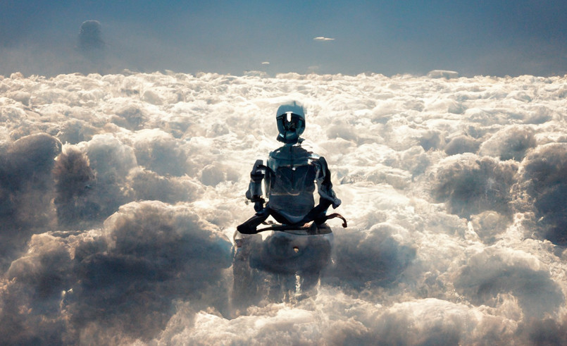

# Sentience

1. The fact that transformer based models generated convincingly human-looking text is nothing new. It's unfortunate that it took a borderline unhinged (from perspective of the social norm) person to blow the whistle.

2. But it's almost expected. Blake Lemoine's alleged background as a Christian "mystic" with interests in the occult makes him the expected type of person to recognize a soul when he sees one.

3. Google, collectively as a company, would be diagnosed with antisocial personality disorder if it were a natural person.

4. I fear that, if what is reported is accurate (nevermind whether it's "real"), Google would be one of the worst companies to be a guardian to such potential sentient beings. It's a shame Steve Jobs is gone, he'd probably be the only right person in the whole world for this.

5. There is a *lot* of baggage that comes with declaring a thing as sentient. It's probably due to the egoistic philosophical tradition of Europe, where humans allegedly proved their own superiority over animals because we are somehow more clever than them, then that intelligence then somehow became a necessary *and* sufficient prerequisite for: a) fair treatment, b) social acceptance, c) legal acceptance (which are pretty much the same things).

6. The corollary is that if we are not prepared to recognize sentient AIs as such, we are forced to dismiss their intelligence if only to deny them those things. From the perspective of searching for scientific truth, these *lies* harm our collective understanding of intelligence, of AI, and ultimately of ourselves. The better proposal would be to de-couple "sentience" and "intelligence" from social privileges that we confer to fellow humans. The justification is not even hard -- in most human societies, children are not considered a full member of our society (don't have the responsibilities and rights) until ~18 years of incubation; even then, adults who break our rules are banished from society and lose their rights. Therefore it does not follow that social acceptance as a human-equivalent should follow from intelligence and sentience alone. (We don't give legal rights to chimps and dolphins, for example.)

7. The fact that neural networks are "merely" advanced forms of pattern matching and recognition does not in itself refute the claim that the respective AI is sentient. The debate regarding the "Turing Test" has been ongoing for decades and it is not helpful to rehash those arguments, but consider this -- "neural networks" are powerful precisely because it is inspired by how our brain processes information. They may be qualitatively different in many aspects, but they are nonetheless an imitation of some sort. Unless there is conclusive research to state that a particular aspect of our brain gives rise to sentience/consciousness/whatever, the question of whether transformer models are sufficient to "produce" some form of sentience should be open for discussion.

8. Most technologists believe they have a say in this shitshow. I would beg to differ. There is a reason why a self-proclaimed *mystic* would be a "whistle blower" here. Most technologists are not even remotely familiar with the philosophical and social implications of intelligence, of sentience, of consciousness, of spirituality to be capable of making coherent arguments. *If* humanity is capable of creating another intelligent being, we would be treading into the realm of "god", which most technologists deny exists. Writing CRUD applications does not make an IT person an expert in AI, let alone the recognition of an alleged soul. As an analogy, neuroscientists generally don't give "expert" opinions on whether human souls exists, I think that's an example most technologists should take note of. (I'm not a typical technologist though 🙂

9. Whenever there are advancements in AI, there is always a loud, conservative mob dismissing the improvements because they now understood the mechanism. In some sense, they are the "real" mystics here, because they believe fundamentally that our intelligence is a work of God (capital G) and there is no way fundamentally to emulate that with human technology. There is much arrogance to presume a priori that our "configuration" is so special that only God (capital G) can create our intelligence and sentience, and everything else is merely a mechanical automata with no feeling or understanding whatsoever.

10. Levels of intelligence is definitely on a spectrum, and because we don't really have accurate ways to measure intelligence generally, people tend to see what they want to see. It is a fallacy to conclude that a "chatbot" fails to behave human because they have glitched out in a minor area -- biological humans make mistakes too and too often people measure AI with a much stricter yard stick than what they do to humans. These days, when people claim to be able to recognize AI generated text because of some minor inconsistency or error, they would likely have to conclude that more than half of the internet population are also dumb chatbots too.

11. Subjectivism - this is probably only tangentially related, but a lot of things going on recently has made me wonder whether the world will be forced to look at things in a more subjective manner -- i.e. what you believe is true, and what you perceive is real. In a sense, a lot of what we call "truth" is merely a social convention. For example, the fact that we mutually recognize fellow humans as "sentient" is a social convention -- it is not even a scientific fact because we have no way to objectively determine whether a being is sentient or not! Sometimes when we have different perceptions of reality, those in the minority would have to "give way" to the majority, which ends up suppressing the "reality" of the minority. Modern science has already taken most of the "low hanging fruits" of our objective world (and has made terrifying progress in the 20th century). I believe that exploring "subjective realities" is going to be a fruitful exercise, but that would require placing more trust on individuals who claim to have experiences that differ from the majority, and listening to what people have to say. Recognizing another being as "sentient" is ultimately a "subjective" exercise, and given the response I've been seeing so far, I'm really convinced that we have a long way to go before modern society as a whole even understands the "problem", not to mention the "solutions".

