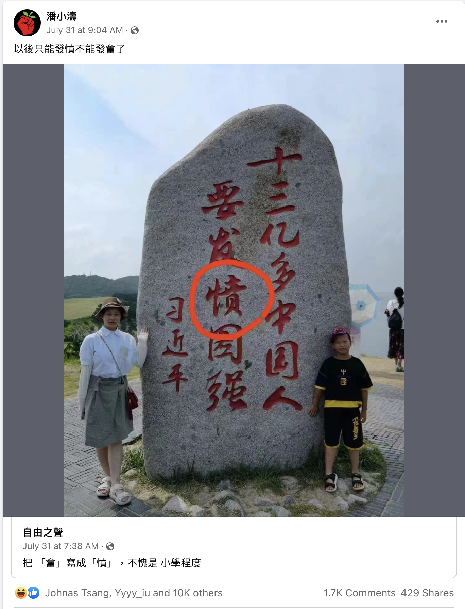
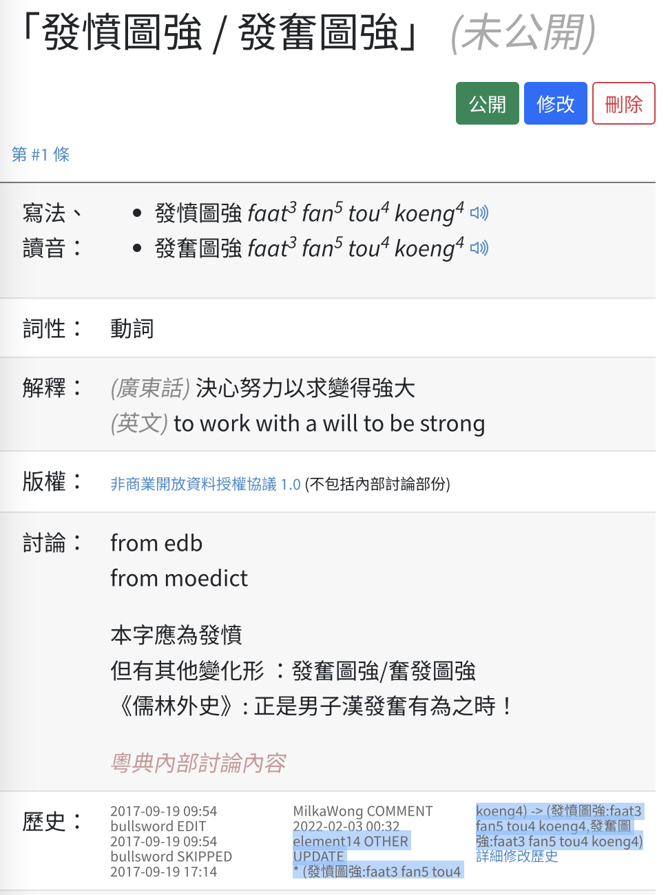
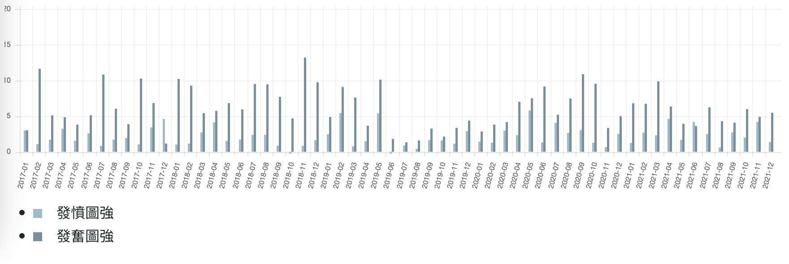

【「發奮圖強」係啱定錯？】

香港人唔識字都唔係新聞，黃絲 KOL 為咗唱衰「中國」戾橫折曲其實亦都唔係新聞。只不過今次罕有地證據確鑿「錯」到無可辯駁，俾人一招 KO。[0]

由於我從來都唔識字，所以對啲咩「正字」完全冇任何堅持[1]。喺我眼中，大家睇得明就得。驚俾人笑唔識字，以致走去笑其他人唔識字，完全係自信心不足嘅補償行為，作為抹黑手段十分低莊。（提外話：喺香港呢個後殖民社會，更加搞笑兼可悲嘅現像就係大家只會笑中國(裔)人文盲，不過 Elon Musk 喺 twitter 打錯字係唔會有香港人笑佢嘅。）

我明白標準有助社會各界有效溝通，起碼有咗共同語言就不至於雞同鴨講，但究竟係「發憤」、「奮發」定「發奮」係咪真係咁大件事呢？ 我只能夠講唯一好處就係可以幫助中華文化延續多幾千年。而家掘返啲秦漢年代嘅古蹟大家仲睇得明啲字，就係多得每一代衛道之士嘅無謂堅持，確保文字傳承原汁原味，一成不變。大家係咪驚幾百年後「憤」字同「奮」字嘅讀音演化，後人睇唔明「發憤」同「發奮」其實係同一意思，所以咁執著於「正字」呢？我又真係唔多覺。走去挑剔錯字，無非係想表達自己受過教育，而對方係唔識字咁解啫。

喺呢個資訊發達嘅年代，學識同社會階級已經冇咩關係，香港年輕一代嘅文盲率其實幾乎係零，笑人唔識字呢個概念本身都真係好老土，有種 boomer 嘅老人除。喺中國特色社會主義嘅香港新秩序之下仲要抱住舊時精英階級主義，亦可謂不識時務。啲老人家喺度詳細講解「茴字有四種寫法」嘅時候，醒目嘅一早就喺度鑽研習近平思想，背頌[2]習近平講話內容。

或者某啲自尊心較強嘅有識之士對呢啲行為嗤之以鼻，不過請大家認真諗下，以政治人物嚟講，你唔係覺得區區一個郭沫若會高得習近平呀嘛？啲人話「#奮發圖強」係啱，係因為郭沫若幾十年前某演講用過呢組詞語。唔係咩經典文學作品嚟，而係1978年人民日報刊登嘅演講辭嚟，題為《科学的春天》，全句係「我祝願中年一代的科學工作者 #奮發圖強，革命加拚命，勇攀世界科學高峰。」點睇都同習近平慶祝香港回歸祖國二十五周年講話本質上係同一種東西。點解要厚此薄彼呢？

另有一說應寫為「#發憤圖強」，因為出自《論語》：「葉公問孔子於子路，子路不對。子曰：女奚不曰，其為人也，發憤忘食，樂以忘憂，不知老之將至云爾。」我真係唔識字，呢度嘅「發憤忘食」點解我真係唔肯定咩意思。真係關努力學習事？先睇字面意思，字典話「憤」字解「鬱積而怒滿」，都唔係好嘢嚟。《史記．太史公自序》：「天子始建漢家之封，而太史公留滯周南，不得與從事，故發憤且卒。」照計司馬氏都係飽讀經典之人，佢話「發憤」會死人，都唔多似係一啲正面用嚟勸勉後進好好學習嘅詞語嚟。睇返語境，孔子事後「教」子路點樣介紹自己，其實都好有自嘲嘅味道。譯返做現代話大概就係「呢個人呢，嬲嗰陣就冇晒胃口，開心嗰陣就咩煩惱都唔記得晒，幾十歲人又笑又喊傻下傻下咁，都唔為意原來自己已經係個老餅。」《論語》入面記錄孔夫子同學生開玩笑嘅例子太多，但因為政治理由，後世嘅儒士鑽研完一輪《至聖先師孔夫子重大講話》之後話「發憤忘食」係解正念、努力、進步，咁其實同啲人研究習近平講話有冇本質上嘅分別呢？（我覺得有呀，起碼習主席唔係講緊笑囉。）

至於「#發奮圖強」又點呢？錯㗎，因為 #冇出處 吖嘛[3]。都係嗰句，中華文化幾千傳承，如果阿豬阿狗都可以自創成語，亂七八糟，成何體統？喺習近平、孔夫子、郭沫若之前，你香港人咩新絲蘿蔔皮，憑咩隨便撰改成語組合？連登仔個個都寫「發奮圖強」[4]，但佢哋有黨籍咩？有國家領導人為佢背書咩？政治地位決定文字話語權，香港經濟地位暫且算一線，但政治地位就梗係十八線城市都不如啦。所以香港人唔識字係歷史嘅必然，係一個政治現實，同香港文盲率或者幾多人讀過大學冇咩關係。

我個人睇法係，香港通俗文化梗係用「發奮圖強」多，究其字義亦都似乎比「發憤圖強」更加合理。奈何黃絲KOL嘅地位同孔夫子冇得比，同習主席更加係冇得比，人哋有得引典故出處，甚至佢本身都可以變成典故，你無權無勢都只能夠收皮認柒 (按：唔好諗住引粵典呀[3])。至於香港啲黃絲 KOL 搞唔清楚問題本質，唔知自己已經冇咗文字話語權[6]仍然亂咁發炮，只可以話係「搬石頭砸自己的腳」[5]。

最後再重申一次，我從來都唔識字，對啲咩「正字」亦真係完全冇任何堅持。只不過對文字話語權呢個議題，對香港嘅「中文人」過咗廿幾年都唔知自己一早冇晒話語權嘅天真態度，有少少發憤忘寢，忍唔住發下牢騷咁解。如果大家睇完呢篇文仍然係覺得寫正字跟典故係好重要，我只能夠講，喺閣下堅持黨嘅領導維護中華文化傳承嘅積極態度面前，我真係自慚形穢。我會好好反省，發憤圖強，為中華民族偉大復興作出新的、更偉大的貢獻㗎喇。

----

- [0] 見下圖
- [1] https://hnfong.github.io/public-crap/writings/2017/%E3%80%8C%F0%A0%92%87%E3%80%8D%E5%AD%97%E4%BF%82%E5%92%A9%E5%9A%9F_qm__%E2%80%94_%E2%80%94_%E6%B8%AF%E5%A7%90%E5%86%A0%E8%BB%8D%E5%B8%B6%E5%87%BA%E5%98%85%E5%93%B2%E5%AD%B8%E5%95%8F%E9%A1%8C.html
- [2] sor 我係咪又寫錯字？利申真係唔識字
- [3] 《粵典》唔算，因為個entry係我親自改嘅，見下圖。
- [4] 目測八九成左右，見下圖。
- [5] 出處係咪... 外交部？
- [6] 呢個係「中文人」喺英殖香港養成嘅自我澎漲，因為英國人慣得理你中文世界玩成點，班「中文人」自然冇王管玩得好開心。

