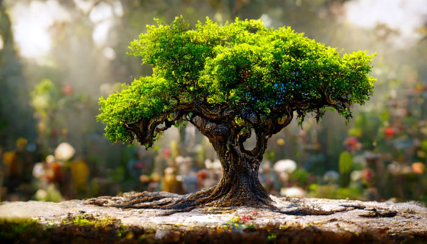

# Free will as a tool of capitalism oppression

I recently realized that there is really no conflict between "free will" and determinism. The logic that "you don't have free will because XXX determines your choices" is flawed in the sense that, if XXX is actually a part of you, then there's no conflict. The problem is that it is very hard to define who oneself is, and as such we have culturally been indoctrinated to believe that our "will" is not our brains, not our physical bodies, not the society that influences us, but some sort of abstract thing that totally lies beyond the reach of the physical world.

The word "free" implies a certain kind of detachment, as if our "will" is supposed to be detached from the physical world. But we know for a fact that this is not true. Our mental state is heavily dependent on the state of our brains. Our decisions are influenced by physical desires and fears. Our beliefs are heavily informed by our cultural environment. Our "will", for the most part (the parts that are observable by other people), are mostly physical.

This is not to say I reject any "spiritual" self that is outside of the physical world. It's just that the flawed assumption that one's "true will" should not be affected by our physical environment is a convenient lie told not because people believe in the spiritual world, but because society wishes to disclaim responsibility for so called "individual actions".

For example, when a person commits a crime, we say, unless there was duress or genuine mistake, they did it out of their own "free will", and must bear responsibility. The "free" detachment of their "will" from the environment is convenient, because upon such assumption, no enquiry is made as to the societal influences that caused the person to commit the crime. Nobody commits theft because they had a poor upbringing and was neglected by society. They committed theft because they "freely chose" to do it. Better to let a poor, underprivileged person assume the responsibility of a crime, than start an investigation of the rich and influential. "Free will" is a disclaimer by society that the criminals alone deserve to be condemned, the poor deserves to be poor, and the rich deserve to be rich. "Free will" is also the excuse for enforcing unjust agreements as contracts, because obviously, everyone chooses freely, even those who consented to the agreement under duress of hunger and poverty. How convenient it is to say that the physical environment does not matter, since our "free will" lies in our spiritual essence? It is, ultimately, a capitalist doctrine based on radical individualism.

Most sane teachings of spirituality respects the physical forces that influences humans. Only capitalism is audacious enough to claim otherwise.

And thus, only those in a capitalist world feel the existential threat when we discover to our shock and horror that, we are (surprise!), actually mostly influenced by our physical selves and physical environment. The threat is not to ourselves or our actual free will, but the capitalist concept of "free will". If we discover, as we already know, that many people committing "crimes" do not really have a choice given the physical circumstances, will we be so ready to condemn them as we do today? If we discover, as we already know, that most people are trying their best given their circumstances, will we be so ready to pick out unfortunate people as scapegoats? The existential threat forces us to realize that people are interconnected in our society, and we cannot merely point fingers at each other. But then how will the rich and powerful justify their privileges if they have to share the blame and shame for the existence of the less fortunate?

And so they must convince everyone that we are all "free". That we are conceptually, in essence, "equal", so that society can be cleanly segregated where the less fortunate can be blamed for their own problems. Nobody objects to the concept of equality of the human spirit, of the value of each individual person. Yet the dissonance between ideal and reality becomes a tool for oppression. In striving for ideals we must not forget to ground ourselves to reality. Though difficult, we must realize who we actually are, before we try to become who we want to be.

