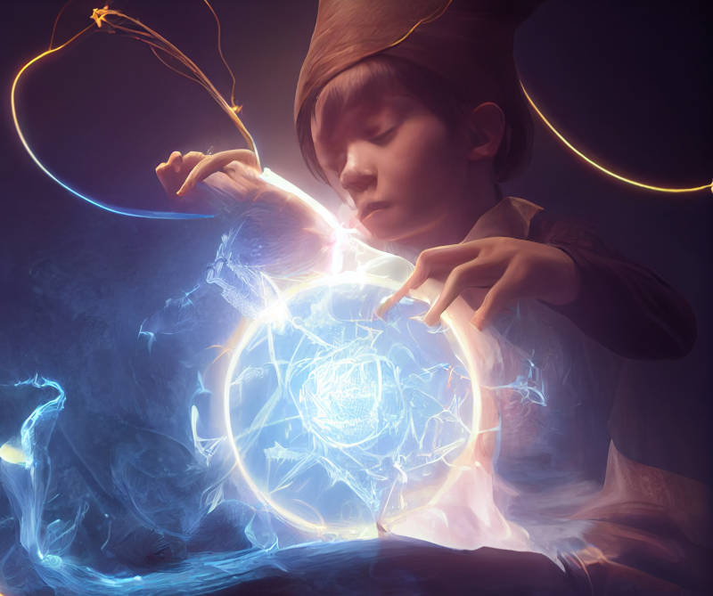

# A short story of obtaining a superpower

One day, a genie came to a man offering a gift.

"I will give you superpowers," the genie said, "with a single thought you shall be able to bend the four elements to your will."

The man happily accepted the offer. And he suddenly had superpowers. Excited at the prospect, he immediately thought about how to use his powers.

A neighbour had a petty quarrel with him yesterday, perhaps he would punish him. A cruel thought briefly flashed in his mind -- wondering whether it became true, the man ran out of his house and saw in horror his neighbour's house burning in a great fire. He panicked, and thought about a lot of water. Moments later a great flood appeared out of nowhere and swept everyone and everything away. The man panicked again, and wished all water to disappear.

In the end, the land within a ten-mile radius became a dry desert. The story ends here, because water comprises two-thirds of the human body.

-----------------------------

# The Dangers of Omnipotence

I was told that the universe actually does bend to our will. This is definitely true\*, it is the extent that is debatable. But anyhow, on human scales, the effect is slow and requires "hard work". We are fascinated by magic(k) that offers quick and "easy" ways to control reality.

I asked, why are human beings so relatively powerless? And my answer was, we must do "work" for a change to take effect, because most of us do not have sufficient control over our thoughts and emotions. We are used to the situation that, as long as we don't act upon our thoughts, they have no real consequences (allegedly). In a sense, we *know* that our thoughts can sometimes be dangerous, so, as humans we must reject any versions of omnipotence even if offered to us. Complicated rituals might be a heritage from the times when magic(k) was real, yet was thought to be dangerous enough (in the sense just described) that it required a lot of "paperwork" to take effect.

Further reading - [耶穌、魔鬼、幻覺](06-%E8%80%B6%E7%A9%8C%E3%80%81%E9%AD%94%E9%AC%BC%E3%80%81%E5%B9%BB%E8%A6%BA.html)

(\* the uncontroversial part is that your mind instructs the body, the body does the work of changing the universe via physical actions. You can move mountains, at the very least by using a shovel and digging the dirt yourself.)

-----------------------------

# The magic of unidirectional focus

Note that a sharp, focused and self-consistent mind is somewhat magical in itself. The typical human life is rife with indecisions and regrets. We spend much time pondering our actions and decisions, and often unknowingly try to move in opposite directions at the same time, working hard to counteract previous hard work, netting zero.

But how does one know the right thing to do without carefully weighing the contradicting options? Sufficiently good intuition is indistinguishable from some forms of magic(k).

Further reading - [矛盾唔係錯：點解我哋需要一致性?](2016/%E7%9F%9B%E7%9B%BE%E5%94%94%E4%BF%82%E9%8C%AF_CL_%E9%BB%9E%E8%A7%A3%E6%88%91%E5%93%8B%E9%9C%80%E8%A6%81%E4%B8%80%E8%87%B4%E6%80%A7_qm_.html)

