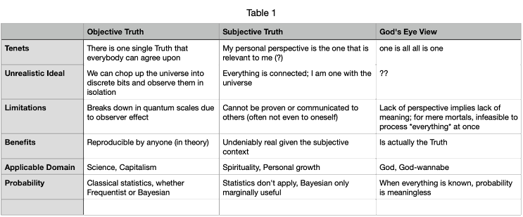

# Elaboration on Subjective Truths

Subjective Truth is correlated to the idea of universal connectedness - that it rejects the idea that the object and subject can be cleanly separated (as is typical in Objective Truth).  That any change in one part of the whole can affect the whole. We cannot always understand the totality of all that is, since we are limited beings that can only see the whole from our personal perspective.

Subjective Truth does not rely on probability or statistics. Events that probability theory say are possible/probable has no meaning if they are not actually experienced. For example, something with a proclaimed 99% chance to happen has no meaning if they don't actually come to pass. (However, in Objective Truth, 99% chance actually means that, if you repeat the incident 100 times, it will be experienced in 99 of them - Objective Truth insists that events can be repeated, whereas Subjective Truth rejects this very idea).

Subjective Truth does not derive knowledge from probabilities. Instead, it uses intuition. As far as Bayesian probability is compatible with Subjective Truth, Subjective Truth provides the priors. The priors are from intuition - knowledge without evidence. Bayesian inference only provides a tool to derive nominal probabilities when the intuition is relatively weak, for unfamiliar topics, etc. It also helps to rectify the intuition if it is wrong (intuitions are sometimes wrong, but to those who subscribe to Subjective Truth, they are less often wrong than would be implied by Objective Truth views).

Since Subjective Truth does not rely on statistics, rejects the notion of repeatability, and derives knowledge without evidence, Subjective Truth cannot be communicated (at least not objectively). It is alleged that metaphors, stories and parables facilitate this task, but the process is less of communication than a belief that the encoded messages somehow brought about understanding on other side. Note that Subjective Truth cannot be communicated even to oneself. The solution exists without a reason.

The lack of reasoning implies the need for trust. For example, you would tell a child not to put his hand into boiling water -- but he may be unable to understand the reason (eg. what are third-degree burns). The child must take your word on trust. In the same way, accepting solutions from intuition without proof requires trust. This also applies to one's self. The only way to utilize one's own intuition is to be in the habit of being brutally honest with oneself. If you routinely lie to yourself, there is no way to trust your own intuitions since there is no way to tell them from lies.

As a matter of my subjective belief, the Universe seems to conspire to maintain consistency with Objective Truth (or more easily understood as "no magic"). Perhaps this is not a conspiracy from the Universe, but a conspiracy among ourselves -- the weight our modern society places on Science and Capitalism compels us to accept the tenets of Objective Truth, that whatever is repeatable (Science) and massively scalable (Capitalism) is true; everything else is left to wither away as "Unscientific".

The sober scientist accepts that *in theory* there could be real phenomena that exists but is not repeatable, i.e. that cannot be described by general laws. In practice, they consider there is no evidence of such (despite historical accounts of such things happening, which they generally disregard as fictional curiosities unsuitable for serious investigation), and regardless they firmly believe (intuitively!?) that we can come up with general laws that adequately describe the universe to arbitrary precision. (Even given the well known problem of "the problem of induction".)

Under this social context, when *by definition* what is known by Science and capable of Capitalism is considered "not magic", it is a corollary that "magic", if it exists at all, must be the total negation of Objective Truth - i.e. unrepeatable, intuitive (no proof), and difficult to communicate.

Of course, there are intermediaries between the extremes -- otherwise it would be meaningless to speak about extreme Subjective Truths at all (since this is an attempt to communicate what they are). Instead, the "quasi-magical" phenomena are low probability events that are not unrepeatable but require peculiar settings that cannot be reproduced in a science lab. They happen often enough for some people to detect a vague pattern, at the threshold that it can be brushed away as coincidence. Or they are subjective experiences that can be explained by way of hallucination. It is these phenomena that is worth discussing (or discussing about discussing).

The purely subjective experience of Subjective Truth phenomena is in some way the only way to initiate one into the community of Subjective Truth. It cannot be denied that Science and Capitalism have almost (except in Quantum Physics) completely explained the Universe in terms of Objective Truth. There is truly no *need* for anyone to use Subjective Truth (to live in modern society). Those who "believe" Subjective Truth when told by others are on shaky grounds due to the risks of misplaced trust. There is a saying, "trust, but verify" - in Subjective Truth it is difficult or impossible to verify, so misplaced trust can lead one down very wrong paths. While it is a good habit to presume honesty and authenticity even with wild claims, it does not mean one should blindly take as Truth whatever is claimed by a "random" person. In short, I don't think it's possible/feasible for an uninitiated person to understand the iceberg without seeing its tip. Once the tip is seen, only then the question becomes "how deep does it go?" (Otherwise, the only reasonable take is to believe that the ocean is vast and empty.)

