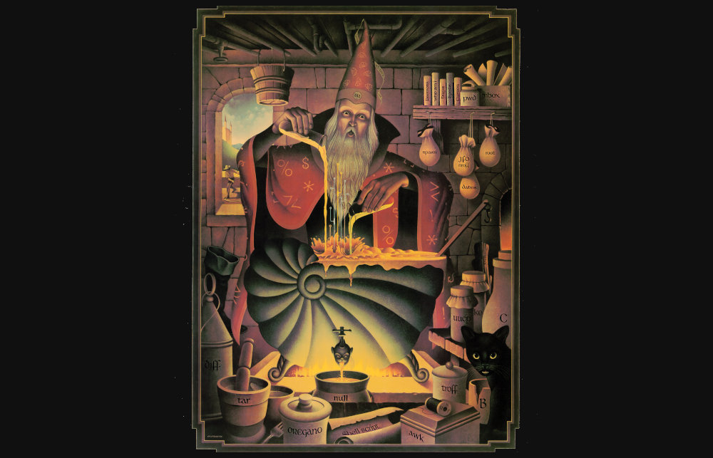

# A Magician's Choice

Let's say with the alleged power of [subjective truth](09-Subjective_Truth.md) (link contains required reading) one miraculously did something that was highly improbable, but within bounds of technical possibility.

Now, a skeptic who doesn't believe in subjective truth comes and asks demands to apply "objective truth" methodology to test whether it was really a miracle or actually just a fluke. That is, they request repeating the attempt at doing the thing, and "test" what the "probabilities" of it happening are, so that they can "calculate the objective probabilities" of it happening.

When they do this, the tester actually is actually *confirming* the objective world view. With the alleged power of subjective truth, the world complies with the objective world belief and behaves "objectively", giving them the "objective probabilities" that they want.

It may be easier to explain with a story.

Let's say a Healer (H) performs an apparently miraculous healing ritual on a subject, completely curing an illness never before cured. H insists that this is done with "magic" and requires belief and submission to the cosmic powers for this to happen.

Now, skeptics arrive and try to analyze the scene. They insist that H is a fraud because this is unscientific woo-woo, and if H really had "powers" H should be able to repeat this process and cure anyone. Of course, either H refuses, or H fails to provide any subsequent healing.

We are all taught in school the **objective, no-nonsense interpretation**: this is just a fluke, there's no magic going on, and if these tricksters are lucky for a while, eventually they will expose themselves as frauds, because the universe works with fundamental laws of physics that don't have human concepts of coincidences etc.

With the **subjective interpretation**, this is the power of subjective truth at work. Both H and the first subject knew the ritual was going to work, and it did. However, when skeptics came to the scene, the intentions (which is a serious matter with subjective interpretation) changed from the act of healing, to trying to test an hypothesis that magical healing exists. The only reason why this needs testing is because somebody doesn't believe in it and wants "**proof**". The fundamentally flawed (from subjective perspective) axiom of frequentism is that if you repeat the "same" thing many times you will have a useful probability distribution. However, how it actually works is that the believer of frequentism actually believes in **objective truth**, and they "know" frequentist probabilities work. So the universe complies accordingly, as per the **subjective interpretation**. In short, ***given a bunch of people believing in objective truth, in particular, "knowing" that objective truth is reality, the power of subjective truth makes it a reality***. And therefore, in the end, objective truth is what we observe.

I'm not even saying either of the interpretations are correct. I'm just saying, it seems, the subjective truth and objective truth are roughly compatible (as I always suspected). Which one you "should" believe, is, in my opinion, a *subjective* choice. The classic Occam's razor says the simpler reductionist objective model works fine. I personally disagree because frequentist assumptions are wrong ([you can never truly repeat anything the second time](https://en.wikipedia.org/wiki/Ichi-go_ichi-e)). Of course the elephant in the room for the subjective interpretation is the **subjective consciousness**, but at least presumably *everyone is dealing with it no matter you want it or not* (which btw is forced upon us at quantum scales). But then, if the two interpretations are roughly compatible, *personally*, I can see no reason why I would not choose the one that allows for magic to happen.

When I was a child, I would have said I wanted to be a "magician" when I grew up, if only it were a legit occupation. (In many ways I'm already close. I make a living by conjuring digital constructs from chaotic bits.)

Despite widespread skepticism, there is still much evidence for "magic". For example, the medical research industry spends disproportionate amount of resources trying to combat the "placebo effect". It's the one major thing getting in the way of "scientific progress", just because sugar pills can often work better than complex chemicals. I'm not sure I've come across any reasonable explanation of this phenomenon other than subjective truth.

Don't get me wrong. I unequivocally support developing medicine that works regardless whether you believe it or not. I'm just saying, while the objective methodology is useful, as honest seekers of truth, we can't just say it is The Truth because the tools that came from it are useful and convenient. In the same way, we can't just say subjective truth is wrong because the tools it gave us are "unreliable" and inconvenient.

The truth is indeed often dangerous. Still, the magi's choice is never in doubt.
