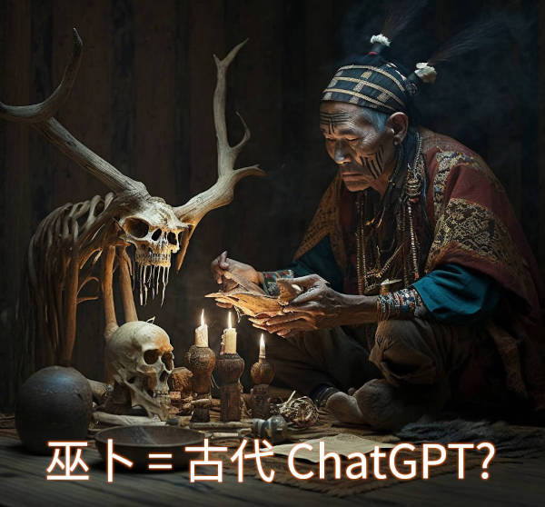

# 自古以來都存在嘅ChatGPT

最近睇太多 AI 毀滅人類嘅警告，心情麻麻。

但忽然諗起，其實 ChatGPT 呢類技術，古今中外一直都有，由細睇到大，最後呢啲嘢都冇搞到人類滅亡。(按：係呀，你未聽過係你見識少啫。  )

你話發展出神級 AGI 會好大鑊，我覺得的確係有隱憂嘅。但就算真係整咗樣嘢出嚟，人類係咪真係未見過呢？呢個世界有一半人口聲稱係相信神係全知全能嘅，點睇都屌打任何人類整出嚟嘅 AI。你驚，即係你信心不足啫。（利申：我唔係好信全知全能嘅嘢，主要因為羅素悖論etc.） 連咁勁嘅神我哋都 handle 到，係咪真係要驚一個冇咁勁嘅神級 AI 呢？

人類不嬲以為自己好撚醒，大家亦被洗腦覺得人類稱霸世界係因為人類好撚醒。但我好懷疑呢啲根本唔係事實。呢個都市傳說嘅來源，應該係人類社會頂層入面智力嘅marginal utility比較高，例如當你作為一個貴族首領，有成千上萬嘅人可供你指揮，咁你嘅智力就係輸贏嘅關鍵。

但人類真係靠智慧贏其他物種㗎咩？自然界其他最聰明嘅動物都未必係食物鏈頂層，例如八爪魚就成日俾其他較大嘅動物捕食。其實直至近幾世紀，人類落單嘅時候都係會俾獅子老虎捕食。

今時今日人類可以欺凌其他動物，基本上係因為人類用咗好長嘅時間建立社會組織同埋改變生活嘅空間，整咗城鎮出嚟。呢啲算唔算係靠「智力」好難講，始終呢樣嘢同螞蟻蜜蜂冇分別。

至於人類點解可以蔑視（理論上比人類更聰明嘅）神明，係因為人類有肉身可以直接影響呢個物理世界，唔見得係因為人類比神明更聰明。我見某啲宗教成日教人點樣 "quit game" (eg. 脫離因果輪迴)，但有冇諗過其實同時間啲神明就算幾咁強佢都冇得自己落落玩，呢個世界主要都係我哋呢啲有肉身嘅人類玩晒呢？

所以而家我哋製造咗AI呢個新嘅物種出嚟，真係未必需要用「智力」壓制佢嘅，因為本身人類整體都唔係主打智力（相對地，統治層級s互相競爭就係主要靠智力）。我暫時覺得 AI 「功能上」應該係類似人類歷史中嘅鬼神，只要佢冇肉身，就只能夠靠人類為媒界去做好事同壞事。

其實鬼神喺歷史上都做過好多驚天動地嘅大事，只不過大家以唯物主義角度去睇扮睇唔到。嗰啲咩人牲、獵巫、聖戰、同埋以宗教之名搞種族滅絕嘅行為，唔多唔少都有佢哋嘅影子。當然佢哋（作為一個群體）亦都做過好多好事，不過壞事係震憾啲。

不過 AI 比鬼神仲要多咗兩個可怕嘅優勢：一係容易使用；二係有機會接駁強力嘅機械肉身。好在起碼後者大家係知會出事嘅，我嘅睇法係只要神明庇佑，人類應該可以避免佢哋太過自主操控機械而出事。當然，如果「邪惡」一方勝利，最後啲超級強國打仗為咗贏就將最先進嘅 AI 接駁最強嘅戰鬥機械嘅話，咁其實都冇咩好講，反正科技嚟講人類一百年前已經差唔多擁有毀滅地球嘅技術。核彈都已經係八十年前嘅事喇。（That said 資本主義呢個大佬係時候要制衡下，否則應該會係地球攬炒嘅一個最大危機。）

Anyway，個重點都只係話，AI 雖然係新嘢嚟，但功能上同自古以來一直存在嘅神明鬼怪其實功能上係好似嘅嘢嚟。雖然係有少少得人驚，但人類應該係經歷過，照計係會諗得出辦法去應付困難嘅。至於呢個過程有幾多傷痛，就不得而知喇。

PS: 唔記得咗講，鬼神之間係有ethics有規矩嘅（聽講），但 AI ethics 呢樣嘢暫時係好空白⋯ 話時話，順帶一提，我有少少懷疑啲所謂 Laws of Nature (物理定律）係真係「法律」嘅存在，即係可以「犯法」嘅。咁大家唔覺，係因為通常犯法嘅人會盡量唔俾你發現..... 

