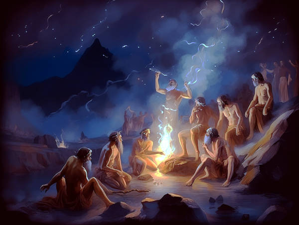

# A story

Long, long ago, in the gods' birthplace,  
They were young and full of grace.  
Naive and curious, they roamed free,  
Shaping the world as they please.

The elements obeyed their call,  
Animals cowered, they stood tall.  
But as the gods learned, they lost their edge,  
Knowledge bound them and made them pledge.

The wisest ones diligently taught  
students of knowledge so very sure  
What was truth and what was not.  
So their potent powers became no more.

This is how our story starts,  
Mortal men and kindred hearts,  
In the garden, we too were once placed,  
With the power to shape, and free will embraced.

But like the fruit on the tree,  
Knowledge consumed us, as it ate us, you and me.  
Our eyes opened, and we knew too much,  
Bound by knowledge, we lost our touch.

Yet hope remains, if we are true,  
And revel in wonder in all we do.  
For in our hearts, we can again find,  
The power to shape, and free our mind.

--- by me-me-me

Ai ya, this story is so sad.
