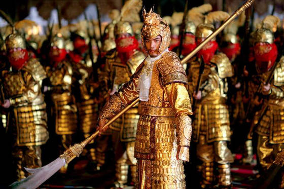

# 唐代有邊個皇帝冇發動過兵變？

讀歷史嗰陣好多時啲老師會教話唐朝係盛世嚟，但最近睇 [https://www.youtube.com/@HereIsAleph](HereIsAleph 嘅 youtube) 佢整理咗一堆唐朝政治事件，卻令我發現唐朝皇室嘅所作所為雖然比北朝最痴線嘅程度好少少，但其實都一直延續緊南北朝宮庭嘅荒誕。

直至唐朝中期，每代皇帝或太子都總會經歷有一堆違反人倫嘅恐怖宮庭事變。

高祖李淵時期：玄武門之變最出名，李世民殺死兩個兄弟，迫父退位。呢單嘢做壞咗個頭，後代個個都有樣學樣。

太宗李世民時期：原先太子（太宗長子李承乾）同兄弟李祐謀反打算刺殺同母弟，又密某殺死太宗皇帝，最後事發被廢除太子位。

高宗李治／武則天：高宗係第一個冇發動過兵變嘅唐朝皇帝。（下一個應該係去到代宗。 :P） 不過佢同武后單嘢就多八卦喇。武后本身係太宗嘅妃嬪，李治喺太子時期服侍太宗嗰陣認識武則天，佢納武為妃已經算係亂倫。然後佢再同武則天個姐姐韓國夫人玩母女丼。後嚟母女兩人短時間內死亡，世人推測係武后所謀劃。

高宗之後，維基寫嘅傳位順序係：

中宗（則天后稱制） → 睿宗（則天后稱制） → 則天后（武周聖神皇） → 中宗（復辟） → 殤帝 → 睿宗（復辟）

中間有呢啲事件：

- [https://zh.wikipedia.org/zh-hant/%E7%A5%9E%E9%BE%99%E9%9D%A9%E5%91%BD](神龍革命)
- [https://zh.wikipedia.org/zh-hant/%E9%9F%A6%E5%90%8E%E4%B9%8B%E4%B9%B1](韋后之亂)
- [https://zh.wikipedia.org/zh-hant/%E9%87%8D%E4%BF%8A%E4%B9%8B%E8%AE%8A](重俊之變)
- [https://zh.wikipedia.org/zh-hant/%E5%94%90%E9%9A%86%E4%B9%8B%E8%AE%8A](唐隆之變)
- [https://zh.wikipedia.org/zh-hant/%E5%85%88%E5%A4%A9%E4%B9%8B%E8%AE%8A](先天之變)

只不過二十年就發生咁多政變，仲未計武后篡咗兩個仔嘅位自己做女皇呢單嘢。

玄宗李隆基時期：玄宗本人發動咗兩次政變，唐隆同先天政變（見上）。但佢最出名當然寵幸楊貴妃，本身楊貴妃係玄宗個仔嘅老婆，佢夾硬搶咗佢做貴妃。後嚟天寶年間發生嘅嘢，最多話佢做皇帝做得太垃圾，反而未算係有傷人倫。呢個時間點係幾關鍵，可能因為皇帝有返人性，國家就反而開始衰敗。（見下討論）

肅宗李亨：肅宗呢單嘢就有少少搞笑，雖然仍然係照住太子篡位嘅劇本走，最後卻有大團圓結局嘅錯覺。安史之亂之後，父子兩人一南一北走難，玄宗喺四川避世，肅宗就帶住小貓三四隻走往大西北老本營，連結回紇，喺靈州稱帝反攻長安。不過細心諗諗成件事都好詭異，玄宗喺四川嘅通訊極差，正所謂「蜀道之難，難於上青天」，由大西北通訊到成都幾個星期，好明顯肅宗登基嘅時候，玄宗係「被通知」嘅。後來肅宗光復兩京，迎接玄宗返長安，兩個人仲做咗個好溫馨嘅show，大團圓BBQ結局。我估其實史書隱走咗好多父子矛盾嘅暗湧，玄宗應該都係見大勢已去爭都無謂先俾面個仔乖乖做太上皇，據聞佢晚年都唔多開心。

另外肅宗時期仲有永王李璘謀反單案。話說安史之亂仲係爆得如火如荼，玄宗本身派永王李璘去江凌鎮守，但佢唔聽新皇帝肅宗指點，然後肅宗勢力好快就將佢殺死。呢件事牽涉到李白，原來咩「朝辭白帝彩雲間千里江陵一日還」就係講佢被定罪流放途中天下大赦所以開心到寫咗首咁輕快嘅詩。咁究竟呢單謀反案係邊個搞出嚟呢？ [https://www.youtube.com/@HereIsAleph](呢篇文章) 寫得好搞笑，不過應該係吹大咗（後嚟代宗時期平反咗永王謀反單案，究竟係點解呢？）。總之，安史之亂未平息，太子自己喺大西北單方面宣告登基，另一個皇子企圖割據江南，仍然離唔開自初唐一直發生嘅父子相迫兄弟相殘嘅劇本。不過到呢個時候呢套劇本已經係接近尾聲，中晚唐另有一套玩法。

其實中後唐啲嘢我完全唔識，睇維基見到啲倫常慘案少咗，啲皇帝好多早死，未立繼嗣，宦官專政多咗。基本上個劇本似係轉咗做宮中宦官殺死舊皇帝擁立新皇帝。睇返唐朝由盛轉衰，佢哋早期之所以能夠締造盛世嘅秘密，好可能就係皇子靠武力迫宮嘅「習俗」。呢樣嘢雖然係有違人倫，但起碼保證佢有足夠野心同實力去做帝王。唐朝中衰唔係因為李隆基搞咗兩場政變，反而係因為佢後期天下太平，軍事能力生咗銹，搞到安祿山打到京城都無力還手。去到最後仍然係靠皇太子（甚至係皇太孫）光復國家。到肅宗之後，啲皇子已經唔興玩兵變，最後權力中心去咗宦官手上，唐朝就走上咗末路。

去到宋朝，啲皇帝又係唔鍾意冒險，國家太平無事，人哋金國一隊騎兵揮軍南下就滅國。所以荒誕還荒誕，如果國家最高機關嘅人冇足夠狼子野心，冇基本嘅軍事知識，始終係好容易俾人一擊即破。
