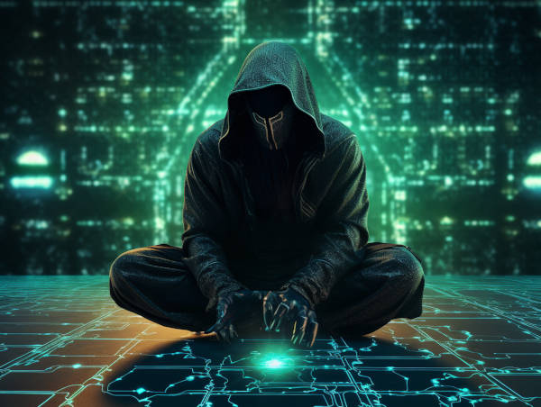

# How to break the Laws of Nature without getting caught

When scientists talk about "Laws of Nature", or "Laws of Physics", they're not really talking about "laws" at all. To the legal positivist, laws are rules made up by humans and enforced by the force of state. Laws can be broken. But when scientists refer to "laws of nature", there is an implicit assumption that they cannot be broken, i.e. you physically cannot commit a crime, and there is no cosmic police enforcing the rules, because the rules enforce themselves. As such, the "Laws of Nature" is not so much as a decree to behave as a statement of fact.

No, Laws don't work that way.

In the quest to explain the alleged violations of the Laws, I have encountered this puzzle: If the Laws are so universally obeyed, how does somebody or something violate them? Why don't we have hard evidence? If scientists have discovered consistent, reproducible Laws of Nature, how can they be broken?

In this article, I will describe the loopholes of the Laws, and how they may be broken, and how the evidence is hidden.

----

### Hiding in the past

_Let bygones be bygones?_

The past is a great place to hide in. Because nobody from the present can reach it. Time machines can't exist. If one tries to "travel back in time", how would they know that they have gone back to the exact same world in the past, and not a similar parallel universe?

The past is truly gone, and there's no way to get back there. What is gone does not exist. The past only exists in our memories and imaginations.

If any violation of Laws did happen, it happened in the past. There might be evidence it happened... but did it really? Are you so sure? Did you misinterpret the records, or perhaps there was just some silly mistake that made it look like a violation happened?

The distant past is an even better place to hide. The records are extremely fuzzy. Any hard evidence has likely faded away. Anything you dig up can be interpreted in many ways, and at least one explanation must be consistent with non-violation.

As long as we give them the "benefit of doubt", we won't really find a lot of violations of the Laws in the past. As long as you strongly believe that "Laws can never be violated even if you wanted to", there is  always some way to explain away inconsistencies that happened in the past, even if the explanations are vague and disingenuous.

### When we're not looking

_"If a tree falls in a forest and no one is around to hear it, does it make a sound?"_

If nobody is around, it doesn't matter if the sound is made or not. It doesn't even matter if the Laws are broken a bit. Nobody has evidence.

But if the happenings in the unobserved parts of the world are inconsequential to us, why would we know the Laws are broken in the first place?

Let's use actual crimes as an example. Let's say a thief steals $100 from somebody's wallet. The fact that the original owner has $100 less money to spend is a consequence. And if the owner actually kept meticulous records of the amount of money in his wallet, then the theft *might* be discovered. But it is perfectly possible that they don't realize $100 is missing, if they didn't remember how much money was supposed to be there.

And the owner may think they misremembered. (See "hiding in the past" above.) Thieves don't mind one or two witnesses as long as the witnesses get discredited. Often, witnesses are so entrenched in the idea that "the Laws cannot be broken" that they doubt their own eyes as well, and rather attribute what they saw to misunderstanding or error than to accept that they saw a violation of the Laws.

Occasionally criminals slip up, and accidentally show themselves committing a violation of the Laws to a large crowd. Ooops. Oh no. According to traditional legends, that is actually against Cosmic Law. I''m don't know what the cosmic police would supposedly do to those serious offenders though.

### Coincidence

"Coincidence is God's way of remaining anonymous" (apparently misattributed to Albert Einstein)

Coincidence is when something meaningful happens under "possible" yet "implausible" circumstances where there is no clear chain of "causation".

A coincidence must be "meaningful" in some way. Bumping into a stranger on the street is not a coincidence, but bumping into a long-lost friend would be.  We believe it is in theory possible to explain what caused such an event through first principles of modern physics, but in practice we give up because even if we accounted for the movement of every molecule, we don't have a way to translate quantum mechanics to the subjective meaning of seeing an old friend. So we wave our hands and say "hi, what a coincidence!"

But even if you had all the tools of modern physics, could you actually *disprove* the idea that some divine will (as opposed to pure chance) led to these coincidences? You may think that you could in theory backtrack the state of the universe and show that these coincidences were bound to occur because of "determinism", that there is no room for any divine intervention since everything works according to physical laws.

But given that we're talking about violations of Laws, it begs the question whether physical laws were actually "obeyed" here. As we have shown above, the past never really existed before. What people would refer to "the past" is merely a reconstruction, a function of the present. Postulating that a past state of the world inevitably deterministically led to the present state is not helpful here, because it is a tautology. The only valid question one could ask is "why does the present exist?"

This is, of course, a subjective question. One could quite logically categorically reject the idea that we are here in the present state because of some meaningful reason, and hence call this situation which is devoid of meaning "coincidence" (but note that coincidence inherently implies meaning per the definition above).  Some people take it to the other extreme and see so much "meaning" in things that their world view becomes inconsistent and arbitrary. But do we actually have evidence either way? I don't think so.

### Randomness

_"God does not play dice"_ (Albert Einstein)

People talk about "randomness" as if it means something. If you want to get fancy, you could even use the term "stochastic". But essentially, randomness is just a measure of our ignorance.
I don't know whether it is truly impossible to get rid of so called "randomness". Quantum mechanics suggest that the universe is fundamentally "random", but my personal interpretation is that our knowledge is fundamentally limited and we are fundamentally ignorant to an extent. Some people see "random" behavior, and conclude that because we can't understand them, the universe itself is playing dice.

This is ironically a very subjective position to take. We have no evidence whether randomness is "fundamental" to the universe, or just looks random to us because we are fundamentally ignorant.

Now, due to such randomness in quantum mechanics, many of the Laws are statistical in nature. So, in many cases, violations are actually permitted as long as they are sufficiently rare. Occam's razor asks us to presume that such violations are meaningless and intentionless, but if you are looking for ways in which the Laws can fundamentally be violated, this is a possibility that cannot be lightly pruned and dismissed.

In fact, one other way to look at things is that the "randomness" of quantum mechanics is a quiet admission that the Laws are just for reference only, and in fact there are no actual consequences if you violate them, as long as you don't always keep doing it.

# Complexity

_If computer scientists had been physicists, we’d simply have declared P  ̸= NP to be an observed law of Nature, analogous to the laws of thermodynamics. A Nobel Prize would even be given for the discovery of that law. (And in the unlikely event that someone later proved P = NP, a second Nobel Prize would be awarded for the law’s overthrow.)_ - Scott Aaronson

Complexity is the twin of randomness, and they are similar in nature. Complexity can be used to generate randomness in the form of "Cryptographically Secure Pseudo-Random Generators" (CSPRNG). Here, the randomness is not fundamental ignorance, but "merely" practical ignorance in the sense that we can not afford the time and resources to figure out what is supposed to be happening.

In general, complexity here means that the system is fundamentally deterministic, but due to limited resources we mere mortals have no capacity to predict or reason about the system.

It is in such complex systems that we see so called "emergent" behavior. In this context, "emergent behavior" might as well be called "magic".  These days, the behavior of large language models are described as "emergent".

In face of complexity, the reductionist believes they are in theory able to explain all the interactions as complying with the Laws -- but there is absolutely no proof whatsoever, because we cannot properly reason about the system.

We are given a dubious proof for the conformity of complex systems to the Laws, namely that everything else sufficiently simple follow the Laws (allegedly), so why would a complex system misbehave simply because we can't reason about them? It doesn't make sense from the objective, mechanical view of the universe.

But if your goal is to violate the Laws without anyone noticing, hiding behind complexity seems like a good idea to me. (Side note: the universe is the most complex system there is within the Law's jurisdiction) 

### Trust me bro

_Trust me, bro_ -- **S**cience

And last but not least, dogma.

Few people have the integrity and commitment to truth necessary to admit that they don't have all the answers when it comes to explaining every phenomena in the world. They are open to the possibility that our current understanding of the laws of nature might be incomplete or missing something crucial.

The rest are generally dogmatic. They refer to the High Priests of Science living in the Ivory Towers, who in their infinite wisdom *must* (a priori) have an explanation. When pressed to give an explanation, they employ every trick in the book of the defense lawyer in a criminal trial to evade an accusation that nature has committed a violation of the Laws. They resort to intimidating the witnesses, questioning their credibility, their sanity, and their intentions. They also ask the witnesses to reenact the violation in public - of course, this usually does not work (see above). Even if the violation was caught red handed, they stubbornly insist that there "must be a scientific explanation". Not that I disagree with that line in a literally sense, but in many cases they forget that the Laws are merely generalizations from past observed phenomena, and should be open to revision given new observations.

(That said, if subjective truth fundamentally diverges from objective truth too greatly, perhaps the idea of a shared foundation of science is flawed anyway.  😞)

### But why?

But why go to such great lengths to uncover possible loopholes in the Laws? (Are you going to exploit them?)

The honest answer is, if you've actually experienced violations of the Laws, and you have an obsessive compulsion to ensure internal consistency of your beliefs, you'll have to find some way to rebuild the system to make modern science work within it. Also, some working hypotheses about when violations of the Law can happen is useful.

Often when people think you could "do magic", they presume you want to show it (or even "prove" it - why somebody would want to be burnt at the stake to prove a point I have no idea) to everyone, but to be honest I'm more concerned with keeping my "magic" affinity sufficiently low. As such, figuring out when and where such "violations of the Law" may happen is actually useful information for me.

And if you've never personally experienced (or noticed) violations of the Laws... yes, Occam's Razor would rightly have you avoid going down this rabbit hole. I would not have you believe anything on my word alone.

But is it taboo to find loopholes? All I have described is that *if* there had been violations, here's how they might have been done, without postulating a total collapse of the established Laws. The alternative is really, arbitrary levels of woowoo, anywhere, everywhere. And I can tell you honestly, the people who've witnessed violations of the Laws are more than you'd imagine. Not all of them are as obsessive with philosophy and belief systems as I am.

