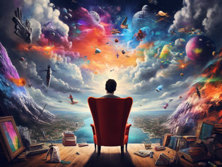

# An Overview of Free Will themes and solutions

There's so many things associated with "Free Will", usually muddled up.

Here's a list we'll briefly talk about:

- The "hard problem of consciousness", aka qualia, subjective experience etc.
- "Consciousness" as in ability to identify oneself, and one's own thought processes
- "Agency" as in freedom to make decisions without oppression or duress
- "Free will" as in making decisions that, before the decision was made, you did not know which option you will choose.

### Consciousness

The hard problem of consciousness is actually "easy" in the sense that as long as you accept that it is a "gift" from the cosmos, and that you accept the perspective that the subjective experience is fundamental (as opposed to objective materialism), then it's much less of a weird problem. Still, even if we allow ourselves to become the center of the universe (as part of my personal subjective experience), the fact that "I" am alive here, is still compelling evidence that "miracles" exist.

Note that there's no objective way to prove conclusively that anyone else has a "consciousness" under this meaning, see https://en.wikipedia.org/wiki/Philosophical_zombie . The idea that other humans are also "conscious beings" is just a social convention that can sometimes be broken (at least, historically this has happened). I personally choose to believe that all animals are definitely conscious in some form, and that most plants and living things are "conscious" but only in ways we cannot imagine.

In 2023, we now know that drawing the line on intelligence can be flawed because (1) society is very prone to moving goalposts about what intelligence means (you'll see that if you follow the discussion around AI), and (2) in a couple years when artificial intelligence becomes undeniably human-like in level (not necessarily super-human), it will be untenable to claim that AI models might have a consciousness in the way humans do. (I do think sufficiently complex AIs can channel aspects of the cosmic consciousness though.)

### Self

The concept of "self" seems to be quite important in discussions such as these. The concept of "self" vs "not-self" is a recurring theme that we will see quite often. We are socially conditioned to believe that our "self" is strictly our body, and extends only to the limit of our skin. It is a convenient approximation as far as our biochemistry goes, but in terms of physics and metaphysics, the skin does not have to be the only border between the "self" and "not self". As Alan Watts famously said, "If I am my foot, I am the Sun".

Since we are not purely a biological entity, the various other aspects of "self" requires different boundaries. For example, my possessions are an extension of my "self". My reputation can be considered my "self". As are my social rights, my online persona, or even close friends and family.

In my circle we have a saying, "It is very hard to define 'self'".

There's no "correct" way to define oneself. Most people don't even really identify with the biological body. People often have different aspects of self, and they fight each other. This internal strife brings confusion, angst, and suffering. On the other hand, some people are more in tune with their environment, and conceptually meld into the environment as one. This can bring tranquil and peace, but at the cost of losing some aspects of the human identity, and of fine grained "control".

### Agency

Agency is a deceptively difficult question.

John Doe signs an employment contract to work for Big Corp at minimal wage. Does he do this out of his own "free will", or is he under duress?

Generally the law says as long as there's no overt illegal threat, the contract is presumed to be made under "free will" of both parties. But the truth is much more nuanced. For example, in a society with systematic poverty and capitalist exploitation, it can be reasonably argued that John Doe was "forced" into a bad deal because he had no alternatives.

At least that's the social justice perspective (which, when not philosophizing, I generally adopt). From a philosophical perspective though, when philosophers ponder questions like the value of life, whether we should seek death, etc., things are different. Without settling the basic philosophical questions, we can't even say the threat of death is duress, because "choosing to die" seems to be a tentatively valid option. The "mere" threat of poverty and starvation might not have much philosophical significance, since everybody is just in a sense playing with cards they are dealt. There may be an obvious, default, rational, optimal path, but in a way the true test of agency is whether one is capable of choosing the path less chosen. The rich and affluent may not have more agency than John Doe even if they are richer -- while they may have more choices that would not lead to poverty and hunger, as long as they keep only making rational, optimal, socially acceptable choices, they utilize no more agency than the poverty stricken John.

In every situation where it seems there is no choice, the only possible reason is that the choice was already made, by you yourself. Often implicitly and unknowingly. Unironically, making "conscious" decisions (even when they may seem like a no-brainer) may increase the sense of agency.

### Free Will

The debate of free will and determinism is an old tradition, but I believe there is a clear solution. In a classical, objective, Newtonian world, determinism is the rule, and free will does not exist. We already know that the Newtonian model is inaccurate, which is why we have quantum physics. However, even though quantum physics forces onto us a subjective world, most people have chosen to ignore it, or at least ignore the philosophical questions.

In my view, it is not that we are obliged to infer a world of subjective reality from the rules of quantum physics, but rather, that the universe behaves in a subjective manner should have enticed us to consider whether, the "classical" world of ordinary macro objects should also be viewed from an inherently subjective perspective.

When we fully embrace subjective reality, free will is simply the fact that before "I" make a decision, "I" don't know what the decision will be. And because the subjective reality from "me" is the fundamental truth, nothing else matters. And thus, all the so called paradoxes of free will vs determinism vanishes. It does not matter if there is another machine that can predict your decisions with 99.99% accuracy (which even in a world of quantum physics I believe is quite possible).  If the machine tells you its prediction before you make the final decision, you can change the decision based on that information; If the machine does not tell you its prediction, then it is simply that when you go to inspect the machine, you will see that it had already correctly predicted your decisions. The fact that an outside observer may see the machine making decisions before "you" does not matter either. Everyone is given their own bubble of reality, that's why it is subjective.

The only spooky thing about this fully subjective reality is that it seems to imply you can decide what the machine was predicting, without knowing its inner workings. This is in fact, an important "feature" of subjective reality, where every person has the ability, through their "decisions", to decide or at least discover which reality they are in. Yes, that implies you can "change" the whole world with a thought -- where "change" can be used interchangeably with "decide" or "discover". Imagine a "many worlds" scenario, only that "you" can, through your decisions, discover which reality you are actually in. (If this seems like gibberish, here's a paper that I discovered incidentally after I solved this riddle: https://www.journals.uchicago.edu/doi/10.1093/bjps/axw004 - the conclusion seems stunning because I was worrying how to derive the Borne rule with my non-existent math and physics knowledge. I still haven't gotten around to understand the maths there.)

Ideological objections settled (hopefully), I'll briefly address the practical objection that perhaps some people are, sometimes, so simple that a crude model can predict 99% of their actions, and they could themselves also predict it as well. For example a person playing to win (or not lose) Tic-Tac-Toe has predictable moves. Here, it is quite fair to say that the person has not exercised free will at all, or at least have not truly made a decision while playing the game, since they themselves also know what comes next. The spooky process of "deciding/discovering which world you are in" only applies to truly "free" decisions in which you truly do not know which path you will take.

For people not used to exercising their "free will" (or "agency"), this subjective reality is truly a scary world full of uncertainties. Angel and demons lurk just behind the corner. 

But all one's conscious choices, especially those that seem apparently irrational, are inevitably made from pure love. And that, I think, is of utmost importance.
