# 美元通漲紀

好耐好耐以前，喺大海嘅另一端，有一個國家。某年某月某日，佢哋嘅央行印咗一堆銀紙。

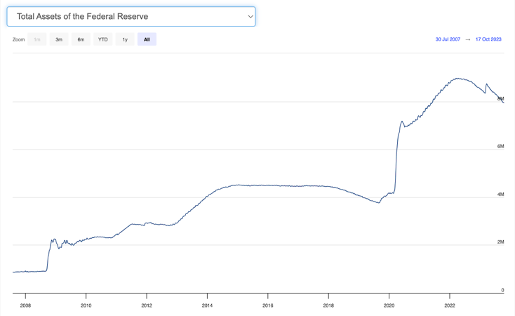

啲銀紙印咗出嚟之後就借咗俾政府救濟萬民於水深火熱之中：

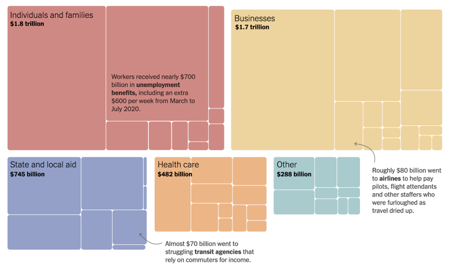

一般教科書就會話，印咁多銀紙會造成通貨澎漲。但 CPI 冇咩即時嘅變化：

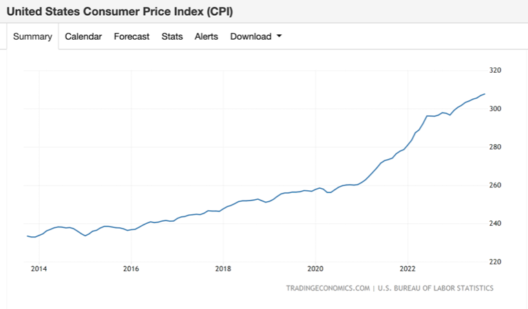

雖然 2021~2022 年通漲係有啲勁，但相對於印咗嘅銀紙，升幅唔算好誇張。

所以呢個故事教訓我哋，印銀紙係唔會導致通漲嘅。印銀紙係唔會導致通漲嘅。印銀紙係唔會導致通漲嘅。印銀紙係唔會導致通漲嘅。（至少唔會引致用 CPI 計算嘅通漲）

CPI 用民眾生活相關嘅物價計算出嚟，而嗰啲嘢唔係靠市面上有幾多銀紙去定價，而係最小學雞嘅供求定律。

人多咗錢，尤其係疫情流行嗰排，唔會買幾袋米喺屋企擺，更加唔會租多兩間屋，或者每日揸多幾十里路車。

所以通漲直接影響嘅，係啲人忽然多咗錢買啲 on9 嘢：

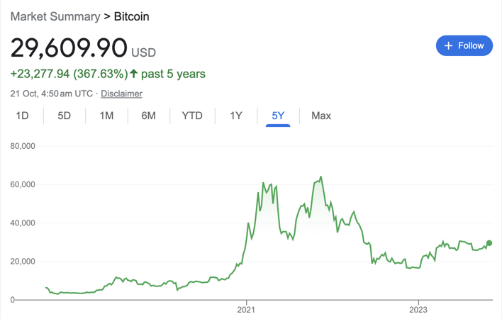

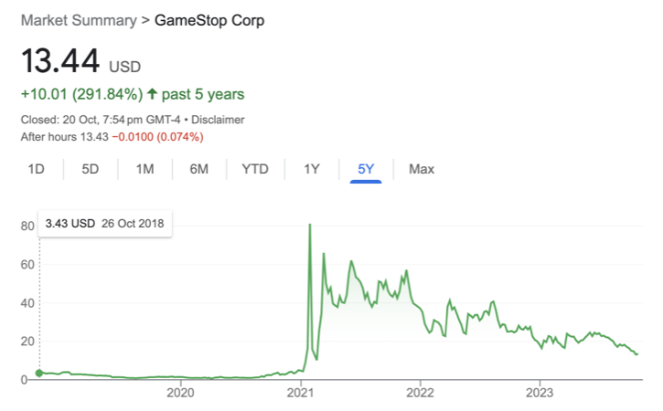

甚至啲 CPI 開始升嗰陣，我哋嘅主角 J Powell 仲喺度話通漲係「過渡性」嘅，唔使驚，唔使加息。當時我仲喺度恥笑佢，但而家諗返其實佢有佢嘅道理，因為始於 CPI 唔係市面上有幾多錢嘅問題，而係供求問題。而當時供應鏈的確出咗啲事。

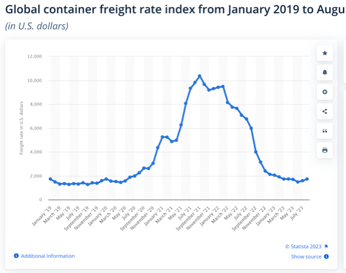

咁當然普京攻烏克蘭都有啲影響：

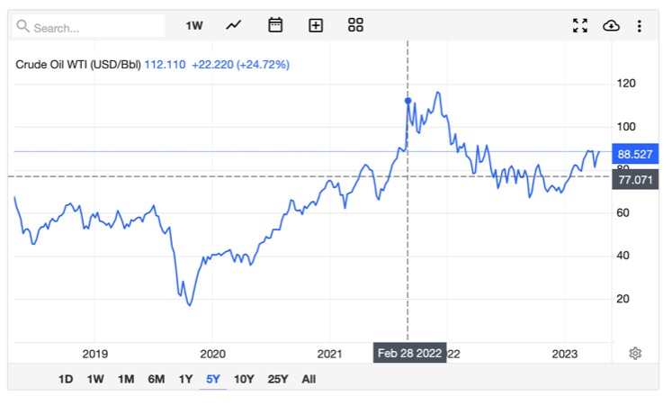

如果你真係相信 CPI 純粹供求問題，而通漲主要係因為運輸、燃油價格上漲，咁央行又真係冇需要考慮加息嘅。

咁但係印銀紙真係唔會引起通漲咩？其實喺 CPI 以外，啲物價係升到含含聲：

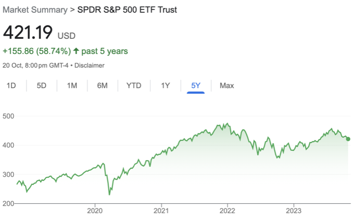

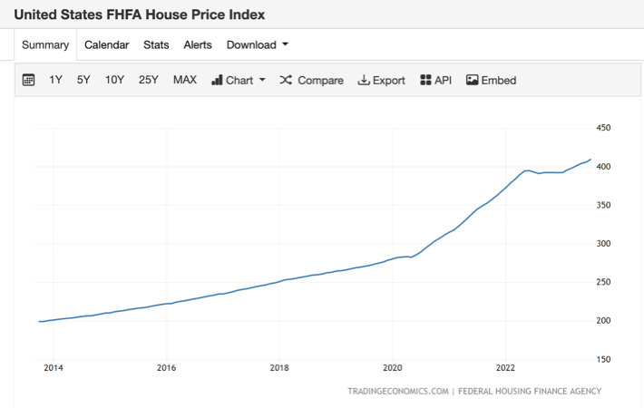

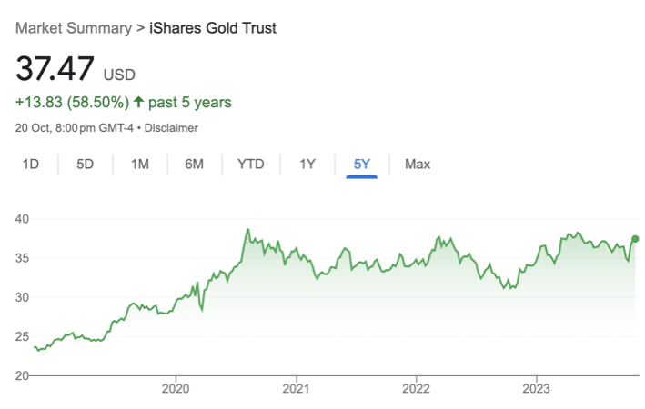

咁「價格」呢樣嘢係相對嘅。呢啲嘢嘅價升，係因為佢哋升值，定係因為貨幣本身貶咗值呢？喺呢個情況，我傾向覺得後者比較講得通。

細個嗰陣成日問點解銀行唔印多啲銀紙出嚟，咁大家咪可以有錢食飯囉。

Turns out 只要食物供應足夠，印銀紙周街派救濟飢民係真係可行嘅。甚至係只要啲嘢有 inelastic demand 就得。

但相反啲唔等使嘅嘢就升值升得好快。越唔等使嘅嘢升得越快。所以股票同金升少少勉強跑贏通漲，BTC 升咗幾倍，而 GME 呢類 meme stocks 就升到變數字遊戲。同期嗰啲 NFT 同各種神奇怪幣層出不窮，都係啲唔等使嘅嘢變得好值錢嘅現象。

眾多跡象都顯示，印出嚟多咗嘅錢，基本上去晒呢啲唔等使嘅嘢度。

FTX 爆嗰陣我慨嘆：好在有 crypto 咋，如果唔係啲人喺傳統金融體制內玩嘢嘅話，對經濟傷害更大呀。 經過大半年不斷反覆思考印錢同通漲嘅關係之後，而家諗返感受更深刻。某程度上可以話，係 crypto 呢個 money sink 救咗 J Powell 一命。印多咗嘅錢自動走晒去 crypto （睇返啲 crypto market cap 條數係幾 match 嘅），然後邊個炒 crypto 輸錢嘅就抵死啦，關人忍事。

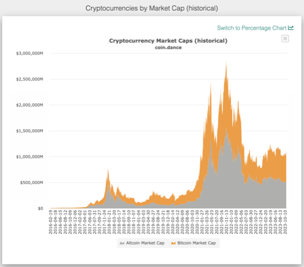

J Powell 印錢，雖則話通漲已經控制喺 4% 以下，所以其實啲 5% 美債係所謂嘅零風險收 1% 實質利率，但你渣住嘅美元美債係咪每年真係只貶值 4% 呢，就好值得商確。如果你嘅錢只係為咗一日兩餐同埋租個狗竇，咁美元只係貶值 4%。不過如果你啲錢係想用嚟過啲比較中產嘅生活，買車買樓過小資生活，咁你嘅美金貶值幅度就肯定唔只 4%。

某程度上，你用唔同嘅價值參考指標，可以得出唔同嘅論述。

例如你用 nominal 美元去講述經濟狀況，就會見到所有嘢越嚟越貴，但自己嘅人工同資產又不斷上升。總之有多餘嘅錢就做定期啦！有 5% 好好㗎喇！

如果用 CPI-adjusted 美元去講，就會見到(nominal)美元慢慢貶值，而樓價股價不斷上升，證明經濟環境大好。不過唔知點解人工總係追唔上樓價股價嘅升幅。

如果你係用薪金去講，就係 CPI 計算嘅嘢越嚟越平，即係只要你肯做嘢嘅話，有手有腳唔會餓得死。不過想過中產生活，買樓買名牌，咁就唔知幾時先有咁嘅機會喇。

如果你係用資本嘅角度去講，就係其實市面上嘅嘢甚少有真正增長，所有貌似增長緊嘅嘢，其實係靠 QE 去維持。點解 CPI 咁低？因為科技發達，農業技術進步，糧食充足，同埋有(美國)政府補貼，所以糧食價格越嚟越低。其他生活必需品都係同樣道理。至於租點解低？因為 QE 造就低息環境，所以租金都被壓低。所有嘢越嚟越平，呢個的確係現代社會成功解決貧窮嘅一大進步。但同時，喺資本角度，一般工人嘅薪金亦都一直下跌，只係冇 CPI 跌得咁快。否則點解以前一個藍領工人做幾年嘢就買到樓，而家佢做幾十年都冇可能置業？

至於「事實」係點就真係哲學問題嚟。錢只係數字遊戲，自由市場定價亦冇話邊個先啱。

講到尾我自己都走唔出一個好抽象嘅哲學問題：究竟錢有咩用？究竟一個經濟體系應該用嚟做啲乜？ 其實答案未必係「大家安居樂業有飯食有瓦遮頭」⋯ 第一生存本身係經濟體系存在嘅先決條件，唔係一個目的嚟。講目的就要喺基本生存以外再搵啲嘢出嚟做，例如古代某啲文明就將人類嘅剩餘價值可能係攞咗去起金字塔。美國就好有趣嘅，除咗發明一堆嘢減低經濟效率之外，就係用嚟維護民主價值 （i.e. 整軍備，倒落海) 中國人就更加有趣，全部去晒買樓。躺平係講緊只要你冇打算喺城市買樓，基本上真係唔需要咁努力。呢個真係 first world 到唔再 first world 嘅 problem 嚟，不過又係真嘅問題嚟。多餘嘅 GDP 如果唔係用嚟搞社會福利主義，咁應該攞嚟做乜呢？如果冇任何嘢去消秏資源，去到最後，都總會有一堆資產係升值升到天價。所以呢，可能我哋都真係應該去起下金字塔⋯

