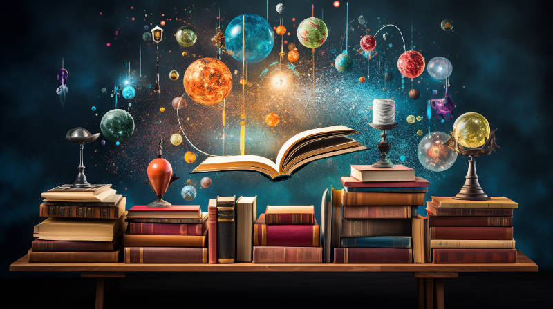

# What is Magic

“Any sufficiently advanced technology is indistinguishable from magic” - Arthur C. Clarke

But is that really true?

The Magic (some spell it as “Magick”) in the modern era actually has a property that is very different from science and technology in general. Whereas science and technology generally involve processes that are reproducible, Magic is often about statistical anomalies.

In general, science covers phenomena that are reproducible under artificial conditions. For example, in a lab; or in a factory. We can, through repeated experiments, understand the conditions that give rise to a phenomenon, and thus we can establish cause and effect.

Much of Magic does not have clear cause and effect. The phenomena are generally not reproducible under artificial conditions, if at all. Proclaimed practitioners generally cannot clearly explain why they can achieve a certain effect, at least not under reductionist language. Any documented effects of Magic are generally seen as coincidence, flukes, or statistical anomalies.

To put it another way, if somebody discovers a surprising natural phenomenon that is easily reproducible in a lab setting, it would most likely be investigated under the umbrella of science, even if at first it *feels* like magic. A lot of technology feels like magic when first introduced, but after a short while, people become accustomed to it and it doesn’t feel that special any more. (This is why, despite Arthur Clarke's quote, we don't really think technology is actually Magic.) In contrast, what is generally considered Magic is always surprising to the general populace because they never expect it to happen, and it doesn't happen often enough that these expectations change.

And thus, with this working definition of Magic, i.e. Magic is the phenomena of statistical anomalies, we have a better idea of the methodologies we must use to research and understand it, in particular, we cannot use the scientific method as-is. Frequentist statistics does not work. The law of large numbers does not apply. Instead, if there is a solution, it must lie in tiny amounts of very surprising evidence, and to process this evidence we must leverage Bayesian statistics instead. To manifest the anomalies, we must turn the Law of Large Numbers on its head, and use its reverse effect, which I shall call the "Anomaly of Small Numbers". In addition, methodology from the humanities should be considered, for example historiography(?), where instead of trying to reproduce the topics studied (impossible since we can't reproduce historical accounts/events), scholars try to assess the reliability of sources. The point is, with this line of thinking, we will find a way forward for studying Magic, as long as we don’t fall into the trap of thinking that “Science” is the totality of all Truth or that it is the only infallible way to find Truth. 

There are obviously yet-to-be-discovered phenomena that can investigated by means of scientific methods. Even though they may sound magical per Arthur Clarke’s quote, perhaps they should be called quasi-magic instead of Magic, to highlight the fundamental differences between the two. 

It is a common misconception that practitioners of Magic reject science and conclusions of mainstream science. This doesn’t have to be the case, at least as far as science does not mistakenly conclude from the lack of *reproducible* evidence of Magic that such phenomena outside of its domain (unreproducible anomalies) absolutely do not exist. (Remember that the lack of evidence is not evidence of absence.) Given the success of modern science in the many domains it has succeeded in, the modern Magic theorist must accept the fact that much of modern science is true, or at least it is a practical, workable interpretation of truth. Once one realizes that Magic is not a subset of science and that science is limited to reproducible phenomena, it would be obvious in retrospect that the scholar in Magic must fully understand what science has to teach us, especially its actual limits, and henceforth attempt to study the phenomena outside of these limits. It would be folly for a scholar in Magic to ignore the teachings of science, and then erroneously attempt to explain phenomena that already has a workable explanation in science -- unless the Magical explanation is part of a larger set of phenomena some of which is unexplainable in science.

