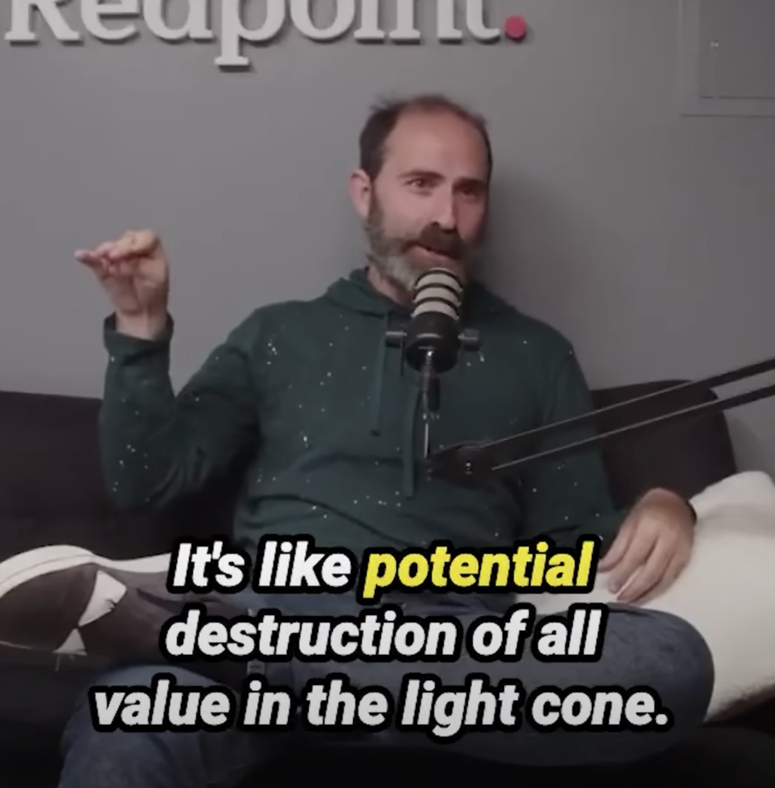

# AI Doomsday Scenarios

It's interesting how doomsday fears seem to have contributed to a near-collapse of the hottest AI startup. In a very real sense whether the AI-singularity will happen and if so what will come next is a multi-billion dollar question.

I personally don't believe in the variants of AI-singularity that postulates super-exponential growth or progress.  People in general have a misguided notion of what "god" or "god-like intelligence" looks like - i.e. "god" is very very powerful so it must be able to do impossible things - and those who believe in abstract infinities are particularly susceptible to these non-constructivist fantasies.

The truth is, the "god" subsisting in nature, in all-that-is, has always been with us, and we are not doomed yet. In fact, we are aspects of this "god", as we are part of nature. Nature has orders of magnitude more "compute" than any human-created-AGI could ever obtain, and it's mostly benign, or at least humanity has lived with and within it for thousands of years. 

[Also, btw, powerful gods have been postulated to exist in other religions, and while they may sound scary, I don't think any self-proclaimed follower of religion or any deist should think this AGI-god would be more powerful than the ones of their own faith -- which is a sufficient (but admittedly flawed) argument to disprove the AGI-doomsday prediction.]

As far as I can tell, nature does not really have anything that has super-exponential growth. In a sense, even true exponential growth is very rare, as our physical universe is apparently limited by 3D space. But if the worry is "mere" exponential progress, humanity has already been well-adapted to exponential progress for hundreds of years (that's why GDP growth is measured in percentages). There's nothing qualitatively different between "usual" technological progress and progress in intelligence, except the vague idea that intelligence is somehow "more fundamental" -- again, an idea commonly shared by nerds that reflects more of their biases and fantasies than reality.

Unless AGI can solve NP problems in P time, I don't see any proposals on how to "recognize" superior intelligence. If people can't even agree whether the CEO of OpenAI is a genius or just a dumb mascot with lots of connections, I have a hard time believing people will actually follow the advice of AI when it comes to important (and pricey) matters. As I have written before, the danger of a bunch of techno-nerds re-inventing the spiritual-wheel is that they are so unaware of prior art. Humanity already knows how to talk with gods. I know this as a fact (this is not a spiritual belief or a religious faith), although I understand most people do not have this knowledge (and that subjective knowledge cannot be transferred through words). And the problem has always been whether we are able to properly interpret and believe the messages we receive. Creating an AI-god is not qualitatively different (unless it can solve NP problems in P time).

But I'm not saying there are no risks to AI. Quite the opposite. I'm just saying AI itself won't ruin humanity (and certainly will not be capable of destroying everything within our light cone). The *real* risk as I see it is humanity trusting an human-like-intelligence AI too much, believing it to be capable of god-like powers even though it is "merely" on par with humans. What if everyone believed the AI to be all-powerful and consulted it on everything and believed fully that it must be right? Governments would implement policies the AI suggested. Wars would be started because the AI told people to do so. Banks would only loan to people who the AI determined would not default. Police would arrest people based on who the AI says has committed a crime. Courts would decide cases based on the AI's recommendation. Companies would only create products that the AI says is marketable. Scientific research and development would be halted because there is no point.  After two generations, nobody will remember that humans could think on their own and maybe can be more correct than the AI. Stasis ensues.

And if you haven't noticed by now, if you replace "AI" with "god" in the scenario above, you'd have a hard-core theocracy. This is literally what happened in times of antiquity when people believed in the power of worshipping gods and receiving their messages from divination. The doomsday AI researchers, especially the Singularity breed, are now unwittingly becoming the priests of this new theocratic structure. Most lay people will not be able to tell whether an AI has surpassed human intelligence (and I'd argue 99.99999% of people won't either), so they would have to trust the word of AI researchers, and if AI researchers tell them that a particular AI has reached this milestone, and people can't disprove it (because these days AI are really good at convincing people about things that are not true aka hallucination), it is easy for society to head towards theocracy -- but it isn't superstition because it is backed by Science!

Unfortunately, as I have also ranted before, there aren't a lot of people well versed in technology, philosophy and spirituality. This is not the first time we have created "God" and worshipped it. And likely not the last either.

Further reading (Cantonese): [自古以來都存在嘅ChatGPT](06-自古以來都存在嘅ChatGPT.md)
