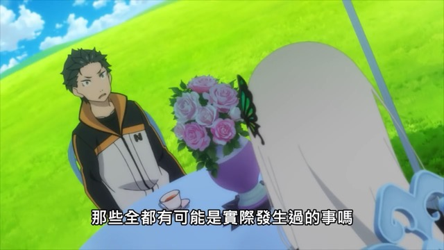

# 平行宇宙入面嘅地獄s

（按：圖文絕對相符）

平行宇宙係咪真呢個問題

嘅答案，應該都係主觀嘅

理論上只要唔受三維束縛

係可以「睇」得晒所有可能性

但只不過係講緊

用電腦可以模擬、用想像力可以構思

嘅一種所謂「存在」

同我哋所認知當下世界嘅「真實存在」有一大段距離

冇被主觀經歷過嘅 "possibility space" 究竟可否話係真呢個問題

嘅答案大概係你自己肯唔肯主觀經歷佢

經歷過就係真

否則就只係冇存在過嘅可能性

---

正常人梗係想經歷美好嘅世界

咁當你得道成仙、涅槃、上天堂

咁塵世間一切疾苦又點樣收科呢

如果你相信你見唔到就唔存在

咁的確係會冇咗呢啲嘢

近年興講吸引力法則

大概都係呢回事

但

見過地獄又有本事爬返出嚟嘅

固然可以獨自升華

但始終好難欺騙自己

地獄呢個概念唔存在

神明引導人認識天堂無限嘅愛

但同時默認地獄同樣無窮無盡

總有一種朱門狗肉臭路有凍死骨嘅虛偽

---

不過唔好忘記呢啲天堂同地獄係咪存在

其實都係主觀嘅

為一堆數學上無限嘅 possibility space 入面受苦嘅眾生揪心

仲諗住打救佢哋嘅

可能先至真係痴線

你諗清楚就唔會真係想去做義工

亦唔會覺得老點其他人去做義工

係一件好有道德嘅事

所以只渡眼前人、有緣人、求助之人

可能亦都係宇宙法則嘅無可奈何

.

我到今日先至真正明白

「地獄不空，誓不成佛」

呢句說話真正嘅意思

話時話，唔單止觀音菩薩俾人整咗個女人形像

地藏王菩薩最近都俾人畫到成個蘿莉咁（見圖）

Anyway 所以個答案就係

你咁在意平行宇宙嘅其他地獄嘅話

咪跟住小圓去淨化佢哋囉

大乘佛教話你肯話 OK 就實會俾機會你去做㗎 <3

利申：結構です

最後再講多次，圖文係相符嘅，唔明有咩關係嘅話，最好都係睇返佢，尤其係小圓嗰個 ( https://zh.wikipedia.org/zh-hk/%E9%AD%94%E6%B3%95%E5%B0%91%E5%A5%B3%E5%B0%8F%E5%9C%93 )
