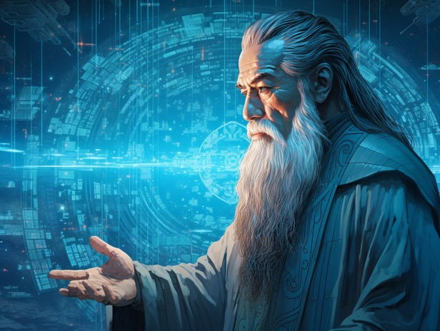

# 唔識文言文，等如啲西人唔識拉丁文，冇問題㗎喎！（好似係）

喺多個朋友嘅臉書見到台灣人討論應唔應該教文言文呢單嘢，少少八卦走咗去睇究竟粒花生搞乜。

話說，記得香港都會得閒拗下文言文教學嘅問題。利申我唔識字嘅，不過一個 tab 查字典 [1] 一邊讀古文，通常都係睇得明嘅。至於係唔係因為中學讀過嗰十篇八篇文言文，我覺得應該冇咩關係⋯ 至於識文言文對 *個人* 嚟講有冇用，除非你真係會走去翻查埃及金字塔周邊啲名同《山海經》啲神物嘅讀音係咪近似[2]，否則都真係冇乜用。（按：啲嘢學識咗仲要實踐過，先有資格講有冇用㗎嘛。）

大家望下歐美世界，佢哋中學都唔會學「文言文」。對佢哋嚟講，拉丁文同埋古希臘文就係佢哋嘅文言文。唔學都冇乜嘢吖（好似係），一樣可以整到原子彈（好似係）。

話說文科同理科嘅教育好唔同，文科比較鍾意叫人讀原典，理科就鍾意叫人買最新版本嘅教科書。對文科人嚟講，你冇讀過《論語》原文[4]真係唔好話自己識孔子，但對理科人嚟講，知道三條定律就等於識得牛頓，走去讀 Philosophiæ Naturalis Principia Mathematica 原文嘅肯定係痴咗線。所以理科老師教書嗰陣，只會指住教科書入面好簡潔咁寫住牛頓三條定律，你記住佢就得㗎，考試會考。但文科老師就一定會堅持叫你讀原典，所以先至會有呢啲文言文之辯[3]。

唔讀原典，係咪會掙咁啲呢？作為一個讀過文科嘅人，我可以好肯定咁答你：係。

我大學讀過幾年籮(Law)，眾所周知普通法制度之下，案例係法律嘅重要來源，所以某程上可以話案例嘅判詞係法律嘅「原典」。但法庭一日判咁多案，冇可能睇得晒，喺未發明 text embeddings[5] 嘅年代，你亦好難準確搜尋到適合嘅判詞去睇。所以就會有教科書。法律教科書會抽取同整理主要案例嘅重點，通常會加埋作者少少(或多多)評論咁。我自己嘅經歷就係，睇完教科書之後會有個大概印像，但如果真係想徹底明白法律原則嘅來龍去脈(包括當中嘅nuance)，就一定要睇判詞原文。[6] 始終啲判詞幾十頁咁長，通常都唔係特登講廢話，而教科書只係將其提鍊成為幾段文字，一定係有資訊流失。總之，睇case唔夠時間，睇textbook會似明非明呢個dilemma，算係我哋讀呢科嘅難處之一。[7]

呢排喺 Youtube 度聽有人講[8]近代科學迷失咗幾十年，其中一個原因係啲人唔識「科學嘅歷史」。試想像下，我哋將牛頓成本書精簡成一頁紙寫晒嘅三條定律，當中係咪會遺失咗啲嘢呢？[9] 如果純粹係用嚟計工程數固然係冇咩問題。但如果係要突破人類知識嘅界限，開發人類未知嘅領域呢？ 起碼，牛頓當時點樣搵到突破，佢遇到啲咩阻滯，佢嘅思路點形成，呢啲心路歷程，我諗係應該要知嘅。當然佢最後完成嘅作品未必會交代晒呢啲嘢，但如果你連牛頓親手寫嘅作品都唔去睇，淨係學一頁紙嘅三條定律就想超越佢嘅成就，就真係有少少過份喇。

問題嚟喇：牛頓係用拉丁文寫文章㗎。你唔識拉丁文，點可能睇得明佢講乜？我鳩估啲人唔睇原典其中一個原因都係言語不通。咁翻譯呢？如果你識得超過一種語言就會知道翻譯係一件幾咁唔精確嘅嘢嚟。語言之間永遠有啲字係譯唔到，失之毫釐，差之千里。舉個離譜少少嘅例子，大家有冇用英文讀過《論語》？ 😀

講起孔子，見臉書朋友share「孔子其實好威武好打得」嘅帖文，其實某程度上都同大家普遍識睇文言文有關。雖然教師從來都唔會話孔子體質弱雞，但始終佢嘅武藝唔係重點，咁正常教書嗰陣都只會著重講佢點樣重視學習、仁愛、禮儀、品德之類，然後佢啲畫像通常都係一個慈祥老公公咁款，咁就好易誤解咗孔子本人嘅屬性。如果一般人唔識得點樣搵返啲《論語》、《史記》出嚟睇原文，好可能永遠都唔會有人同你講「點滿武力是為了讓你不得不跟我講道理」。雖然係搞笑，但人自古以來都係外貌協會嘅，孔子早年有人跟隨，睇怕同佢外表同武力值係有一定嘅關係。呢啲嘢，如果你純粹係要學習仁愛品德，確實係「唔需要知」。但如果你係立志做聖人，咁知道呢啲嘢係幾有用嘅。(起碼唔會on9到以為齋講道理就會有人理你[10]。)

「立志做聖人」呢樣嘢真係唔係講笑嘅。據講號稱「中國最後一個聖人」嘅王陽明細個就話讀書係為咗做聖人。同埋佢係識文言文嘅，斷估佢係有利用文言文知識去認真研究孔子點樣做到聖人。同埋，佢又真係能文能武嘅。你話佢帶兵打仗都可能只係戰術叻未必有武藝，但佢領軍時被人擺上抬要show兩手，最後箭法如神，三發三中。[11] 所以究竟識文言文有冇用呢？對絕大部份人嚟講，真係冇咩用。但係社會需唔需要聖人？每年出幾多個聖人？如果聖人呢樣嘢係千年一遇，又值唔值得叫所有人浪費時間去學文言文，等千年一遇嘅聖人胚子除咗學仁愛品德，仲會識得走去練習射箭練氣功？

呢個真係好難答嘅問題。

語言呢樣嘢唔係一朝一夕學得識，講起「書到用時方恨少」，近排我研究魔法（唔係你估點解我會走去認真煲《山海經》），真係覺得唔識睇拉丁文同古希臘文好可惜。曾經有三秒諗過係咪應該借神學院過橋用佢哋啲課程去學返呢樣嘢。（講下咋，不過真係諗過三秒。）雖然係咁，但都係會慶幸自己識得文言文，起碼第時有時間睇《太乙金華經》嗰陣，唔會好似 Carl Jung 咁樣要睇譯本。（諗起都覺得佢慘⋯ 哈哈哈哈）但，各位中文老師堅持要教文言文嗰陣，係咪諗緊啲學生要睇得明《太乙金華經》呢？ 哈哈，係咁爾諗下都想笑出聲。

---

- [1] 字典我淨係信康熙嗰本；我有份寫嗰啲⋯ 就唔好信到十足⋯
- [2] 崑崙係 Khnum (aka Khnum-Khufu)； 開明獸係 Horem-aket，獅身人面像。詳見 [呢度](https://hnfong.github.io/public-crap/writings/2021/%E5%B4%91%E5%B4%99\_=\_%E5%9F%83%E5%8F%8A%E9%87%91%E5%AD%97%E5%A1%94.html)
- [3] 係，我仲記得原本議題咩，冇甩到㗎。
- [4] 我知《論語》唔係孔子寫嘅。事實上孔子「述而不作」，應該唔會俾你搵到佢親自論述嘅著作，所以大家都係唔好係咁擺佢上抬叫佢老師喇⋯ (你有資格咩?)
- [5] 呢兩三年先至夠準確嘅 AI/NLP 玩意嚟。大概係用啲 AI 技術將文字變成一堆數字(vector)，然後你可以將兩堆數字(vector)乘埋(cross product計cosine distance)就可以知道兩段文字有幾大關係。放心，我仲記得原本議題係乜嘅。
- [6] 話說一開始迫我哋睇判詞(佢成個course都冇用過教科書)嗰條友，而家tenure咗就好全職(好似係)喺網上恥笑啲crypto撚。
- [7] 利申：差少少 3rd hon。
- [8] [Dangers of Superstitious Physics - Dr. Alberto Martinez, UT Austin - DSPod 209](https://www.youtube.com/watch?v=DBE35j9wFQs)
- [9] 我知數學微積分會講返少少，但都補唔返㗎。
- [10] 諗起啲光頭KOLs...
- [11] 另外，唔知係咪金庸9up(搵唔到source)，相傳佢喺軍中練氣功，嘯氣大聲到幾里外都聽到。呢單嘢 fake 同唔 fake 之間，件事可能係fake，但佢練氣功有咩咁奇？孟子都練(浩然之)氣啦。雖然此氣又未必等同彼氣，但啲嘢嘅根基係共通嘅。讀多啲書、經歷多啲嘢就會明。我早排 download 咗個 pdf 書，一開頭就話「常言道，修德不练功，到老一场空；练功不修德，容易走火入魔」 (我心諗邊度嚟嘅「常言」XDDD 但屌你又真係無可辯駁喎 - 至於點解我知係啱？試過就知。)
