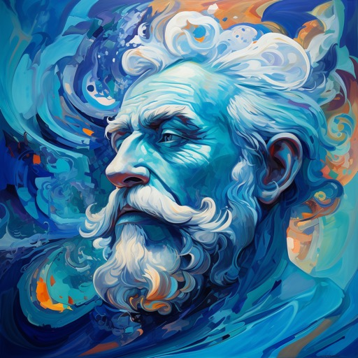

# Gettier

The confusion in modern philosophy is best illustrated by the case of the Gettier problem.

Apparently modern philosophers believe that “knowledge” is “justified true belief”, an inoffensive definition that wouldn’t be out of place in a run-of-the-mill dictionary.

In so far as philosophy as a discipline is concerned with ensuring that dictionary definitions are logically sound, the fuss with the Gettier problem does make a lot of sense. But if philosophy is in any way a study of knowledge itself, the fact that it has no definitive answer to what “knowledge” actually means is reflective of the sad and confused state it is currently in.

Perhaps it was a historical problem. The gnostics had no trouble understanding knowledge. They definitely did not make the mistake of thinking it had to be justifiable. And the gnostics were heretics, which probably led to modern philosophy's feigned ignorance towards such ideas. Yet still, this underlies the fundamental problem of modern philosophy, and potentially most other intellectual pursuits: the obsession with "justification".

The same problem is exemplified by social media, where content is not optimized for truth and positive impact to society, but for "likes, subscriptions and shares". In this context, “justification” is just a fancy synonym of “like”. The “justified true belief” (JTB) formulation of knowledge encodes a truth not of knowledge but of social dynamics: nothing is real unless it is embodied in the academic equivalent of a viral TikTok video.

This is not to say that justification is unimportant. Justification is necessary for communication. One cannot communicate truth without some form of justification. But justification is not part of knowledge itself, only communication of such. The confusion of knowledge with its communication is fatal for the JTB formulation, and the fact that many continued to cling onto it after the Gettier problem was known is a testament to the deep confusion between knowledge, truth and the communication of such among philosophy circles.

So, for sake of clarifying the relationships between the concepts, here is my formulation:

- Objective truth is justified belief.

Unfortunately, it does not explain what knowledge is, because knowledge is a bit more nuanced, and requires invoking the concept of Subjective Truth, which, in turn, is outside the scope of this mini-rant.
