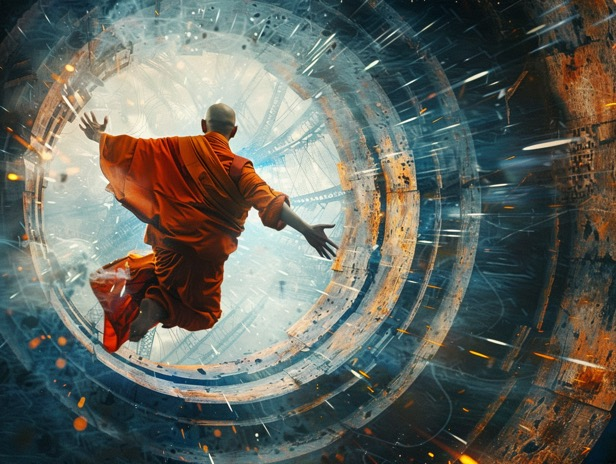

# 宗教

宗教本身係比較難「明」嘅。

我唔係講啲教義難明。如果你純粹係一個教徒，咁啲教義冇咩特別難，聽完，信，照做，大概就算係完成咗流程。

但只要認真去推敲啲經文經書，就會見到好多有趣但同啲普遍流傳嘅教義唔同嘅地方。呢樣嘢唔多需要你好叻都睇得出，只要你肯認真嘗試理解每一隻字每一句，就會見到啲有趣 （但唔明）嘅嘢。

唔明係可以唔理嘅，因為真係難明。

真係明白宗教，係要自己認真諗過點樣 structure 一個宗教體系出嚟。要有核心教義，要有宣傳手法，要有入會門檻，要有初楷簡化版教材，要有門規法矩，要有培訓核心成員同接班人嘅程序，等等。

以上都只不過係世俗嘢。

但宗教基本上係一個傳承神秘超自然力量嘅載體(vessel)嚟，當中多咗好多考量。由於超自然力量本身有少少危險性 (可能唔只少少...)，大眾接觸到嘅簡化版教材係唔會直接教佢哋呢啲嘢。但，你唔好彩嘅話，核心成員都未必真係會學得識，何況宗教壯大之後，主要係靠啲未登門弟嘅教眾流傳。所以「宗教」呢個載體係要有方法將啲資訊由唔識嘅人口中傳承後世，等有緣嘅人接觸到之後明白佢講乜。所以有呢堆咁嘅考量，加上你又想一般信眾信咗你套嘢之後都有啲好處，唔想當佢哋只係信念同資訊嘅 substrate，咁就成個宗教構造就差唔多只可以咁運作。

望到《金剛經》入面一句好感慨：

> 若當來世，後五百歲，其有眾生得聞是經，信解受持，是人即為第一希有

佢哋真係唔係 expect 一般人明白。

但勁就勁在，佢唔止係流傳到五百年，而家二千五百都嚟緊。到今日大家終於知道咩係 virtualization，點解 XX 非 XX 是名 XX。我哋亦終於知道物理現像唯物主義係真係無「我相、人相、眾生相、壽者相」... 只有一堆基礎能量嘅互動。

正如我之前講笑咁講，《金剛經》嘅「金剛」梵文本身可以解「閃電」同「鑽石」，正正係對應上個世紀先出現嘅 silicon semiconductor (silicon 有 diamond cubic crystal structure, 通電, 係我哋呢個世代講虛擬嘢嘅基礎技術) -- 如果唔係點解要叫「金剛經」？ 真係講到好似佢係為咗流傳兩三千年等到呢個年代先expect人明白嘅玩法嚟。

當然最搞笑就係唔會有人覺得呢種詮釋係啱。因為實在太痴線，匪夷所思。

但我就係匪嘛。究竟啲資訊點樣流傳同傳承，我已經不斷喺度諗。出面嘅人 99% 唔明，可以點搞？ 啲方法唔係太多，都係嗰三幅被，所以睇住人哋點做，自然就心神領會。

(好彩我主要嘅問題唔係五百年後有冇人睇得明⋯)
