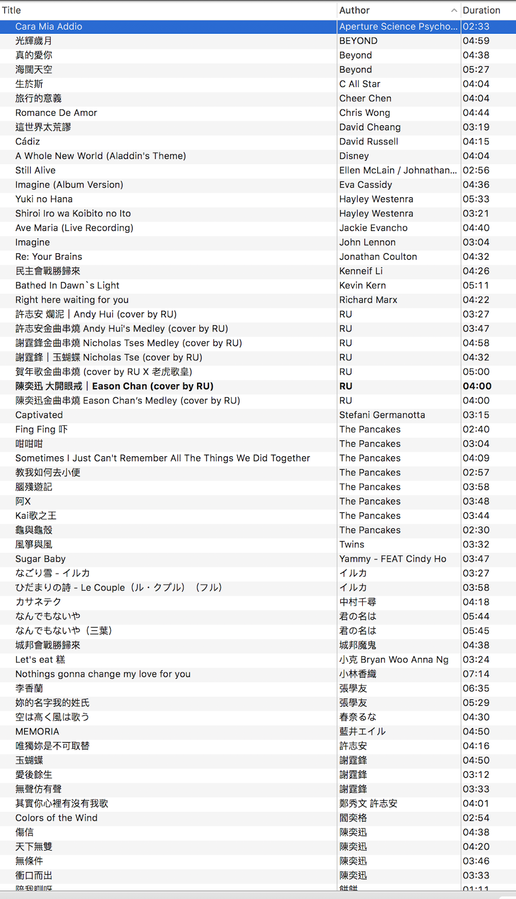

# 我聽啲咩歌？

2018 年寫過咗呢啲：

> 呢幾日得閒少少，執完房就執埋電腦。平日我唔算係好熱衷聽歌，十幾廿年前最興 mp3、玩 iPod 嘅年代，我都係冇「養成」聽歌嘅習慣。我天生冇咩音樂細胞，聽住歌做嘢轉數會低啲，所以就冇咩點聽。不過呢十年八載都係遇著一啲自己鍾意嘅歌手，同埋收集咗一堆自己幾鍾意嘅歌。有啲係流行曲，有啲名不經傳，有香港本土嘅，有外國嘅，有啲係覺得好聽，有啲係有啲特別留念嘅意義，有啲係純粹惡搞。見開咗個 blog 講生活無聊嘢，就分享下啦。絕大部份都係跟住個名上網搵到嘅嘢嚟，除咗最後嗰首⋯⋯未必咁易搵。

原來都六年前嘅事。

呢六年個 playlist 都多咗好多雜不甩嘅嘢。 （其實啲人聽到我 playlist 都會覺得點解你乜都有嘅？）

我諗由最新近嘅講起？（non-exhaustive）

- [Kiri T 至少做一件離譜的事](https://www.youtube.com/watch?v=RPoNXvSFHE4) - 唔識呢位歌手，純粹偶然喺臉書見到，個 MV 真係好正好搞笑。(小巴司機：「⋯」) 首歌都係好聽嘅。我見維基話佢係主打英文歌，幾有趣。得閒會聽下。

- Yoasobi - 我真係舊年因為 アイドル (IDOL) 先認識 Yoasobi ，但其實我同意 IDOL 好嘈 :0) 「吱吱吱吱吱咋咋咋？」 《夜に駆ける》我一般。我最鍾意嘅其實係《[もう少しだけ](https://www.youtube.com/watch?v=K1Tz2yNmamI)》，某程度上係好合適我呢排suppose走緊嘅方向。好過夜に駆ける個意境吖。

- 講到 Idol ，英文版我只推 [rachie 嘅 cover](https://www.youtube.com/watch?v=Vo6OdQfo1xU) ；其實 Yoasobi 係有官方英文版嘅，我見有人讚佢(哋?)將英文版唱到好似唱日文咁，我心諗：「　」。只有 rachie 嘅版本真係聽得明係英文同埋順暢。我甚至覺得比日文原唱更好。(可能係因為我唔識日文...)  另外 rachie 其他日文英譯嘅 cover 都好好聽 eg. [A Cruel Angel's Thesis](https://www.youtube.com/watch?v=AX2-R_MuoNM)

- 有位究極冷門嘅 Youtube 結他手我幾鍾意： [https://youtube.com/@jasongeovanni5056/videos](https://youtube.com/@jasongeovanni5056/videos)  似乎係一位印尼後生仔。

- 糖妹 - 佢把聲好好好好聽 (係有陳慧嫻feel)，可惜 live 會偶爾走音... 不過佢 iTunes 上面啲歌應該係執到冇走嘅。值得加落 list 度。

- 可愛くてごめん (sor)

- [Sirenita Bobinsana by Blu of Earth](https://soundcloud.com/blucosmiceagle/sirenita-bobinsana-open-my-heart) - 第一次聽被感動到

- [久遠たま](https://www.youtube.com/@QuonTama) - Youtube 歌手，唱 live 有啲水準 （i.e. 唔一定走音） 佢最鍾意唱啲大聲快歌，睇得出佢嗌得好開心。我最鍾意嘅係佢首 《回レ!雪月花》嘅 Cover。首嘢應該都少少冷門，係『機巧少女は傷つかない』嘅 ED。 首歌嘅節奏同內容都好得意，有少少日系中二病但又有啲青春咁。我係因為佢呢首 cover 先發現久遠たま。

- Chloë Agnew 嘅 Ave Maria - Chloë Agnew，名不經傳，亦都唔係出咗好多歌。我都唔知之前喺邊度搵佢呢首歌出嚟。佢演繹 Ave Maria 同一般嘅經典西樂女歌手有啲唔同，感覺冇「一直谷盡道氣」，有迴腸百轉嘅空間，係比較柔和嘅一種演繹。 (呢首係佢後生把聲)

- 君だったら	by HAPPY BIRTHDAY - 唔知點解啲人可以寫啲咁淒美嘅歌...

- [Enn](https://youtube.com/@ennsings) - 一位香港 Youtube 歌手，好多非中文歌 (日、英 cover），但我比較鍾意嘅係 《[「うっせぇわ」粵語廣東話翻唱『收皮啦～』- Chill Remix](https://www.youtube.com/watch?v=BaIIEoIXSQY)》同埋佢 Vtuber debut(?) 首歌《[まふまふ「女の子になりたい」粵語廣東話翻唱『想變成人類呀！』](https://www.youtube.com/watch?v=Fb-lu-qsfsw)》

- 講起 Enn ，順便提下同佢一齊合作嘅歌手 Yuka。我最鍾意佢呢首：[天使にふれたよ! を 歌ってみた](https://www.youtube.com/watch?v=hiaP9dhXRo4) - 我完全唔記得點解會搵到呢首歌 （睇 view 數都知幾冷門....），但我係經過佢先知道 Enn @_@

- なんでもないや - 上白石萌音  --- 等等等埋我解釋.... 上白石萌音喺 2016 年做《我的名字。》嘅聲優嗰陣都出過一首《なんでもないや》，嗰首就一般般啦。但佢 2021(?) 年做咗一次『yattokosa』 Tour ，呢次真係唱得超好。完全係另一個層次。版權問題 Youtube 好似冇咗，但感謝黨感謝國家，[Bilibili 好似仲有](https://www.bilibili.com/video/BV1QP4y1A7e7/)。

- 薩拉熱窩的羅密歐與茱麗葉 - 鄭秀文  --- 重新發現咗呢首 90 年代嘅歌。唔知點解特別啱vibe。

- 雪の果てに君の名を - nonoc -- Re Zero 外傳嘅主題曲。 nonoc 嘅唱功有少少勉強，但我覺得首歌本身係好聽。(走音敏感嘅朋友可以試下聽 acoustic 版?)

- secret base〜君がくれたもの〜

- Tiffany Poon - 佢不嬲都係做 live classical performance 但近年多咗「出碟」？ 

- [Chopin - Winter Wind - Cateen](https://www.youtube.com/watch?v=pHlqEvAwdVc) -- 呢首好明顯係睇完《四月😭》之後鍾意咗。呢個版本喺網上我搵到最好聽嘅， Hayato Sumino 好似係佢本名，似乎係一位正經嘅古典鋼琴家，不過佢有個 youtube channel 叫 Cateen ，[有時會 post 啲鳩嘢](https://www.youtube.com/watch?v=zN6icPe9N3Q)⋯

- [Theishter](https://www.youtube.com/@TehIshter/videos) - 佢編/彈啲動畫歌好正

