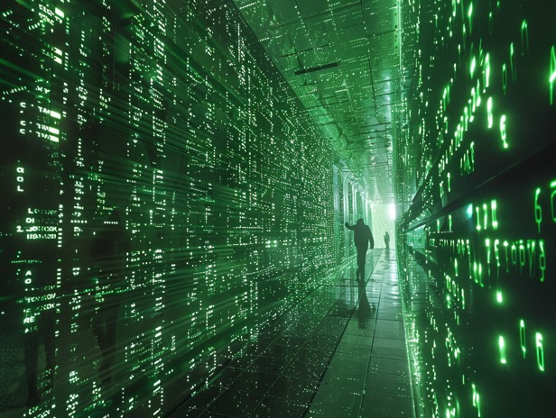

# Thoughts on Simulation Theory

"We are living in a computer-programmed reality, and the only clue we have to it is when some variable is changed, and some alteration in reality occurs. We have the overwhelming impression that we were reliving the present - deja vu."  -- Philip K. Dick

This is basically the same argument made in The Matrix movie.

I kind of sympathize with simulation theory in the sense that I think some of its elements are quite plausible, but I can't help but notice that those arguments as-is are a bit too crude.

People tend to make assumptions as to the limitations on the Creators of the simulated reality, but given that they have already made such an elaborate simulation (i.e. this Universe), it seems to me that it is unwise to speculate about specific limitations that the Creators might have when designing or implementing the simulation.

"Deja Vu", the "Mandela effect", the "glitches" in the system -- they are intriguing for sure, and deserve further investigation and analysis, but I think it is premature to say that they provide evidence of simulation. It just *looks like* artifacts of simulation for us given our technological limitations, but they may be there for reasons of some other kind. For example, allowing occasional "exceptions" in the system keeps the system open ended, and allows the system to evolve between different laws and mechanisms. It also permits the possibility of Magic -- I wrote about my own speculations earlier [How to break the Laws of Nature without getting caught.md](../2023/15-How_to_break_the_Laws_of_Nature_without_getting_caught.md).

I also note that the arguments about limitations in laws of physics due to computational limits of the Creators of the system are absolutely baseless -- if this is a simulation, the system running the simulation must have many orders of magnitude more computation power than we can imagine; it would be like people in 1900 conjecturing what computation power we have in the 2000s. They wouldn't be able to fathom the computation power we have and all the "wasteful" ways we use the power (electron apps anyone?)

Furthermore, the assumption that time exists outside the simulation and poses a limitation on the simulation engine is very suspect. (Also, this assumption is quite at odds with esoteric teachings, and thus probably doubly wrong.) In fact, the system running the simulation could be nothing more than a simple Turing machine with infinite tape -- because the concept of time only exists within this simulation, it doesn't matter how "fast" or "slow" the simulation is run.

That said, my intuition is that "simulation" is definitely a step in the right direction -- it's what ancient esoteric teachings have been telling us for a long time -- that life is a game that repeats itself (Reincarnation), that life is a play (Brahman?), etc. They just didn't have a word for "simulation".

People tend to misunderstand the philosophical implications of "reality is a simulation". For starters, it doesn't make reality "unreal" -- there's the "simulations all the way down" argument, and arguably every one *and* none of them are "real" -- reality is only as real as you let it be. It is perfectly viable to be aware of simulation theory, agree with its arguments, and still choosing to treat the alleged simulated reality as "real". In fact, I would argue that it is the most appropriate way to interpret the world.

By the way, the question of why the simulation isn't perfect (and so we can exploit its bugs to take a peek at what is "outside" of it) is a profound question that probably doesn't have a convergent answer. I suspect it may be a fundamental law that there cannot be a perfectly closed system. This law would allow for changes in reality to a greater extent than whatever one could imagine, and perhaps could be seen as a corollary of the law of abundance... Or perhaps it's just a way to let us break out of the system if we wanted.

Perhaps.
