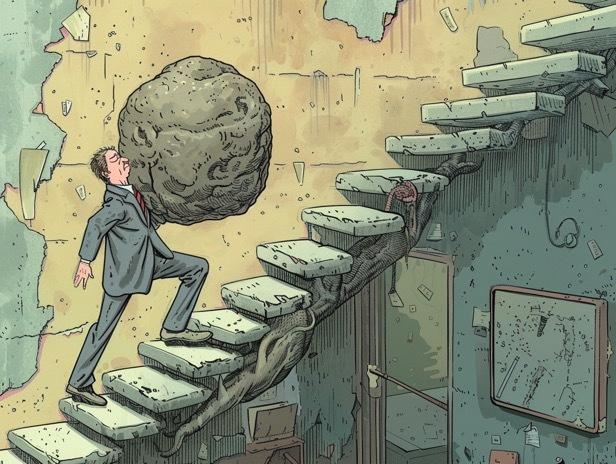

# 內需 vs on9 工

困擾咗我好耐嘅問題，得閒就要開個腦出嚟braindump。

話說現代社會科技發達經濟快速增長，理論上人係應該冇咁忙碌，會多啲時間。但事實上又好似唔係咁。

就咁睇 GDP 其實大家嘅經濟輸出又唔係真係多咗咁多，幾十年嚟增加咗一倍左右？ 但感覺上呢個數唔係好反映到呢幾十年嚟科技嘅翻天覆地變化：有好多嘢平咗，但貨幣亦的確比表面上(CPI)貶咗好多值(因為科技令啲生活必需品平咗...)，有一堆 confounding variables 都唔知計 "value" 先啱。

所以唯有掉咗啲數字去純感覺寫下抒情文。

現代科技同資本主義對生產嘅成本效益嘅影響，我主觀感覺肯定唔係幾十年先翻一倍。例如以前社會大部份人係務農為生，但而家先進社會從事農業嘅人可能係 <10%，大概可以側面證明呢幾百年嚟科技係令農業效率高咗起碼十倍。多咗出嚟嘅勞動力去咗邊呢？ 咁現代社會確實係多咗好多物質同非物質嘅嘢，但理論上去到某個地步，經濟輸出嘅效率高過某個需求嗰陣，始終應該會有堆人多咗時間出嚟冇嘢做㗎嘛？

呢個問題係好老土嘅經濟學預言嚟，關鍵字係「後稀缺」(post-scarcity)。

其實我係有少少跌眼鏡嘅，因為呢幾十年嚟科技發展的確係將好多原本需要勞動嘅工作自動化，我本身仲諗住「後稀缺」嘅時代近在咫尺，應該可以見到啲先進國家嘅失業率升高，市場對勞動力需求減弱。但事實上件事就好似唔係咁樣，呢幾個月美國財經新聞好搞笑，啲人日日都喺度關注究竟就業市場幾時降溫等失業率升返聯儲局就有藉口減息。但 "jobs growth has been stronger than expected" 平均三日就會聽到十次，我到而家都唔係好知啲其實有咩咁多嘢做。

我一直都好懷疑，先進國家其實一早已經有能力進入「後稀缺」嘅初始狀態，只不過佢哋嘅經濟發展出一堆 "bullshit jobs"。香港人去到「外國」(泛指歐美先進國家)會驚訝佢哋嘅工作效率低，我相信都係大概就係咁樣一回事。而歐美國家又係好鍾意發明啲繁文縟節，經典例子就係稅制，條文有幾千頁紙，相關文獻有七萬頁紙。難怪歐美先進國家會由「工業國家」「升格」為「服務經濟」，你做任何生意都要請一堆會計師、律師、財技師、鳩噏師去提供服務，咁你自然會變成一個 service economy。

但如果歐美先進國家真係咁冇效率，點解喺國際市場上佢哋仍然好似咁有優勢賺咁多錢？ 我個人嘅觀察係：佢哋有一半係食老本，靠上世紀打出嘅名堂支撐佢哋高昂嘅價錢 (例如勞力士錶咁)，有一半就係靠科技霸權，呢個主要係美國嘅絕活，好多科技相關嘅嘢仍然係獨市生意，或者起碼冇人敢向其他發展中國家購買高端科技產品。

我個人睇法係，歐洲嘅低效能會喺呢十幾年開始變得明顯 (其實而家已經係，但講緊嘅係路人皆見嗰種)，老本食完之後可能要開始食穀種。美國個情況係有啲複雜，始終頹勢未明，純粹係有堆結構問題隨時爆發，但爆唔爆好難預視。

我最睇唔透嘅反而係中國個情況。如果將中國當成已發展國家，其服務行業只係佔 GDP 一半多少少，遠低於其他歐美先進國家 (70+%)。話說中國「內需」問題係經濟學嘅老生常談，但其實某程度上係違反常識嘅。需求低某程度上係代表富足，所以純粹講 「提高內需」呢樣嘢係有少少on9嘅。個問題喺邊？我好懷疑係因為中國做事風格相對務實有效率，呢樣嘢反映喺輸出去國際市場嘅貨品嘅價格度。點解中國貨可以比歐美國家平好幾倍？質素當然係有啲關係，但解釋唔晒成件事。結果歐美啲人為咗面子就要發明一堆中國無良企業剝削工人嘅說法去令自己好過啲，但個人認為最大因素就係中國企業效率高規模大，相對少bullshit，唔興喺所有嘢中間攝啲不事生產嘅人抽佣 (共產黨作為執政黨唔計，就算係有抽油水都同稅收冇分別)。

如果係咁計嘅話，中國嗰啲驚人嘅 20+% 青年失業率就有得解釋：根本冇咁多嘢做，後稀缺嚟緊。

一個表面上啱啱從離發展中國家嘅畢業嘅國家竟然都就快「後稀缺」，聽落好似唔合常理，但如果唔係咁，我都唔知可以點解釋我整體見到嘅情況。

當然你可以講返啲老土嘢：中國內需弱，政府應該要製造就業 blah blah blah，但如果你明我上面講乜嘅話，基本上「發展內需」同「製造就業」其實都係同一樣嘢，就係「製造 bullshit jobs」。（嚴格嚟講「製造就業」係可以唔bullshit嘅，但就要靠吸引外資或增加出口... 但夾埋「發展內需」就真係 100.00000% 鐵定係製造 bullshit)

而製造bullshit呢樣嘢，資本主義社會係做得非常成功。大家都知道喺資本主義社會底下，失業率高係好大鑊。所以喺後稀缺邊沿嘅資本主義社會暗暗引入啲奇怪共產主義概念，高舉「勞動就係美德」嘅旗幟，有意無意不斷製造需要勞力嘅bullshit jobs，令到大家有工返，保持一定嘅 lower class wealth equality。由於搵到錢就代表社會認可你嘅價值，所以一般人都唔會太在意自己做嘅嘢有幾多 bullshit 成份，總之 trust the system，啲好叻嘅經濟學家話我哋呢套系統一定係世界最有效率最犀利，因為幾十年前就證明咗係。點解歐美嘅理論撚咁憎中國，我懷疑佢哋嘅潛意識(甚至明意識)見到中國嘅存在係嚴重威脅緊呢個論述：好明顯中國嘅經濟係有效率過歐美勁多，以前就話係低科技世界工廠，而家連電車都平你幾倍，你班茂利仲當 Elon Musk 係神咁拜，件事拍埋一齊就會見到其中一方連底褲都冇著。 咁會好大鑊。

當然，究竟係歐美嘅bullshit系統冧先定係中國個系統失業率爆煲先，我唔清楚，我淨係知呢兩樣嘢拍埋一齊總會起碼有一邊係unstable嘅。我估中國嗰邊會被迫作出少少讓步，製造一啲 bullshit jobs 出嚟頂住先，但除非班進步無私比冇我想像中睇得透徹，否則應該唔會真係 all in on the bullshit。然後咁玩法歐洲會冧先，美國自然會需要同中國「死過」，但係咪傳統熱戰爭就好難講。如果係「冷戰」嘅話，美國呢套 bullshit capitalism 長遠應該係會輸經濟戰嘅，而我睇唔出美國個制度可以糾正到佢哋嘅路線錯誤。

呢啲嘢嘅 timescale 應該係二三十年，當然如果歐美突然獲得一啲中國追唔到嘅科技突破，咁可以延續多十年廿年。但睇返而家美國 AI 嘅發展，我見到嘅係 (1) 硬件突破其實不在歐美而主要係台灣 (TSMC)，(2) 硬件以外嘅科技發展，中國已經跟得非常貼，而家中國嘅 AI 模型係right on their heels，另外就係好多「美國(企業)」嘅paper 都係成堆「望落去好似中國人名」嘅名。美國唯一優勢就只剩下「美金多」，可以買多啲 compute 用錢領先 AI 競賽。呀同埋仲有美國點得郁台灣唔好輸出硬件科技俾中國。 兩樣其實都係「食老本」嘅優勢嚟，尤其後者，講緊嘅係二戰之後美軍控制太平洋嘅優勢。

而歐洲其實我真係等緊佢經濟上收皮，壇花生我係非常期待。

後記：篇文係冇重點嘅。一開始講明係braindump。久違嘅凌晨四點brain dump。各位老師晚安。
