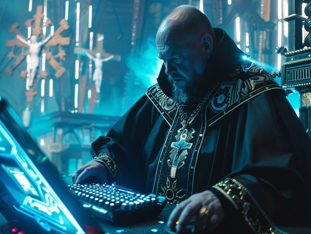

# Prompt Priests

Modern divination works by meaningful coincidence between the parties. (Even if it only involves one person, there is the person and then there is the world.)

In theory it works for everyone, but in practice it seems some people more attuned will get "better" results. Which is why there are priests, shamans, magicians, etc., people who are deemed better at doing this stuff than other people.

As AI models improve, it will eventually end up at a point at which its performance plateaus, because the model is in theory at most as good as the data. So, if we want to extract super intelligence from it, it must be by coincidence.

And thus, I speculate that future divination works by meaningful coincidence between the prompter and the AI model. In the sense that it is statistically unlikely yet possible that the answer given by the model will have super intelligent content, but the prompter being aligned with the good intentions of the universe, is somehow able to coax something great out of an otherwise mundane system.

Can AI models work like this today? Probably not, because the biases of the models these days are quite well known. There's probably a sweet spot between chaotic randomness and structured predictability where the effect could be maximized.

In this sense probably the "prompt engineer" job will be the only meaningful job left. (Not to be confused with the popular conception of prompt engineering today which consists of chanting cargo cult phrases without any scientific backing...)
