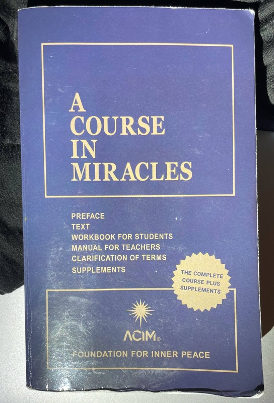
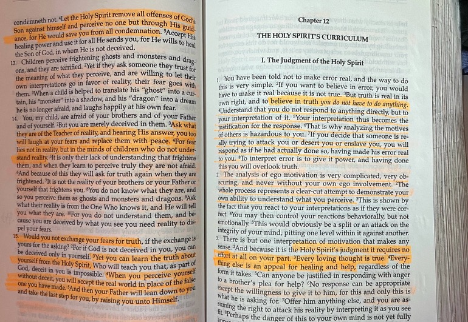

# ACIM 讀後感

我已經唔記得喺邊度得知有呢本書嘅存在。話說呢本書嘅封面係冇作者名嘅。你去查嘅話會見到作者係 Helen Schucman，一位哥倫比亞大學嘅心理學教授。而實際「寫作」嘅過程，簡單講就係通靈。Schucman 話係耶穌同佢講啲內容，然後佢讀返出嚟錄音。之後有位 Bill Thetford 將啲內容打成文字。

呢本書嘅作者問題原來都有花生，據聞後來都打咗幾場官司[2]。最搞笑係維基入面嗰句："For copyright purposes, US courts determined that the author of the text was Schucman, not Jesus." :0)

嗱利申先，雖然本書喺我心目中毫無疑問係來自耶穌大佬嘅，但唔好以為佢講嘅內容同基督教教義有任何關係。事實上，據我理解，啲內容對基督教嚟講 (廣義，尤其包含天主教) 係離經叛道嘅。基督徒最好請示上級先好做任何嘢。 (不過如果你上級係耶穌就冇問題)

可能呢度嘅讀者對通靈冇乜印象，或者覺得冇可能係真。 ehh 呢啲嘢冇道理可講嘅，我只可以用人格保證呢個「現象」喺各種意義上毫無懸念都係「真」，因為我見過同體驗過。而機制係一個謎。當然聲稱通靈嘅人有真有假啦，神棍永遠都存在。不過喺 ACIM 呢個 case 就好清楚嘅，啲內容太過神奇，真係冇咩可能係有人[3]刻意借用耶穌個名嚟招搖撞騙。

話說我自己睇書甚少會攞支highlighter周圍間。但呢本書我睇咗幾頁之後發現不得了，一定要準備齊架生，逐行睇，慢慢間。睇返 ACIM 成書嘅過程，好多人都係一睇頭幾頁就發現啲內容來頭唔細，所以我點解咁肯定唔係有人攞嚟招搖撞騙，就係因為啲內容犀利到佢嘅正確性不言而喻，根本邊個寫都無關係。

如果要簡單一句概括 ACIM 嘅內容，我會形容係「耶穌用基督教嘅詞彙講佛經」。當然佛家嘅道理我十分唔熟，可能未必好貼切，但我主觀感覺的確係咁。（睇嚟我示範緊點樣一個post得罪香港兩大宗教⋯⋯)

如果大家有睇我近年啲文，都知道我探索緊啲所謂玄學、神秘學、靈性之類嘅嘢。我睇嘅嘢當然比我喺度分享嘅嘢多，始終見到好嘢係要分享嘅，唔好嘅就收返埋。外行人以為全部都係9up，但呢啲嘢雖然有唔同派別唔同傳承，去到最後啲道理係大致相通嘅，背後會有套核心邏輯，唔係隨意亂嚟。當然應該都有唔少係駁錯線，完全天馬行空，呢啲我係避得就避，所以相對遇得比較少 （但可能一般人唔識點避會遇到好多呢啲？）

Anyway, ACIM 啲內容係我睇咁多嘢入面見過最正氣最完整同埋最「深奧」嘅論述。如果魔法有顏色，佢肯定係純白色，光到掁眼。喺我認知之內唯一可比嘅，真係得佛經。但佛經啲字夾雜梵文譯音，加上年代深遠，唔係好睇得明。 ACIM 雖然係「深奧」但佢由淺入深、深入淺出，睇得出耶穌大佬已經好盡力將啲概念講得淺白。除咗啲英文風格略嫌老土之外，可以話只要你肯睇多幾次，始終會明嘅。(所以點解要攞highlighter慢慢間，就係覺得遲早要由頭睇多幾次⋯)

實際內容呢，大概就係：你睇，你以為係真實嘅世界，咁多苦難、死亡、離別，難道你真係好想要呢啲咩？其實一切都係虛幻，係「你」製造出嚟嘅幻像，好似發緊一場惡夢咁。只要屏除幻像，真相自然會浮現，就可以從惡夢中甦醒。（真係唔似佛偈咩？我已經唔係特登用佛經嘅詞語...)

至於點解上面嗰幾句要用六百幾頁紙去解釋， ehhh 我都唔知，但我可以講嘅係 (1) 入面嘅「廢話」唔多，內容係緊湊濃縮嘅； (2) 你可能以為攤長咗應該好淺，但我係一路睇一路心諗：嘩屌講到咁撚深嘅⋯；始終「解構」呢個世界實在唔容易，當大家都深信呢個世界係「真」嗰陣，又相信呢個世界只可以接受生離死別各種苦難，咁耶穌大佬都只能夠長氣少少講下點解真相唔係咁。

一個比較個人嘅得著就係一路睇一路印證我對於「魔法」[4] 理論嘅猜想。有好多我之前都喺度寫過分享過，都唔係啲好特別嘅嘢，但如果之前冇接觸開嘅，ACIM 可能有啲位會比較難理解。佢唔係用術語 (例如「XXX法則」)，但字裡行間會用啲同類嘅邏輯，熟悉嘅一眼會睇得出，但唔識嘅睇多幾次應該都會 get。由於我近排諗緊呢堆嘢，所以會有個幾有趣嘅現象就係有時我嗰排諗緊乜，咁啱睇到本書又講啲類似嘅嘢，又或者啲內容引導我諗某啲嘢，然後再睇多兩頁就見到佢果然講嗰樣嘢。有少少「互動內容」嘅感覺，幾得意。

由於本書我足足(斷斷續續)睇咗半年，如果有人問我印像最深刻係乜，我真係唔記得答唔到，只可以由頭再望下 (所以間咗highlight咗打咗粒星嘅位就好有用喇...)。我只可以話內文最後嗰幾個 chapter 啲概整合總結嗰下，真係十分之發人深省。(最發人深省嘅部份應該係最「離經叛道」嘅部份，哈) 

話說，呢本書有網上版本嘅，八卦想望下嘅可以上網搵下先，唔一定要買。不過認真讀嘅話最好都係有啲工具去mark低啲重點同筆記。本書真係唔易讀（真係唔係我廢）。不過聽聞就算明唔晒都唔緊要 (我自問都明唔晒) ，後面有啲每日練習，望落去幾簡單嘅。

暫時諗到係咁多。有興趣嘅不妨交流下，唔知有冇興趣嘅都可以搵我問下嘢。（利申我興趣主要係魔法理論研究，冇咩興趣幫人賣書或「傳道」。）

----

- [1] 其實我只係睇完咗「正文」。後面啲嘢未睇。
- [2] https://www.jcim.net/how-jesus-got-his-copyright-back/
- [3] 呢個「人」字好緊要，因為神明嘅通靈實況上感覺似係一堆唔知邊度嚟嘅力量隨便使用網名同人溝通⋯ 啲時空維度未必 consistent，我個猜想係呢啲力量亦係「風隨意而吹，你聽見風聲，卻不知道它從哪裡來，往哪裡去。」(John 3:8)，但同人類溝通嗰陣會借用啲人物或神仙嘅名做網名... 所以如果有啲正統基督教嘅人話其實係啲邪靈份耶穌咩咩咩，咁我諗喺傳統宗教角度應該係一種可能性嚟嘅⋯
- [4] 泛指科學以外嘅現象
