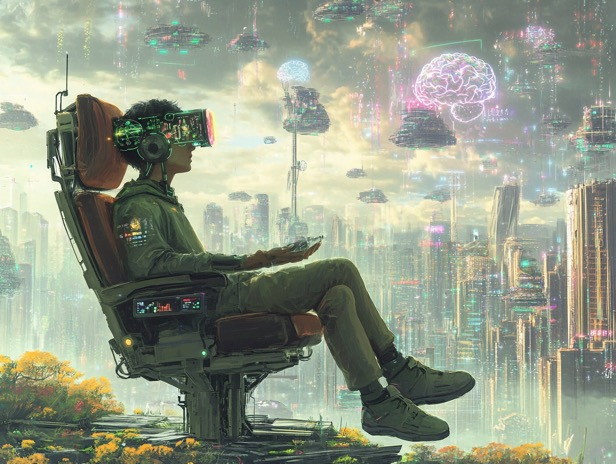

# God Games for Gods

Looking at the local inference communities, eg. models on huggingface, /localllama/ discussions, etc., a lot of them seem to be focused on using the models for roleplay. I suppose quite a bit of them are for satisfying sexual fantasies, but it seems to me the roleplay itself (irrespective of whether it was sexual) has a lot of potential.

In created virtual realities, we can become God.

We used to be limited by the constraints of our own imagination, we can now create worlds that are more detailed and more complex than anything we could have ever imagined. In the old days, we had to rely on our own creativity, or even on the creativity of others (Tolkien, Lovecraft, etc.), to create a world that was believable and engaging. Now, we can create rough sketches of worlds and have AI models fill in the relatively mundane blanks.

Imagine what happens if AI models become more advanced. Imagine when we create the technology that responds to our thoughts. Powerful multi-modal models are already on the horizon. Mind reading devices are already theoretically possible, merely a matter of whether we actually want to use them or not.

In the near future, I could totally see powerful "God games" where worlds are created by mere thought of the player. The AI would fill in any blanks, render the world as realistically as possible by "hallucinating", and respond to the player's thoughts.

We almost have the technology to do this. We just need to put the pieces together.

The feeling of becoming God could trigger a profound awakening in people. It could be a powerful tool for self-improvement, for understanding the nature of reality, for understanding the nature of consciousness, for understanding the nature of the self.

"Your will be done! In Heaven as on earth this is forever true. It matters not where you believe you are, nor what you think the truth about yourself must really be." (ACIM T-31.VI.4)
