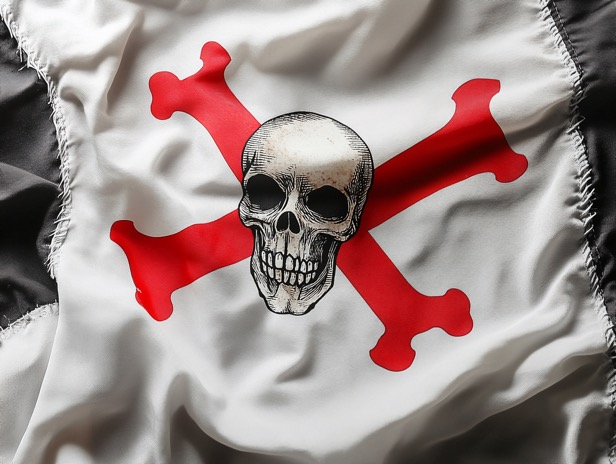

# 英國係維京人嘅後裔

唔知大家知唔知道，十世紀令歐洲人聞風喪膽嘅 #維京人 去咗邊？

血統嚟講就梗係去咗英國王室 (見最底維基引文)，雖然話現任國王查理斯唔係維京人父系直屬，但而家男女平等，唔可以咁父權淨係計老豆嘅。計埋老母就一定係維京血統，仲要係王位一直由十世紀傳承𠻹。

至於維京文化，就更加容易尋找歷史脈絡。維京人 ~10 世紀攻佔咗 Normandy， ~11 世紀攻佔咗英國 ("Norman Conquest") (另按：之前已經有幾單維京人向英國遷徙)。之後由於附近冇咩新地方俾佢哋佔取，受制於航海技術所限，隔咗幾百年先至再有大作為。

17 世紀維京人後裔佔領北美洲；18 世紀殖民澳洲；19 世紀佔領印度...

話說雖然 17 至 19 世紀係殖民時代，但點解最後係「英國人」(差啲打咗維京人) 成就咗「日不落帝國」？ 因為人哋有一套經歷千年磨練完善嘅 SoP：由海盜打劫財產，去到成個國家都佔取埋，全部都輕駕就熟。維京民族喺十世紀已經開始殖民 Iceland 同 Greenland，所以呢啲航海探險文化深殖民族基因，去到正式嘅「大航海時代」點會唔贏人幾條街？

其實去到現代，英文世界對「海盜」都仍然有種不解嘅情意結。香港人拍「古惑仔」仍然係會驚呢啲嘢教壞細路，但人哋荷里活拍「加勒比海盜」，竟然可以拍到老少咸宜。人哋細蚊仔幾歲大就已經學人扮海盜覺得好型，殺人越貨(呢個概念)一啲都唔避諱，你只要退一步諗諗就會覺得呢件事十分不可思議。

而家英國某程度上仍然有好幾個「海盜窟」，或者叫「Treasure Island」啦。最出名嗰兩個，其一叫做 British Virgin Islands (BVI)，其二叫 Cayman Islands。如果你鍾意錢，呢啲地方係收藏個人財富嘅好地方；如果你唔鍾意錢，你會話係啲有錢人斂財自肥之後埋藏金銀珠寶嘅法外之地。

我覺得香港作為一個歷史上嘅「海盜窟」，呢啲嘢雖然唔係英國「正史」會同你講，但作為香港人總係要知道有呢啲另類觀點嘅。(有時覺得香港人真係超易洗腦，倒返轉講英國兩百年前係以海盜毒梟揚威國際呢啲事實，成日都要驚打碎好多玻璃心...)

以上呢啲資訊對大家未必好有用，除非你有需要知道(大)英(帝)國興衰嘅歷史脈絡。成也海盜，敗也海盜，英國往後幾十年嘅發展會點樣，我覺得係要睇下幾十年後嘅海盜業仲有冇咁好賺。個人意見嚟，不過我總係覺得移英嗰班一係唔認知英國呢個國家一直靠咩搵食，一係就覺得未來幾十年海盜業會復興。

---

"""
Rollo was a Viking who, as Count of Rouen, became the first ruler of Normandy, a region in today's northern France. He emerged as a leading warrior figure among the Norsemen who had secured a permanent foothold on Frankish soil in the valley of the lower Seine after the Siege of Chartres in 911
[...]
Rollo was the great-great-great-grandfather of William the Conqueror, the progenitor of House of Normandy in England; however, Charles III and the British Royal Family are not direct male-line descendants of Rollo, as the House of Normandy ended with the death of Henry I. However, the House of Plantagenet was influenced by the Norman dynasty, as Empress Matilda, the mother of Henry II of England was the daughter of the Norman king Henry I.
"""
