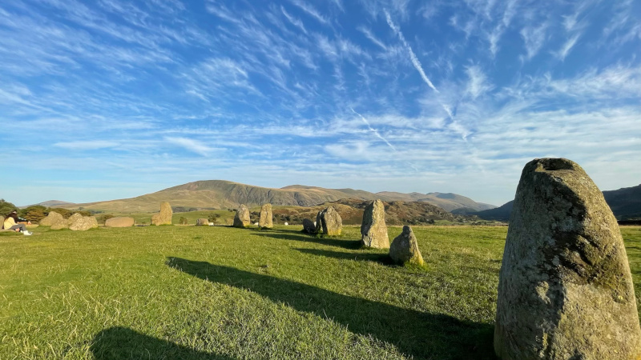

# Why



```
Why is the sky blue?
To match the color of the sea
Dwellers will not remember
Think it for of some law of physics
But the laws simply reflect
upon our original wish
As all there is to know
About the system were lovingly designed
Crafted with our minds,
and imbued with our soul.

Why are there Sun and Moon?
Puzzled are those who fail to realize
The world is but a playground
Perplexed in the way eclipses occur
As they two barely cover each other
Explained not by reason but
Only by fairies’ tales
That we wanted symbols
Of Yin and Yang
It’s what this world is about
Yes or no, to or fro, friend or foe.
```
