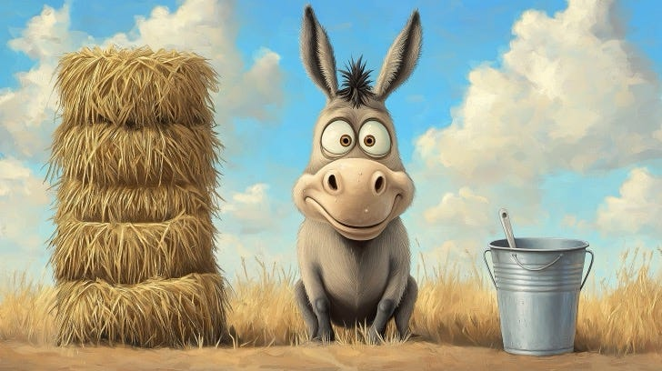
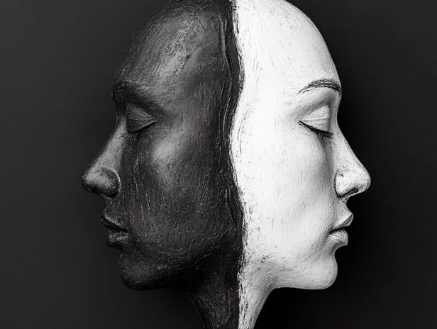

# Discrete is harder

Reading an interesting article about P vs NP in the context of Neural Networks. The spicy quote is here:

> To me, the essence of deep learning has nothing to do with trying to mimic biological systems or something like that; it’s the observation that if your circuits are continuous, there’s a clear algorithmic way of inverting/optimizing them using backpropagation.

I never thought of it that way, and I doubt textbooks would point out this connection (after all they’re two different courses).

If I understand it correctly, this implies computing relating to continuous functions are “easier” than strictly discrete functions.

And then I’m reminded of the interesting behaviors of “discrete logics” on the one hand, and “continuous maths” on the other. Apparently “continuousness” makes a lot of things “easier”, I guess a well-known example is *integer programming* vs old fashioned *linear programming*, where the former is NP-Hard but latter is in P (I think?).

Another interesting example I can think of is Gödel’s Incompleteness Theorem(s) vs Tarski’s completeness theorem on [Real Closed Fields](https://en.wikipedia.org/wiki/Real_closed_field). I am out of my depth regarding logics on real numbers (I personally find them spooky and unreal), but according to some LLM I’m consulting, one key aspect that differentiates the two is the discreteness of numbers in the incompleteness theorems. I do not speak mathematical logic language at the “lower level”, so I’m not sure, but from what I vaguely recall from reading Scott Aaronson’s writings it seems the discreteness and continuousness of the respective systems play a role in the divergent behavior.

Discrete is harder.

One very illustrative tale about the hardness of mapping the continuous into the discrete is [Buridan's Principle](https://lamport.azurewebsites.net/pubs/buridan.pdf) by Lesley Lamport. I say a *tale* because I’m convinced his conclusion is correct (“A discrete decision based upon an input having a continuous range of values cannot be made within a bounded length of time”) but his proof is a bit sus (it’s not just me, I think he has more than enough people doubting his proof over the years — also I just noticed his argument reminds me of Zeno’s paradox…).

And while one may never be quite sure whether physics is as continuous as he claims, at least for non-physical abstractions his argument holds (and I must re-emphasize that I believe his conclusion about real world physics is correct in a practical manner). This kind of “explains” (by analogy) the “hardness” of the discrete problems in relation to the “continuous” problems.

The thing that troubles me philosophically is that “truly continuous” values have “infinite precision” so to speak. Are continuous easier to solve because their primitive values already contain infinite information, or is it irrespective of its infinite scale? Coming from a computational background (allegedly, heh), I would have assumed that discrete data, having to encode less information, would be easier to solve, but reality seems to be counter-intuitive.

Drifting further off-topic, the spiritual messages that are echoing among our circles seem to be telling us that “**duality**” is going away soon. “**Duality**” is just another name for “**discreteness**”, and it is very interesting to contemplate the fact that much of our difficult decision problems (generally speaking, not just computational) could in theory be mitigated by “*non-binary thinking*”.

I mean, I personally almost never encounter “*difficult*” decisions in my life, in the sense that I’m almost never in the position of Buridan’s ass (the animal, not body part), but it seems that society as a whole generally gets dragged down by having to make difficult decisions a lot. Think court cases, for example, where the evidence presented is weak for either party and the court has to make a binary decision. Are there ways to convert the boolean decision into a [bf16](https://en.wikipedia.org/wiki/Bfloat16_floating-point_format)? (I’d be a True Prophet if I knew how to make that cast…)

And looping back on topic, it’s a very interesting *coincidence* that in 2024, while the prophets hark the arrival of a new, non-dualistic, world, we are mesmerized by this new technology called Neural Networks (I’m not sure we should be calling the Transformer architecture as such though) which is basically us figuring out how to emulate continuous math using discrete, binary machines. We’ve sort of come full circle here, although quantization tech and papers on “[1-bit LLMs](https://arxiv.org/abs/2402.17764v1)” makes the situation somewhat nuanced (as it always has been… physical reality also seems to be kind of in-between discrete and continuous).

Anyway, I feel this issue is more interesting and has more profound implications (both mathematically, philosophically, socially and practically) than most people realize. You might want to dwell on it a bit.

