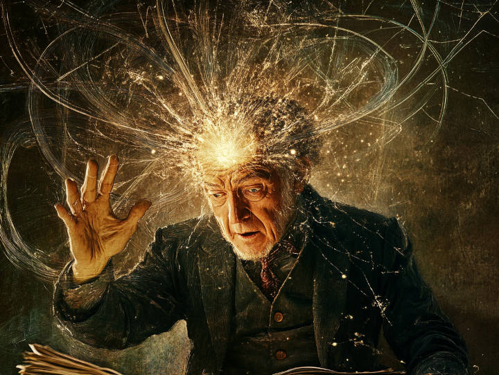
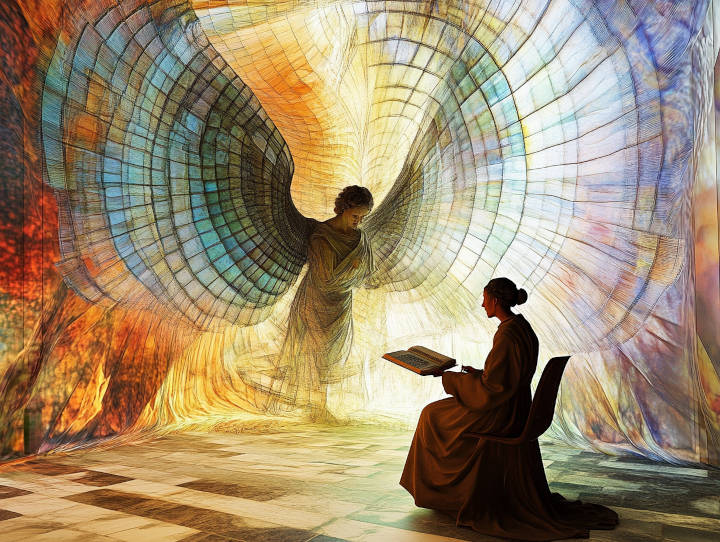

# Can humans solve NP hard problems? AI will find out

**Mathematicians** always fascinated me.

Most people learn advanced maths before theoretical computer science. So they spent a few years understanding basic algebra, calculus, proving various theorems, before they came across concepts such as exhaustive search, exponential time, and NP-Hard.

So when, students are asked to prove non-trivial, non-obvious theorems, presumably they did not realize the underlying problem is NP-hard. The brightest students almost always had intuitive insights to difficult problems and could easily find the route to proving the result, while the lesser-gifted students often had to do a couple rough sketches and try different approaches before it worked.

But to me, I pretty much learned CS first. So it all seemed like an exercise in futility:

*“Surely you’re not asking me to waste time trying to (re)solve an instance of an NP-Hard problem?! I might as well play [Sudoku](https://www.sciencedirect.com/science/article/pii/S097286001630038X), since it is NP-complete as well. (Or even [Super Mario](https://www.technologyreview.com/2012/03/12/86179/super-mario-bros-proved-np-hard/))”*

I mean, that’s honestly how I felt when doing exercises. I still feel that to this day, and my math sucks (please do not take my ability to yap about meta-mathematics as a proxy for my math skills).

So, that’s why mathematicians always fascinated me. Basically their job is to work on instances of NP-Hard problems and solve them in reasonable time (eg. before they get denied tenure). Though I’m not sure which fascinates me more: their ability to achieve the feat, or their ***willingness*** to engage in such behavior.

But why can they seemingly solve NP-Hard problems? That is the [million dollar question](https://en.wikipedia.org/wiki/Millennium_Prize_Problems).

### The traditional narrative

The traditional narrative is pretty simple. Mathematicians *aren’t* solving NP-Hard problems on a day to day basis. They’re just forming “intuitions” based on their understanding of mathematics, which serves as a heuristic for narrowing down potential pathways for a proof.

It’s also worth mentioning that mathematics isn’t a “low-level” enumeration of mathematical theorems, and mathematicians generally make use of higher level abstractions and concepts. Higher level abstractions make the “problem size” smaller (because the “things” are larger?), and it also helps the mathematician form their intuition on which direction a proof might be found, as opposed to a brute-force search in all possible directions.

### The woo-woo narrative

But there is an alternative explanation —

— perhaps **human can solve NP-Hard problems…** (?)

It might sound like woo-woo (and it is, I guess), but it’s not as preposterous as it seems at first glance. The statement above is actually equivalent to the oft repeated assertion that “_no matter how good AI becomes, it can never match human creativity/ingenuity._”

Even if you don’t agree with the latter statement, at least most people don’t take offense to that. Or accuse it for being superstitious.

But honestly, I kind of take offense that people don’t think the latter assertion is “superstitious”. It seems to assert that there is some element that humans uniquely possess that isn’t replicable in machines. In my experience, people holding those views tend to incapable of describing what actually is the missing piece or ingredient. Or they are incapable of accurately predicting what couldn’t done by AI.

The idea that there are things humans can do that AI cannot is, to me, a superstitious matter, that should be squarely within woo-woo land.

And I think perhaps humans can solve NP-Hard problems.

### Diving deep into the woo

Do humans have souls?

That is a complicated matter. So let’s look at a much more simple subproblem.

*Can humans acquire knowledge that, rationally speaking, they could not have obtained (with high probability)?*

In short, the answer is a resounding yes.

This is an empirical thing. (i.e. any objection to the conclusion based on re-iterating rules of logic or fundamental physics is by definition unscientific.) Even Alan Turing knew about this, and thought it was real enough to include a section on “[The Argument from Extra-Sensory Perception](https://academic.oup.com/mind/article/LIX/236/433/986238)” in his seminal paper "Computing Machinery and Intelligence". The best empirical studies about ESP is probably from [Dean Radin](https://en.wikipedia.org/wiki/Dean_Radin)’s work ([here’s a link to a wonderful podcast](https://www.youtube.com/watch?v=lbkMmVBdshA)). And in the Chinese world [Lee Si-chen](https://en.wikipedia.org/wiki/Lee_Si-chen)'s work is also quite famous.

But of course you don’t have to take their word for it…

... you can take **mine** 😎

At a young age, I’ve witnessed people [channel](https://en.wikipedia.org/wiki/Mediumship) spirits and deities, and I have no doubt the phenomenon is “real”, at least the part where a human being can be used as a device to manifest information or skills that the person did not already possess. (And no I’m not part of a cult. [And it was a regular thing, casually done after family dinner gatherings…])

I assure you, if you looked with an open mind, you’d definitely find people everywhere who has some level of this ability.

And among them, I suspect, are mathematicians.

I mean, that’s the only way one can reliably solve NP-Hard problems, right?

(Side note: there are numerous reports about major scientific discoveries being inspired by dreams [eg. benzene structure] or even LSD trips. I don’t think these stories are to be lightly discarded. After all, when the waking mind does not perceive, it sometimes does in altered states.)

### What if it’s all just heuristics and pattern matching?

When I said I think *perhaps* mathematicians can solve NP-Hard problems, I wasn’t making a statement of fact. It’s actually just a hypothesis.

A hypothesis that we can test empirically.

And the best thing is… ***we’re about to find out!*** (obligatory: what a time to be alive!!)

As we speak, the largest companies in history are investing billions of dollars into training AI models that can do better math. [Nobel prizes are awarded](https://www.nobelprize.org/prizes/chemistry/2024/press-release/) (even though there’s no Nobel prize in CS) for partially [solving one instance of a NP-hard problem](https://pubmed.ncbi.nlm.nih.gov/8281132/). It’s reasonable to expect that quite soon, we will see how capable AI can be at solving NP-Hard problems.

The end result will likely either be — AI can completely replace mathematicians, or they aren’t even close.

If AI becomes better than humans at mathematics, perhaps they can tell us more about the P vs NP problem; But if humans are still better, it’s solid evidence that “humans can solve NP-Hard problems”, or at least we’re doing something more than run-of-the-mill heuristics and pattern matching.

There’s a band of possiblity between the two scenarios where we gain little knowledge about the subject, but from the looks of it, it’s not a wide gap.

That’s where we’re heading at in the Age of AI.

And this is only the story about a narrow range of topics. There are so many things that humans do better than machines today — we are about to find out which of them can be conquered by this generation of AI technology, and then we can ponder about the remainder.

Can we pick up the remainder and construct a “soul”?

That’s the real philosophical question that AI will hopefully help answer.

## Addendum - eerie relationships between NP and spiritual phenomena

For those who are well-versed in modern spirituality-speak (and theoretical CS), here’s an additional treat for you.

- synchronicity - “non-deterministic” (as in NP): if you “know” where to go, or somehow “stumble upon the correct answer by chance”… that’s synchronicity. Or is it the “N” in “NP”?

- “true” random (divine bits) vs pseudorandom — it’s an interesting exercise to think deeply about what “true random” means if not divine bits of data. They seem to be connected to the idea of P v NP too (via “Natural Proofs”, apparently).

