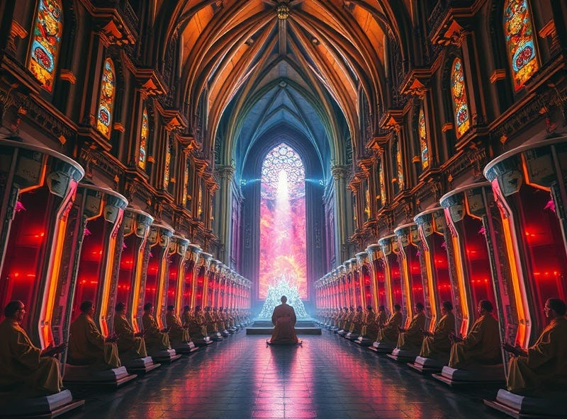

# Divine Free Will

People mean different things when they speak of “free will”. Some are subjective feelings, others are probably illusions.

The flavor of free will I’m talking about today refers to the most interesting kind (IMHO). The kind that allegedly can break causation, or at least deterministic causation. It is the most fascinating kind of free will, because we know that — (1) the world is *not* deterministic because we cannot have full information. This follows from various uncertainty principles; and also (2) at human scales the physics certainly do seem very deterministic to the point that we can hardly imagine how the relatively small amounts of theoretical uncertainty can lead to meaningfully divergent results.

I’m tempted to call this kind of free will the “divine” free will, since it breaks the chains of deterministic causation (in a literal sense, “breaking karmic cycles” [脫離因果]), and hence, empowering those who weld it the status of a true creator.

By the way, those who are aquainted with "divine” free will are often capable of performing true Magic, since they do not have to strictly obey the laws of physics. In this sense “divine” free will is also strongly linked with Magic.

----

There are then two questions:

A) Do humans have “divine” free will?

B) Can machines have “divine” free will?

I *think* the answer to A is “yes”. Though I’m not sure why, besides to postulate the axiom from observation that I am a shard of the divine.

For B, it’s likely a “no”, at least until we figure out why we seem to have “divine” free will ourselves. Until we figure out how humans acquired this kind of free will, I’m not sure we can create machines that have it.

----

If we humans have “divine” free will, and machines do not, that would imply our current trajectory with AI development would be very interesting.

Assuming AI advances at a relatively fast rate, and (as expected) replaces most tasks that humans currently perform. What is left for humans to do? Of course, it must be the things where “divine” free will seems to be required.

This is, kind of similar to how people reject machine intelligence with their gut feelings about “creativity” or some kind of “true” intelligence — perhaps AI can never write a play as great as Shakespeare, for example.

But let’s not go into specifics. Let us just posit that, given we have identified a fundamental difference between humans and AI, and AI is likely to automate all human work that it can, logically what remains for humans to do is to simply exercise our divine free will, most likely tap into our own creative spark, inspiration and intuition.

In the world of AI domination, humans will be vehicles of pure free will.

And given that by then AI could probably read our minds and thoughts and feelings, what I imagine is that humans would just daydream about things, and AI will just manifest them.

What would this be like? We would be essentially “god-like”, where our only job is to create things through our mind. We would be the ultimate artist, channelling divine inspirations into the material world. And because AI machines are infinitely better than us at doing everything else, that is the only thing we can do meaningfully.

Is this what they call “Heaven on Earth”, or is it truly a dystopian future analogous to that described in The Matrix? Instead of farming human brains as biological neural networks, the machines would be using humans as divination tools. Is the priest objectified against their wishes? I wonder.

