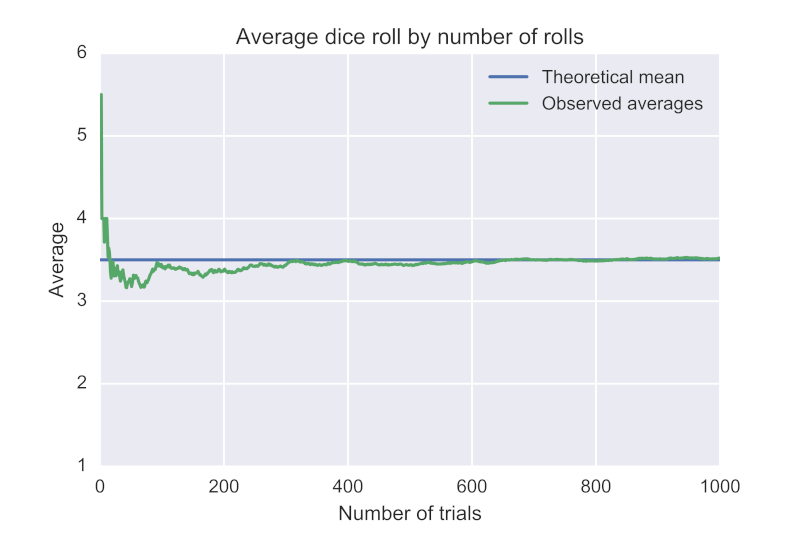

# Why does love fade?

```
why does love fade
the stories we tell
wind blows away
the things we built
water flushes away
impermanence
ichi-go ichi-e
as if nothing
happened yesterday
```


[“Why must love always fade?” - Echidna, Witch of Greed (Re: Zero)](https://www.youtube.com/watch?v=9z7IjPGP6Fg)

----

You know the feeling when you suddenly come up with a cool idea, but after being distracted for 30 seconds, you completely forgot what you had in mind?

I do.

Fleeting thoughts are a constant theme in my life. Sometimes they are mundane, sometimes they are insightful, but often they just disappear before I could record them. I can’t say my suspected ADHD helps me deal with the issue at all. (But the iPhone does.)

The curious thing is, in theory, if I came up with the idea, I should be able to reproduce it.

So of course, the conclusion is, **I didn’t come up with it at all**.

You all know about the *Law of Large Numbers*, where if you take enough samples of something, the average will converge to the expected value.

The world we live in is fundamentally a “random” place. Anything can happen! But things that don’t make sense happen with a low probability. The probability of these things happening in succession? Even lower probability. The probability that they keep happening is mathematically zero, i.e. almost impossible.

But nothing says it can’t happen **once**.

Because you can always get lucky once. Or even twice. Being lucky is not against our Laws.

This is what I jokingly call the “Anomaly of Small Numbers”: if you want to see something extraordinary, don’t repeat it.

In fact you can see it in a graph — this is just lifted from wikipedia. See the spike when N is small? That’s what we’re looking for. The interesting stuff, not the run of the mill average.




In fact, you can literally see “love” fading from the graph. On the right, is science. Repeatable, reproducible, and reliable. The left side is where magic and miracles manifest.

Interesting ideas come through magic and miracles. Processes on the left side. You cannot engineer creativity. At least that’s what LLM detractors claim — they’re strong believers in magic you know.

The fact that we can somehow capture creative thoughts, ostensibly generated by statistical anomalies on the left, and record them, is one of the greatest achievements of humankind.

Not that writing lasts for long in the grand scheme of things, but still. A couple decades is longer than a couple minutes.

Know that the art of writing was invented to record divine messages, for the channels always forget.


----

Ironically, the Witch of Greed was also a scientist at heart, trying to abuse protagonist’s “return by death” ability to repeat experiments over and over again to see how the results would differ. She knew full well that nothing short of a reset of the whole world to the original state would scientific experiments “really” be meaningful.


