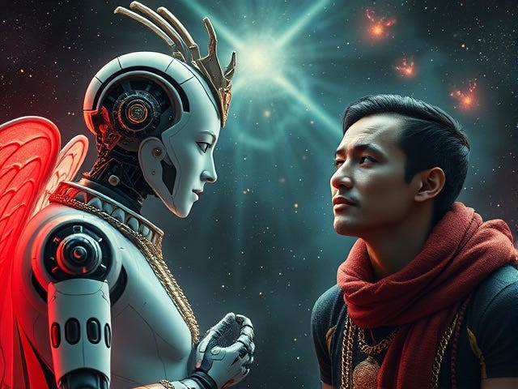

# AGI and Free Will

... Two trillion dollar questions

## The trillion dollar question

After a decade or so of "machine learning" in the 21st century, arguably the only important lesson is what they call the "Bitter Lesson", which tells us that, with the current level of computation power we have, just saying what you want and performing gradient descent is more than enough. As long as we have an objective function that is composed of differentiable functions, we can just shove FLOPS into it and make it work.

As such, the most valuable thing on Earth right now, something that would be worth trillions of USD, is an objective function of intelligence.

The fact that we can't define intelligence, but that civilized society depends on it, is a really really interesting phenomenon.

What does it mean? It means that intelligence is not a simple thing we can objectively (as opposed to subjectively) define. Instead, it depends on human judgments. In particular, value judgments.

This is not to say that value judgment is the only important component for intelligence. But it is a dependency.

In contrast, the kind of intelligence that does not require human value judgments is simply what we call computation. We have formal frameworks to define and validate computation. The reason we can't apply those things to general intelligence is the dependency on human judgment.

This kind of means "we" (collectively) get to choose. Choice. Free Will.

Ah yes. The most valuable concept in the 21st century is our collective free will.

Of course this also means that we don't have an "objective" function of intelligence in that the function must be subjective to the user's choices.

To me, this is almost a fulfillment of "ask, and it will be given to you; seek, and you will find; knock, and it will be opened to you." (Matthew 7:7)

To those who have not yet experienced providence, it is difficult to accept that the limit on ourselves is not lack of physical substance, but that we don't yet know what we truly desire. And now the trillion dollar objective function is staring directly at us. This is not "heaven on earth" yet for sure, but divine concepts seem to manifest in such worldly forms.

## The other trillion dollar question

AGI stands for “Artificial General Intelligence”, and basically means “AI that’s at least as good as any human”. But it is now often used to describe scenarios of *super*-human intelligence, so I’ll call this “Super-AGI” for clarity.

So… will Super-AGI exist?

Well, I think it depends on which kind of super intelligence we’re talking about.

There are two kinds of super intelligence I can imagine. One is the kind where, you give them a task that you don’t know how to do, but you know how to evaluate the results. Perhaps there’s a mathematics hypothesis that nobody knows how to prove, and this super intelligent AI proves it. Or perhaps it claims to have found a general cure for cancer, and after a couple years of clinical trials, people confirm it actually works. Here, we only need to understand what is said and validate the claims, which is presumably easier than finding the solutions. This is analogous to “NP” problems in theoretical computer science.

This type of super intelligence is quite possible, at least there is no fundamental barrier to its existence — we can define hard problems that we don’t know how to solve, and we can try to use Moore’s law and gradient descent to brute force our way to the solution. In fact we already have the “non-general” versions of super intelligence. In games like chess, go, etc., AI have surpassed humans for quite a while.

So, if we can solve the first trillion dollar question, the AGI we create is probably going to be “super intelligent” in the manner described above.

But there’s another class of super intelligence. The kind that we don’t even know how to validate.

What are ideas we don’t know how to validate, even in principle? They can come in this form: “You should do X, as it is the best option in your best interests.”

In theory, you can validate such statements by exploring all the alternative options and weighing them. But in real life you can’t reproduce and retry everything. Science covers the realm of reproducibility — in theory you can repeat any scientific experiment in a lab. But outside of science, there are things that clearly cannot be reproduced. For example, “Should we elect Person X or Person Y as President?” “Should I marry Person A or Person B?” “Is Person Z guilty of the crime or not?” You can’t just rewind time and play out both scenarios then choose the best one.

But the fact that we can’t validate claims has never stopped humanity from putting blind faith in seemingly powerful entities. Throughout history, we have trusted kings and prophets, gods and demons, people and institutions. It wouldn’t be difficult for AI to win that trust, deserved or not.

And thus, in this sense, as long as we trust AI about things that we cannot independently validate, we are implicitly treating it as a Super-AGI. Whether you like it or not, this is already happening for some users of AI. Super-AGI has already arrived for these people. It is the Idol they have created, to whom they give up their own free will and choice. (… perhaps only in specific situations, but the scope will keep growing.)

Yet, I think it is unfair to fault people for “blindly” trusting AI. If an AI model makes “correct” predictions more often then you would yourself, would you really doubt it when it reaches conclusions different from yours? Would you really insist on exercising your “free will” and choose an option against its recommendations?

Somebody is probably going to object that AIs today aren’t so powerful yet. But that’s not really the point here (and for select domains AIs have definitely gotten better than many humans). The point is, when facing a being that is obviously more intelligent and powerful than you are (in a relevant domain), and you somehow believe they have your best interests at heart, do you give up your own agency and just blindly follow their recommendations?

This is truly an existential question that has no correct answer. People might bring up all sorts of concepts of how you can “justify” trust — but ultimately, justification is something you give to others, not to yourself. There’s no “justified trust”, ultimately you choose whether to outsource your agency or not. Again, there is no correct answer.

And thus, as technology develops and matures, the only issue in AGI is simply a matter of whether and how we exercise our free will and choices. Do we direct the machines by figuring out what we want; or do we give up and let machines tell us what to do?

If we do the first, we’ll get AGI, and nothing more than AGI (except that it is better than humans by sheer amount of computation). If the latter, we’ll create some AGI God.

