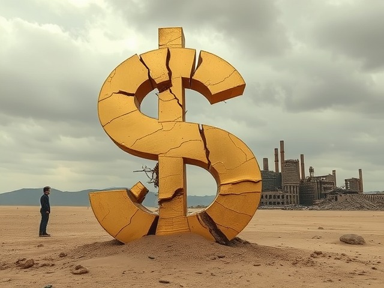

# [Vibe Essaying] The System Is Cracking, and Something Else Is Coming

We are living in the late stages of something—an ending that doesn’t yet know its successor. The old engine of the world, capitalism, still rumbles on, but it sputters more often now, coughs smoke, and makes strange noises when you press on the gas. It still moves, sure. But we’re starting to realize it may be running on fumes—on memory, on habit, on collective belief.

For a long time, capitalism was the most dynamic, productive force in human history. It tore apart old hierarchies, industrialized the globe, lifted billions out of subsistence, and gave us the modern world. But now, the things that once made it powerful—its ability to channel capital into production, to turn labor into value, to expand endlessly—are faltering. The machine keeps turning, but the gears are grinding.

You can feel it in the headlines. Tariffs are up. Global trade is fracturing. The U.S. is imposing massive taxes on imports from nearly all of its trading partners, not just rivals like China but allies too. Some goods now face tariffs of 25%, 60%, even more. In raw numbers, the revenue is substantial—estimates range into the hundreds of billions, possibly even a trillion dollars per year. It’s enough to make a dent in the federal deficit, which hovers above two trillion annually. But the deeper story isn’t fiscal—it's existential. These tariffs are not the confident moves of a rising power; they are the anxious reflexes of a system trying to rewind history. They are the symptoms of something larger unraveling.

The U.S. isn’t just trying to raise revenue. It’s trying to claw back manufacturing jobs it offshored decades ago in the pursuit of efficiency and profit. But this sudden desire to “bring jobs home” is not a solution—it’s a symptom. A symptom of a system facing the consequences of its own internal contradictions. Capitalism, at its core, seeks control: ownership of capital, command over production, dominance through accumulation. But it also relentlessly seeks to minimize effort—outsourcing labor, automating processes, abstracting value into finance. For decades, this worked. But eventually, the offloading becomes a hollowing. The physical substrate of production, of work, of contribution—gets thinner and thinner. What’s left is consumerism without substance, capital without connection, and a society filled with people asking what any of it means.

Once upon a time, Marx predicted that capitalism would collapse under the weight of its contradictions, giving way to socialism, then ultimately to communism. But that story assumed a world where labor was still central, where value came from human effort, and where the struggle between owners and workers would drive history forward. That world may already be gone. The contradiction now isn’t just between capital and labor—it’s between capital and relevance.

Automation has changed everything. The machines are here. They build our cars, stock our warehouses, write our code, even generate our essays. AI is accelerating this transformation, replacing cognitive labor just as robotics replaced manual labor before it. And the strange thing is: we aren’t celebrating. We aren’t throwing a party for the liberation of humanity from toil. Instead, we’re anxious. Because our system only knows how to assign value through work. The very idea of a "job" is still treated as sacred, even as jobs themselves become obsolete. We don’t know what to do with a world where work doesn’t matter anymore.

And yet, that’s the world we’re drifting into. Slowly, unevenly, but undeniably. The productive forces of society—machines, code, networks—are sufficient to meet the basic needs of everyone on Earth. Especially in the developed world, where birth rates are falling, and populations are aging, the material abundance we already have is more than enough. There is no technical reason why food, housing, healthcare, education, and energy couldn’t be guaranteed to all. The scarcity is artificial. It’s maintained to keep the system running—because if people stopped believing in scarcity, they might stop believing in capitalism altogether.

That belief is already eroding. People are waking up to the fact that their labor doesn’t buy dignity anymore. That the rich don’t get rich by working. That the system rewards ownership, not contribution. That value is a hallucination maintained through control—of money, of laws, of narratives. In late capitalism, capital is power, and power is belief. It works because we all agree to pretend it does. But when that belief fails, when the collective consensus breaks, what’s left?

This is the moment we’re in now: not just an economic crisis, but a crisis of meaning. We are surrounded by abundance and ruled by systems that insist on austerity. We are capable of easing suffering on a mass scale, but we don’t, because the logic of the market doesn’t allow it. We are told to work harder in a world that no longer needs our labor. We are told to compete in a game where the rules are rigged. We are told that growth is the answer, even as the ecological limits of that growth close in around us.

What happens after belief collapses? Nobody knows. Marx imagined that the working class would seize the means of production and build a more rational society. But if the means of production now run themselves, if the machines do the work and the needs are already met, then the revolution doesn’t look like a factory strike—it looks like a mass refusal to play the game. A collective shrug. A quiet exodus. Not a war, but a withdrawal.

We may be entering a post-scarcity world, or at least something adjacent to it. Not a utopia, not yet—but a world where the old rules no longer make sense. Where the central question is no longer “how do we produce enough?” but “why do we distribute so unfairly?” And perhaps even more deeply: “why are we still organizing life around work, when the machines already won?”

This isn’t just the end of capitalism. It may be the end of laborism—the entire civilizational logic that says humans must toil to earn their place. If that logic dies, then we will have to invent something new. It won’t be socialism in the Marxist sense. It won’t be capitalism either. It might be something unrecognizable, something we haven’t named yet. Something that doesn’t yet exist, because we haven’t dared to imagine it clearly.

But the cracks are showing. The spell is breaking. And on the other side, there might just be a future we build—not because we must, but because we can.

----

[Original Prompts](https://github.com/hnfong/public-crap/blob/main/transcripts/late-stage-capitalism.txt)
