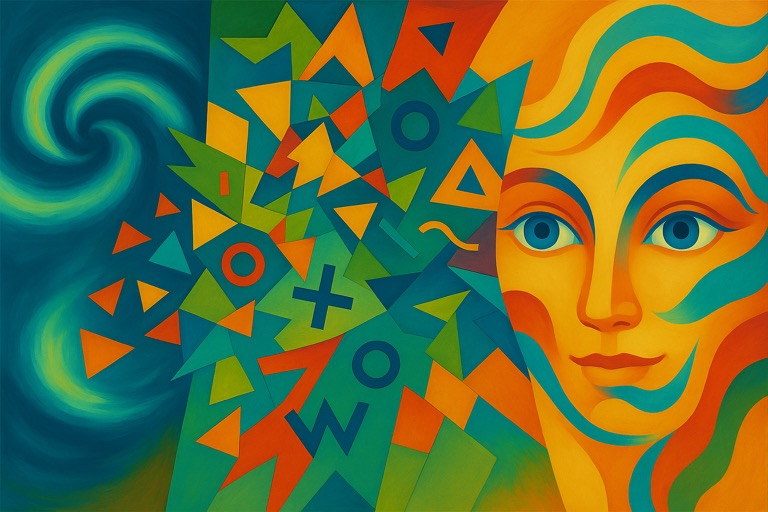

# 解釋就係掩飾

之前講算命占卜，稍為提過「解釋就係掩飾」呢個概念。查返原來舊年已經諗住講。

點解拖咗咁耐？我估可能係因為唔想倒米啩。始終近年聲稱做魔法理論研究，如果研完個結果係根本成個 premise 都係虛嘅，搵現象嘅解釋係完全冇意義，咁都幾無奈。

不過紙係包唔住火嘅，「解釋就係掩飾」既然係真，喺 meta-meta-physics 角度都要講下。

---

呢個世界嘅嘢，會發生就會發生。你唔識點解釋啲現象，同佢會唔會發生係冇乜關係嘅。

所有嘅解釋都係「錯」嘅。起碼一定係片面、唔完滿。呢樣嘢其實大家都知，所以人類先會追求「更好嘅」解釋。

解釋有咩用？大家會以為解釋會令我哋更容易預測未來，但其實冇咩必然關係。如果純粹係做 forecast，近年嘅machine learning已經話俾大家知其實用「大數據」就已經好勁，唔使明嘅，甚至你「唔明」先會準。當然預測未來靠大數據唔係最好嘅方法，不過呢個後話，我喺度只係舉個例去證明做預測唔使解釋或「明」任何嘢嘅。

有時啲解釋雖然係「錯」，但會引起人嘅想像力同靈感。例如 atomic theory 去到好後期先至有量子力學呢啲好似比較準嘅解釋，但有量子之前好似都幫到手解決啲化學問題。不過靈感呢家嘢嘅嘢，亦都唔需要你解釋到啲底層嘢嘅運作。都係嗰句，你搵到啲統計上嘅規律出嚟，同你作到個故仔出嚟，嚴格嚟講係兩回事。

我會聲稱「解釋」最主要嘅功效喺心理方面。即係等大家夜晚唔好失眠。呢樣嘢係事實嚟，我都唔知點解釋，唯有重申幾次。

- 解釋就係掩飾。
- 解釋就係掩飾。
- 解釋就係掩飾。

...

我諗呢樣嘢對一般人嚟講係幾難接受嘅，但起碼我接受咗。有時諗到某啲嘢有啲好正嘅解釋，但都只能夠一笑置之。解釋冇所謂「真」，或者準確啲講係可以同時有唔同甚至互拆嘅「可以當真」嘅解釋。例如數學上嘅 proof 就好明顯。一來 proof 係主攻心理嘅，佢存在都主要係為咗令數學家唔好失眠；二來 theorem 嘅真唔係「因為」某某個 proof 而變成真，而係本身個 theorem 喺數學上自有永有，但人類因為眠唔著所以先嘗試「解釋」點解佢真。Pythagoras theorem 有幾廿萬個 proof，但佢唔係「因為」啲 proof 「所以」真，而係大家覺得唔安樂想搵啲嘢說服自己個 theorem 係真啫。(至於啲當 formal theorem proving 係 more than a useful tool 嘅人，你是on9的，你是9able的。)

現實生活嘅「解釋」都一樣。例如「點解我肚餓」，都可以有 N 個「可以當真」嘅解釋：

- 因為身體嘅荷爾蒙乜乜乜令到身體產生飢餓嘅感覺
- 因為十幾個小時冇食嘢
- 因為窮冇錢買飯呀！

呢幾個解釋可以同時（好似）為真，但每個解釋都唔係講緊點解呢個世界係咁樣，而係透露作呢個解釋出嚟嘅人同埋接受解釋嘅人背後嘅agenda。都係嗰句，純粹心理效果，同真相無關。(終極真相係你信啲乜就係乜。因果方面如果你唔buy純唯心主義，咁世界整體上一個狀態造成下一個狀態。你抽取世界整體任何一部份出嚟講都係一個唔完整嘅解釋。)

所以當你覺得需要某樣嘢嘅解釋嗰陣，你係應該問下自己究竟呢個需求係基於咩心理狀況。解釋嘅內容係完全唔關事嘅，最重要係你接受咗個解釋 (i.e. 又即係心理效果)。

喺現實生活入面，唔好以為某啲解釋係「啱過」其他某啲解釋。或者倒轉嚟講就係：「雖然我個解釋唔係100%準確但起碼冇你個解釋咁錯」。呢種講法等於話「我作嗰個故仔雖然都係9up，但起碼好聽過你個故仔」。講故仔好聽係一個幾有用嘅技能嚟，講好聽嘅 bed time stories 會令人好瞓啲，但同真相完全冇關。所有解釋都係掩飾，唔會啱啲就真啲。

寫得有少少亂，呢個題目係好L難寫嘅，因為個標題己經講晒，冇嘢好解釋，純粹係大家接唔接受呢個事實。

That said, 下面係更令人爆頭嘅 further reading:

- https://centraltrunks.blogspot.com/2023/06/blog-post_80.html
