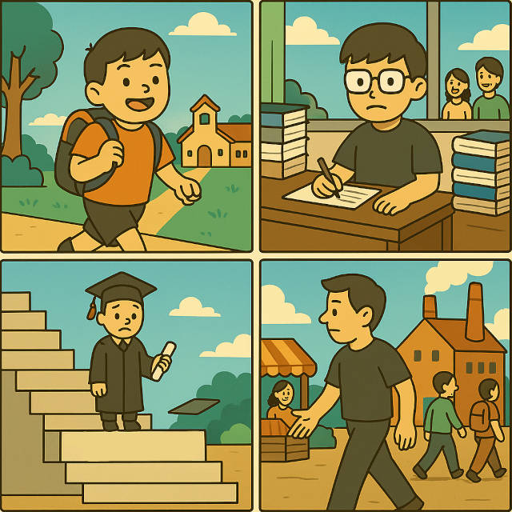

# 讀書冇用

【讀書冇用（一）：學校冇用】

我提出「讀書冇用」唔係否定大家以前嘅經歷，而係睇住社會急速變化嘅結論。大家最容易理解嘅一part係「學校冇用」。以前資訊冇咁發達嘅年代，「學校」呢樣嘢可以將有志學習嘅人匯聚埋喺同一個地方，方便一齊學習同交流。以前知識難得，所以有資格嘅教師係好重要嘅社會資源。

但喺 21 世紀大家都知道，幾乎任何你想學嘅嘢，喺網上都搵到充足嘅資料。（尤其係你識英文嘅話。）所以如果你讀書係為咗學習知識，傳統嘅學校對你嚟講唔係必須嘅，反而如果你嘅學習模式同學校嘅教學模式唔夾嘅話，你可能進度更加慢都唔定。

當然，「自學」都係一種技能嚟，理論上學校可以係教呢啲。但講真，邊有學校真係focus呢樣嘢 :0) 「學校」作為一個龐大嘅institution，應對社會變化係好慢嘅，尤其係中學，要跟政府政策(按：不限於香港)，做得最好嘅學校，最多都只能夠係 90% 時間教標準課程嘅內容，再另外攝10%時間教下啲學生點樣自己搵資料學習。 (但講到最新嘅新科技，例如點樣用AI輔助學習，其實老師同學生係一齊模索緊⋯)

但我都講返少少學校嘅好處：有得同啲同齡嘅人比較砌磋，對成長係好有幫助嘅。

【讀書冇用（二）：沙紙冇(乜)用】

呢幾廿年有個現象好似叫credential inflation(教育通脹?)，大意就係而家周街都係大學生，一個招牌砸落嚟都砸死幾件。

好多人會認為「即係代表要讀多啲書先夠同人爭啦」⋯但咁真係啱咩？某樣嘢「通脹」，即係越來越失去價值。如果一個學位唔夠，你讀多兩個，咁即係你用緊 N 倍嘅時間，去完成同樣社會價值嘅事。淨係咁睇，成件事已經好冇效率。

讀書當然唔係講究效率，但呢個post主要討論點解沙紙冇(乜)用。當學歷係咁貶值，你越花更多時間去追更多學歷，就好似啲茂利炒燶股票，跌到仆街就不斷買入溝淡佢博有朝一日佢升返回本。

話雖如此，今時今日有一個學士學位都係方便好多嘅。但如果你係從功利角度以為有個學歷點都好過冇，咁喺呢個年代你真係要精明啲，認真搜集資料睇下係咪值得先去報。（⋯尤其係啲master）

另外亦都好睇你日後打算做啲咩工作咩行業。唔係每個行業都真係需要大學學歷。功利嚟講，就算你喺香港平平地咁讀，讀大學嘅機會成本都係4年嘅學費+收入。假設你做大廈保安一個月有一萬蚊，學費五萬，咁四年大學嘅成本就係60+萬㗎喇。(唔係你以為你個首期去咗邊？)

【讀書冇用（三）：讀書真係冇用】

講咗點解學校冇用、沙紙冇用，而家嚟到主菜，正式講下點解讀書冇用。

其實呢樣嘢大家已經知道㗎喇。喺2025年，日日都有人講「AI會唔會取代XYZ」，就係因為佢哋好清楚咁意識到，AI再發展落去，好多靠知識搵食嘅工作都可能會被淘汰。

不過由於「讀書好L重要」呢個思想太根深蒂固，好多人嘅腦筋未能急劇轉彎，推斷出合理嘅結論：不出幾年，讀書真係冇乜經濟價值。

講返啲宏觀歷史嘢先。幾百年嚟，社會喺科技推動下急速變化。呢啲變化唔係最近嘅事，而係自工業革命以來就不斷發生。19世紀大部份經濟以農業為主，人類發明咗大規模農耕技術之後，就唔需要咁多農夫；去到20世紀初至中期，先進經濟以工業為主，工廠需要大量人手，但近年工廠已經靠機械自動化咗好多嘢；20世紀末，大家講緊服務業、知識型經濟，需要好多有知識嘅人才。但係！！！如果「服務」同「知識」呢啲嘢都被AI自動化咗，咁⋯⋯？

（話時話，我置頂post寫明「退休先知」，唔好問我之後會變成點。我只係話「知識型經濟」喺21世紀會轉型，其他我乜都唔知）

我諗好多人會話「讀書唔係為賺錢，係學點做人⋯」唔緊要，呢樣嘢我下篇再講。

【讀書冇用（四）：讀書唔會教你點做人㗎】

我成日喺網上見到啲人講「讀咗咁多書都唔識做人！」或者「讀書最重要係學識點做人」，其實我係覺得好神奇，點解啲人會有咁嚴重嘅錯覺？

唔知佢哋係冇讀過書所以有咁嘅幻想，定係佢啲老師特別鍾意講經。我個人經歷：讀書嗰陣遲到早退唔交功課⋯⋯好似都冇乜人點話我。🤪（最多靜靜雞俾個F我）

我有少少懷疑嗰啲人仲活喺清朝，因為明清年代科舉制度係考四書五經嘅，即係論語孟子嗰啲。四書五經最基礎嘅嘢，確實主要係講儒家倫理、點樣做人處世。

要知道政府設個考試遊戲出嚟，梗係有自己嘅打算。封建社會講「君君臣臣父父子子」，佢哋選拔人才做官，考試內容就係用儒家經典洗你腦，等你背呢啲嘢背到爛熟，確保你識得點樣做一個乖乖聽話，廉潔忠實嘅好官。(當然洗腦唔一定work⋯呢個後話)

現代社會都一樣。一般嚟講，現代強制教育係資本主義嘅陽謀嚟。以前社會需要大量識字、識處理文書、肯聽上級指示、會準時交課嘅人手。眾所周知，人天生係有自由意志嘅，所以就要靠學校去灌輸啲比較適合社會狀況嘅價值喇。

在此之外我就真係唔知讀書同識做人有咩關係。計我話，學做人最快係讀「社會大學」，實踐中學習嘛。

（題外話）話說，早幾年好多香港嘅(中小學)教師𢭃咗N年人工，都唔知原來份糧係政府用公帑出嘅。到出事嗰陣先發現，吖仆街原來係唔可以憑「良心」去教書而係要配合政治需要嘅。

事實擺在眼前，真係唔好話我誅心，教育開支億億聲唔通真係純粹公益不求回報㗎咩。

社會需要啲乜，政治現況需要啲乜，同某某人讀書想尋求啲乜，我覺得可以係三樣唔同嘅嘢嚟。做人都有好多唔同方法，以為讀幾年書學下微積分就會忽然學識點樣「做人」真係未免太天真。

【讀書冇用（五）：曾經嘅社會上流機制】

啲人咁堅持要讀書，其實唔係冇原因嘅。直至最近(學歷貶值前?)，一個好嘅大學學位或博士學位，係會為你帶來社會地位嘅。

近年好少人講呢啲。唔同範疇各自發展。

新派私人機構講究效率：如果你個學位可以靠父幹得到，咁即係呢位兒子本人能力未必好強。所以佢哋寧願親自把關，將面試搞到好難，無論你係名校畢業定係二三線學校畢業，一樣要通過機構考核先有工做。啲科技公司例如Google, Meta呢啲基本上都係行呢條路線。

政治上係另一種玩法。曾幾何時入到一間名牌大學係擠入上流社會嘅入場券，曾經某啲年代嘅政治精英亦都係意識到要容許適量嘅社會階級流動，主動帶挈啲後輩。呢個機制崩得最明顯係美國。美國而家係Boomer治國，年輕後進空間越嚟越細：克林頓、小布殊、侵都係1946年出世、拜登係1942。除咗克林頓同奧巴馬之外，其他都係老人政治或世家掌權，學術界反而變咗離地左膠嘅集中地。

可能上面啲例子太「虛」，不過最近有單花生幾有代表性，就係侵同哈佛開拖。套返落「讀書可否上流」度，就即係侵政府向世界宣告：你傳統名牌大學又點？我就係唔承認你係精英，吹咩？

呢類現像你喺香港、中國內地都會見到相類嘅嘢。大家都好熟悉啦，你家族有錢又聽話就👌 儒生俗士，豈識時務？識時務者魏俊傑嘛。

可能有人覺得話政治、搵錢呢啲嘢太庸俗，讀書係為做學術㗎嘛。但學術界嘅公信力近年都跌得好嚴重下。以前你搵某某大學某某大教授出嚟講句，大家就收皮。而家網絡上乜都有，唔會有人因為你個title係professor就信你或尊重你。

呢樣嘢某程度上係學術界嘅腐敗，自己攞嚟嘅。有部份係網絡世界消息通透，你講錯嘢係會有人發現仲會收唔返。呢樣嘢我可能寫多篇【讀書冇用（六）：象牙塔嘅腐敗】，不過個坑有啲大，可能要等心情先再寫。

講返社會上流。由於學術界嘅職位係一種類似龐氏騙局嘅架構，你睇住啲已上岸教授好似德高望重咁款，但其實啲新人係內捲到一個極點，人工低工作量大，但未必有德高望重嘅紅利。我成日告誡啲朋友唔好讀博士，就係因為個產業鏈真係完合唔make sense（無論我覺得適唔適合讀都會叫佢唔好讀，因為佢決心起碼要大到無視我嘅建議，否則肯定會好慘。）

Anyway有緣再講，今晚係咁先。
