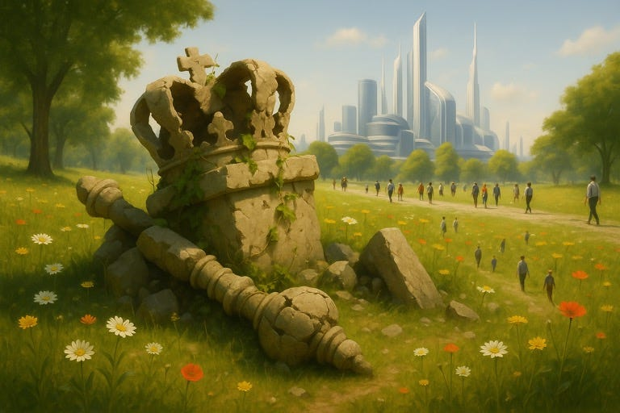

# Exterminating the Ghost of Imperialism: The End of Dominion in the Age of Equality

It's a common narrative that China is rising and about to challenge the US as the leading world power, but I think it misses the point. The US has basically imploded from its own internal inconsistencies, as reality has caught up with the contradictions built into its empire and economy.

In a sense, imperialism and colonialism never really went away. It became less overt, yet the notion that some peoples (or tribes, nations, countries, etc.) are superior over others never really died. It just morphed into new (and admittedly less sinister) forms.

And it is this idea — that some peoples or groups are inherently superior — that ultimately led to the whole thing collapsing in on itself.

The core thesis of neo-imperialism-colonialism (or whatever-ism-you-wanna-call-it) is this: there are "superior" economies, and "lesser" ones. The dominant economies benefit from being able to purchase cheap goods from the "lesser" economies, exploiting their cheaper labor costs.

This also fits neatly into the capitalist framework, where lower costs are irresistible to capitalists. Cheap stuff is good.

The problem here is that this marriage of imperialism and capitalism does not fundamentally work. They are, in many ways, mutually inconsistent. The imperialist sees those with weaker bargaining power as inferior, and asserts that the powerful "deserve" to exploit the weak. Yet, if a "lesser" economy is able to produce goods more cheaply, that implies greater efficiency — and in capitalist terms, greater value. In other words: they are, by capitalist logic, better. That contradiction cannot hold forever.

For a relatively long time, this contradiction did not rise to the surface. So long as "lesser" economies could not produce high-end goods and products, the "superior" economies felt safe. After all, whatever efficiency gained by the "lesser" economies, they were limited in the technology they could employ, and had to pay the exorbitant prices if they wanted to access state of the art technology.

But as global access to technology improved, the gap narrowed.

The imperialists drank heavy doses of copium to deal with the stress of the looming threat as the rest of the world slowly caught up. This is where the idea that "lesser" economies only produce "cheap goods" comes from, and why they are often rudely asserted. And for a long time, it was at least partially true, especially since lower quality usually comes with lower cost — which, after all, was the whole point.

But what if it is no longer true? Capitalism says that you are worth only as much as the market determines. If a "lesser" economy can do basically everything at a lesser price and the "superior" economy cannot match the price, then the latter is going to have an existential crisis. After all, capitalism also says that if you cannot produce things of value (at the price determined by the market), you do not deserve to exist.

Now, the neo-imperialists need extra-strength copium to deal with this stress. Imperialism can be backed by hubris, especially if the world is slow to realize what is actually happening. And hubris can feel Great as long as imagination does not meet physical reality. It is also quite convenient that financial instruments these days are mostly a product of people's imagination, so the meeting of the two sides may actually take a non-trivial amount of time.

As much as I'm a herald of the fall of capitalism, I think, upon reflection, capitalism will outlast "imperialism". The idea that some people are superior to others based on nothing but some imaginary "status", is going to be dead soon. It's a silly idea anyway, if you actually think about it.

Capitalism-as-we-know-it will also fall, because "(market) value" is imaginary — a temporary illusion justified by scarcity and labor. But as automation advances and technology frees us from tedium, the premise collapses. We are left with a simple truth: the system no longer needs us to function. So why keep it? For what purpose?

Capitalism stands in conflict with a deeper, more personal belief: that each of us, at least to ourselves, matters — that what we want is meaningful, perhaps even the most important thing in the world. In a world after capitalism, our value isn’t defined by what we contribute, but by what we desire. And in a world where machines do everything that *needs* to be done, human desire is the only thing left for the system to serve. If no one wants anything, the whole machinery becomes meaningless — a godlike apparatus with no soul to animate it.

Which is why it matters *what* we want. The imperialist impulse to dominate must be fully eradicated before we can enter this post-capitalist world. It would be very bad — existentially bad — for a significant group of people to desire dominance over others. It might take time for people to fully embrace the idea that everyone and everything is fundamentally equal, but in an age of technological "godhood", anyone who finds joy in domination cannot exist within the system.

(... have I contradicted my assertion that I've retired from 先知-ing? Oh my god so99ry I accidentally the words...)
