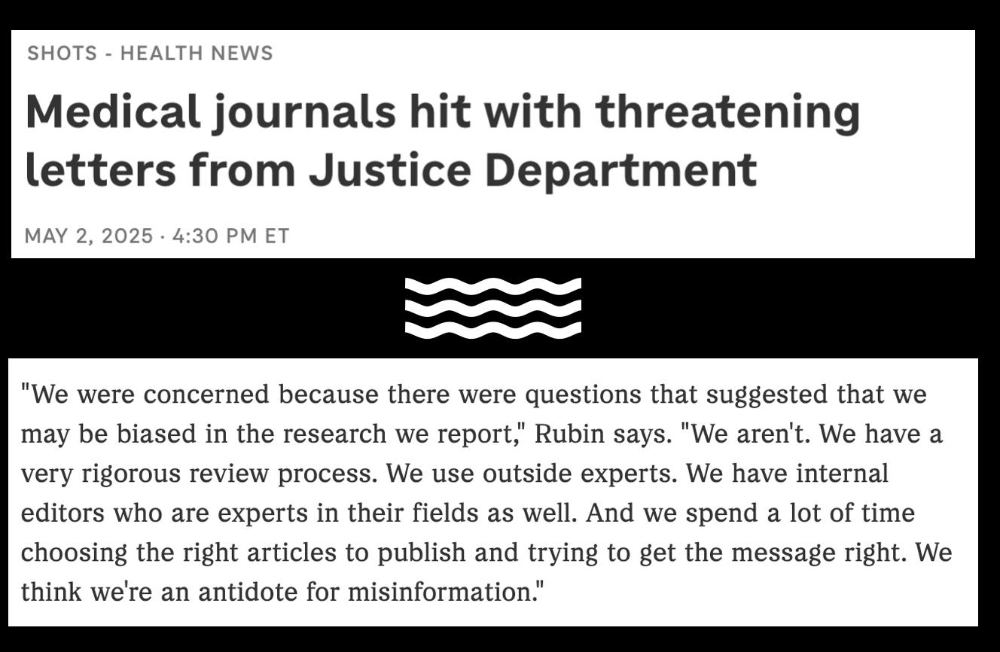

# 醫學期刊話自己客觀中立

見新聞話侵政府搞鳩啲醫學期刊，寫信質疑佢哋係咪客觀公平中立。

呢個係 New England Journal of Medicine 總編 Dr. Eric Rubin 喺媒體上嘅回應 （見圖）。

我懷疑一般人係覺得冇咩問題嘅，不過我睇完就十分感慨，第一次深切感受到某啲人真係應該學習下基本(?)嘅哲學。

一個好似 NEJM 咁大影響力嘅期刊，確實係應該需要花功夫去嘗試保持客觀中立嘅。而事實上我都唔懷疑佢哋係有做到(個嘗試)。但花咗呢啲功夫係咪就真係會客觀中立呢？你點知自己係咪客觀中立呢？呢個係哲學問題 #1。究竟咩先至係客觀中立呢？呢個係哲學問題 #2。

喺哲學層面嚟講，呢兩個問題係無解嘅。由於我唔睇哲學書，所以我都唔知啲人嘗試用咩方法去解，但結果係無解嘅 （所以我先至珍惜生命唔會走去睇書）。現實上處理呢兩條哲學問題嘅方法基本上都係靠強權。正所謂「有強權就有公理」（好似係），曾幾何時 NEJM 說一是一，說二是二，唔會有人質疑，呢啲就係強權。（唔使用劍嘅...）

或者做慣強權，唔需要諗太多哲學問題。喺一個說一是一嘅時勢，你話自己說一是一，就梗係說一是一啦，唔通會係二咩？

不過當人嘅哲學修為趕唔上時代變化，民粹政府由唔尊重學術嘅peasants主導政策，咁你說一就好容易變咗說二。

事實上說一喺平時真係會變咗說二。就例如以前香港某啲圈子流傳住一句名言：「做人最緊要正直」。未聽過唔緊要，你肯定聽過「我份人呢，就最公道嘅」。

淨係訴諸經驗唔太好，都講下機制。一個人如果覺得自己已經係好公平，咁代表冇乜改善空間，咁就好自然一切照舊，唔會刻意改善。萬一佢錯判自己係咪公平，咁就代表佢永遠都會係咁。（留意哲學結論：冇人知咩係客觀公平中立）

本來呢，其實搞一個學術期刊真係唔需要絕對嘅中立。本質上一個學術期刊都係編輯覺得咩論文值得登就登，啲人覺得你偏頗，咪搵下一家期刊。衰就衰在 NEJM 係全世界最 "prestigious" 嘅醫學期刊(之一??)，咁你講得係世界最好，自然唔可以有偏頗。（個因果關係好似唔trivial但我懶得駁埋啲腸）

人哋醫學期刊有千百個 alternatives ，世界冇咗你又唔會死，永遠有下一家接手；咁都放唔低身段，其實係幾可悲嘅事嚟。話說眾所周知本老師呢幾年嚟有搞開一個粵語詞典（聽聞粵粵詞典只此一家），一開始就諗咗唔少哲學問題，例如啲內容點樣保持客觀中立之類。某程度上上面提到嗰啲「哲學結論」就係呢啲討論之中建立嘅。所以如果有人send email問粵典係咪客觀中立定係有咩立場，佢好可能會收到呢個回覆：

「你咪 on9 啦，邊有呢樣嘢㗎？我哋相信主觀事實嘅，雖然我哋有幾廿萬位編輯，但客觀呢樣嘢根本唔存在，無謂追一樣唔存在嘅嘢啦。如果呢度唔啱你嘅話，你可以自己整返部詞典出嚟，嗱我哋嘅data喺呢條link會搵到，好行唔送 88」

目的唔係串啦，事實就係冇解嘛。

話說 （偷偷哋講下政治），公共機關因為係公家，所以夾硬要搞個答案出嚟，不過每個哲學家都有唔同嘅答案。現代社會最興嘅係民主制，一人一票人多蝦人少。古代聖賢就覺得民粹唔係好好，例如柏拉圖就推崇哲人王，有智慧嘅人嘅決定先至啱。獨裁者唔使講啦，強權就係公理嘛。而右派經濟學家就覺得咪搞咁多嘢，小政府咪少啲煩惱囉，私人機構就唔使咁公平咁公正。

某程度上侵政府係攞住民粹同強權兩張牌去挑機，喺哲學上其實都真係錯唔晒。至於若果你喺度又激動又痛心疾首咁講咩「你點可以咁樣質疑科學乜乜乜㗎」嘅話，我只能夠再一次慨嘆「某啲人真係應該學習下基本(?)嘅哲學」。

其實要我估嘅話， NEJM 應該都係好努力嘗試做到公平公正嘅，現代醫學理論應該都仍然係大致合理咁描述真相嘅，現代科學只要應用到嗰啲照計都唔錯得去邊嘅。不過我真係冇咩興趣信人哋嘅教，做人哋嘅教嘅教徒。（人哋講嘅嘢要信，不過唔可以信到十足。）

所以呢（真係有因果連系），最後講句（因為某啲人s比較煩），如果你係見到「哲學」呢兩個字就起槓，我勸你不必。「學哲學」同「讀哲學書」係兩回事嚟，「事實係主觀嘅」係我呢個存在系統嘅特色嚟，你一日未去到全知嘅神嘅水平都會係咁。撻朵無謂啦 （見上 cf. 信人哋嘅教）

