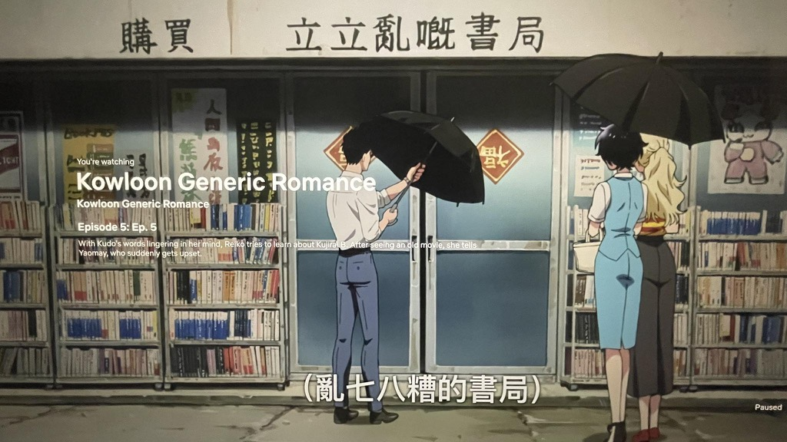
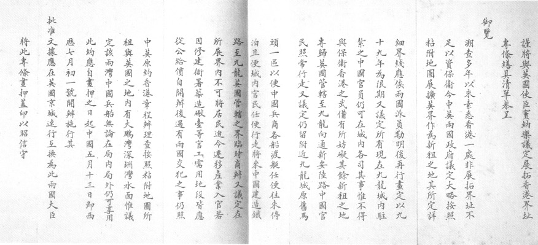

# 《展拓香港界址專條》只係一份歷史文件，不再具有任何現實意義

最近追緊套動畫番背景係九龍寨城。所以就多手望下啲相關嘅無聊嘢。

由於唔熟書，啱啱先知道原來九龍寨城雖然本身係俾清政府駐軍，但好似屁股未坐熱就俾英軍趕走咗。我仲以為駐守咗一段時期𠻹。

再查落去就開始有少少得意，乜唔係《展拓香港界址專條》寫明個地方留俾清政府㗎咩？點解可以趕人走？

睇返啲條文就覺得件事真係十分之on9。條約係咁寫：

  "... within the city of Kowloon the Chinese officials now stationed there
  shall continue to exercise jurisdiction except so far as may be inconsistent
  with the military requirements for the defence of Hong Kong."

另外有一段

  "It is further understood that there will be no expropriation or expulsion of
  the inhabitants of the district included within the extension, and that if
  land is required for public offices, fortifications, or the like official
  purposes, it shall be bought at a fair price."

之後冇幾耐 (過咗一年)，英方就話清兵喺度駐守有礙香港防務，趕晒佢哋走。然後就有個 order in council 話將九龍寨城當係一般英殖香港領土：

  "The City of Kowloon shall be, and the same is hereby declared to be, for the
  term of the lease in the said Convention mentioned, part and parcel of Her
  Majesty's Colony of Hong Kong, in like manner and for all intents and
  purposes as if it had originally formed part of the said Colony." -- Kowloon
  City Order in Council (1899)

呢件事最後好似冇發生，真係令人感慨英國果然係法治國家。據中文維基所述，李鴻章向當時港督據理力爭，話你點可以違反簽好咗嘅條約。港英政府最後放棄喺九龍寨城實施管治權。由於條約寫明英方唔可以侵佔或驅趕居民，最後九龍寨城就發展成咁。而清政府後來冇再派人去九龍，相信都係想避免英方再次話清駐軍「唔符合香港防衛的軍事需求」。「唔派員駐守就阻唔到你啦？咁你就冇籍口攞咗佢嚟用。」（設計對白）

作為「歷史文件」嚟講，成件事都真係好膠。法治大法真好。

