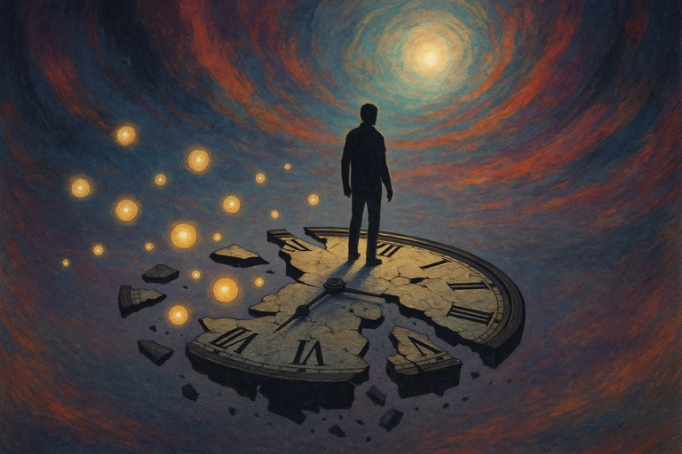

# 罪疚、時間、自由



先講講下罪疚。

罪疚感(guilt?)呢樣嘢，係講緊你犯咗錯，然後你自己都知衰，因而產生嘅情感嚟。但有個問題我一直都好在意。假設你犯咗錯，然後過咗一排，你完全唔記得有呢回事。如果其他人走嚟質問你，佢哋攞住客觀證據，證明你真係做過呢件事，而你仍然係冇印像嘅話⋯⋯ 可能你理性上都係信自己係有做，但情感上應該係覺得被老屈，而唔係有罪疚感。

我相信(希望?)一般正常人都係咁諗。

但呢個現像就引起一個比較嚴重嘅問題：罪疚感係咪來自記憶？即係話，記憶先至係罪疚嘅根源？

呢個結論，正常人應該會覺得痴L線。一般常識話俾我哋知，你犯咗錯，良心責備，就會產生罪疚感。「你犯咗錯」係客觀事實嚟，罪係源於你犯嘅錯，而唔係你嘅記憶。

我同正常人嘅分別，主要在於我十年前睇唔開，一炮過睇晒八集《涼宮春日》嘅「漫無止境的八月」。個效果同你一日諗八個小時「南嘸阿彌陀佛」異曲同工。自此之後，我對「時間」嘅理解就開始有啲動搖。最後個結論係：「過去」嚴格嚟講係唔存在嘅，一般我哋講嘅「過去」係靠「現在」投射出嚟嘅產物，本質上同「未來」一樣係充滿不確定性。[1]

所以「過去」發生嘅所有嘢，都係我哋攞住「現在」嘅證據重新構建出嚟嘅嘢。好多時啲證據喺大家腦海中嘅記憶。而其他嘅各種紀錄，廣義嚟講都係一種記憶，只不過唔係用我哋嘅大腦去記，而係身外物。但作用一樣，都係一啲俾我哋重構返「過去」嘅嘢嚟。

所以，(廣義嘅)記憶，的確係罪疚嘅根源。

----

再講下時間。

點解我哋會相信(廣義嘅)記憶？點解我哋相信「過去」係真實，相信「未來」一定會來臨？我當日其實喺呢個問題係棘住咗嘅。當日用 Darwinism 草草了事[2]，最近先知原來完整嘅答案係一個極級深坑。

簡單啲講，就係自由意志嘅問題嚟。真係要講個解釋嘅話，大概都係「你信嘅嘢就係真」(主觀事實[3])，不過「解釋就係掩飾」[4]，去到尾只能夠話純粹係大家on9，冇咩點解。

但個on9位喺邊？我尋晚瞓唔著嘅狀態記錄咗呢幾句，好似好過我用粵文寫：

```
It is foolish to predict the future from the past
The past does not exist
Foolishness comes from the idea that he must be bound to the past in order to determine the future 
We already know that it s foolish to do so. This is why there is a never-ending debate about the conflict between free will and determinism.
Free well is not bound by the past 
You cannot predict the future from the past
The the fact that we can apparently predict the future from the past implies that we have given up our free will
We seem to crave the predictability that comes with the presence and future being a deterministic continuation of the past 
However, if we had a choice, should we really want the predictability offered by the idea of determinism? The choice is between predictability and getting what we want.
```

受「過去」束縛嘅問題喺邊？問題你咁做咪 exac7ly 放棄咗自由意志。啲咩因果業力其實都係講緊呢樣嘢。我哋用一個叫「因果」(cause and effect) 嘅籠困住咗自己，然後大聲宣告「人生而自由」，其實都係件幾膠嘅事。

---

自由意志係終極考題，雖然我成日提呢樣嘢，但我摸索咗咁多年都只係feel到個大概。正如上面所講，透徹理解同運用自由意志，係可以斬斷因果、業力嘅，應該都近涅槃嘅地步。所以唔係講笑，真係超級深坑嚟。

Anyway, 自由意志同決定論之間嘅矛盾係有啲好迂迴但有趣嘅方法處理嘅。（本身我係諗住引返啲舊文，但我發現我自己都亂到冇咩整齊嘅解釋⋯ ）簡單嚟講就係你claim咗幾多自由，決定論就會幫你清埋剩低嗰啲。

我哋平時最熟悉嘅「自由意志」係講緊肉身(皮膚包住嘅嘢)嘅自由意志。所以貌似身體外嘅嘢我哋決定唔到。但常言道「定義『自己』好難」。「皮膚包住」只係大家慣常定義，但唔係唯一真相嚟。莊子曰：「天地與我並生，而萬物與我為一」，「我」其實可以係天地萬物。如果「我」係天地萬物，咁決定論就冇掟企。

喺一個冇任何「決定論」嘅世界，「我」每一刻都係體驗緊「我」最想體驗嘅嘢，同「過去」冇任何關聯。用俗人嘅眼光嚟睇，呢個世界可能係極度混沌，毫無章法嘅世界。但我可以肯定咁講，邏輯上一個「冇因果冇業力嘅極樂世界」，應該exac7ly係咁嘅樣。 （個問題純粹係我仲未識得整個咁嘅世界出嚟。）

----

兜返去開頭講嘅嘢先。

「罪疚」嘅根源係「(廣義嘅)記憶」。無論係自己嘅「罪」或其他人嘅「罪」，所有「罪」嘅證據都係源自「記憶」。所以消除「罪疚」嘅方法係好簡單，就係消除「罪」嘅記憶。

講到呢度我懷疑會有啲人開始跳掣，話「吓咁即係你殺咗人然後毀滅晒啲證據就冇罪？」 如果呢條係必答嘅是非題，答案係「係」嘅，不過留意本身個情境就自相矛盾。前設係「某某殺咗人」，但後來又話「佢毀滅晒所有證據」，咁你又點知佢殺咗人？所以個情境完全係自相矛盾嘅。常言道「天知地知你知我知」，都有四個party知道件事，咁就唔算係消除晒啲記憶。真正消除咗嘅記憶，同冇發生過係完全冇分別。（記住，「過去」嚴格嚟講係唔存在嘅。）

咁記憶係點消除？咁就要靠自由意志。「其實唔難」嘅方法就係：你想佢唔存在，佢就唔存在㗎喇~~~ 所以點解啲人話天堂地獄都係一念之間。

---

1. [時間，係現代文明嘅產物](../2015/時間_CM_係現代文明嘅產物.md)
2. [《Endless Eight》觀後感：明天會否來臨?](../2014/《Endless_Eight》觀後感_CL_明天會否來臨_qm_.md)
3. [Subjective Truth](writings/2022/09-Subjective_Truth.md)
4. [解釋就係掩飾](15-解釋就係掩飾.md)
